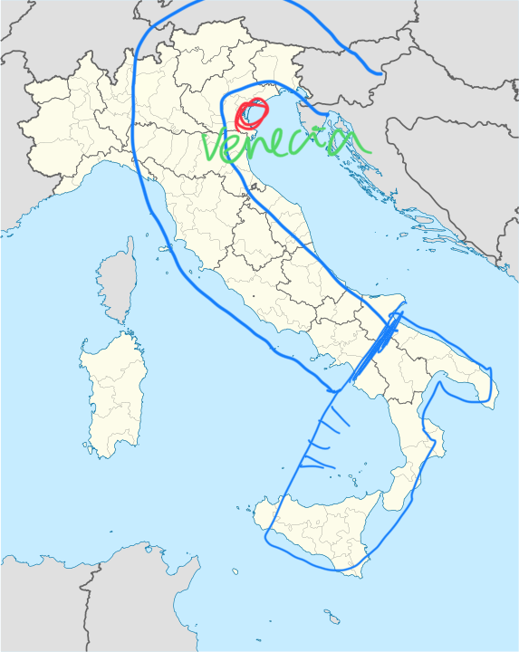

# El corvejón de Europa
***Donde está Venecia, y como la geografía determina la historia***

> "Venecia nació de la nada, de un poco de lodo y de la espuma del mar, como
> Venus, su casi homónima" P. Braunstein, R. Delort, citados en "Marco Polo y la
> Ruta de la Seda", de Jean Pierre Drège

Cualquier país, ciudad, imperio, isla, continente, barrio; cualquier entidad
geográfica, en suma, está determinada por la geografía, así que hablar de dónde
está Venecia es, posiblemente, la mejor manera de empezar a entender por qué
existe Venecia y qué es, ha sido, y posiblemente, será.

Todo el mundo tiene la idea de que Italia es una bota, con la punta señalando
hacia el Oeste, en la dirección de España, y la pierna en sí ligeramente
inclinada hacia el Este. Más o menos a la altura de la espinilla estaría
Roma. Pues bien, Venecia estaría justamente en el corvejón; es decir, donde se
dobla la rodilla, pero en la parte trasera de la misma.  El muslo, entonces,
sería la antigua Yugoslavia, hoy en día Eslovenia, Croacia, Montenegro... Y
continuaría con Albania y Grecia. Entre el muslo y el gemelo y talón de la
pierna (o tacón de la bota) estaría el Mar Adriático. Es decir, Venecia está en
el extremo de un mar alargado, con una entrada relativamente estrecha, con menos
de 160 kilómetros de ancho (en su parte más amplia), muchos puertos y por tanto
muy navegable y también fácilmente defendible.

Aunque sólo fuera por ese hecho, Venecia ya sería notable, aunque una posición
similar tienen Trieste o Grado. Pero es que, además, Venecia es una isla, o más
bien un conjunto de muchas islas unidas por puentes en medio de una laguna. Esa
laguna está separada del Adriático por una serie de barras arenosas (o "lidos"),
en las cuales se abren varias "puertas"; una vez más, posición fácilmente
defendible en tiempos azarosos.

Lo que se considera Venecia en sí tendría una forma de busto tumbado, con dos
partes separadas una de otra por el Gran Canal, la parte superior (que incluye
San Marcos y todas las zonas más conocidas) con una forma aproximada de llave
inglesa, con las fauces cerradas sobre la parte inferior, que incluye la
estación del tren y diferentes barrios en general relativamente lejos de los
principales ejes turísticos. Debajo de estos dos estaría la Giudecca, una isla
también alargada y más alejada todavía de los circuitos turísticos, ya que se
accede a ella solo usando los (relativamente caros) *vaporetti*.

> Casi todas sus atracciones, desde San Giorgio Maggiore hasta Molino Stucky, se
> ven perfectamente desde el *vaporetto* que va desde San Marco hasta Piazzale
> Roma.

La posición que ocupó Venecia, por tanto, es relativamente privilegiada,
geográficamente hablando. Situada en una zona templada, bañada por un mar
cálido, a salvo de mareas vivas y en una zona defendible tanto desde el mar como
desde tierra (a la que se unió por un puente solo en el siglo XIX), en la
"bisagra" de Europa, entre oriente y occidente, esta posición explica por qué
surgió aquí la ciudad que acabó expandiéndose hasta convertirse en el primer
imperio marítimo, un imperio que duraría, con altos y bajos, casi tanto como el
bizantino y mucho más que el español o el inglés.

No todo son ventajas, claro. La laguna está expuesta a mareas, y por tanto a
subidas excesivas del nivel del agua, las cada vez más frecuentes *acqua alta*,
cuando el agua empieza a salir por los sumideros de la *piazza* San Marco y a
reptar por los alrededores del puente de Rialto hasta convertirlos en un gran
charco donde los turistas chapotean felices por la experiencia y los camareros
vuelven a sacar sus botas altas y maldecir el reuma y lo que van a tener que
barrer al día siguiente. Este sistema de exclusas, llamado MOSE, tratará de
evitar, en un futuro próximo, que el *acqua* sea tan alta que convierta a los
canalillos en verdaderos canales, y a los canales en una laguna continua de la
que sólo salgan las cúpulas de San Marco y las dos columnas con el león y el
cocodrilo masacrado por San Teodoro.

Pero de eso hablaremos (sólo un poco) en uno de los siguientes capítulos.
