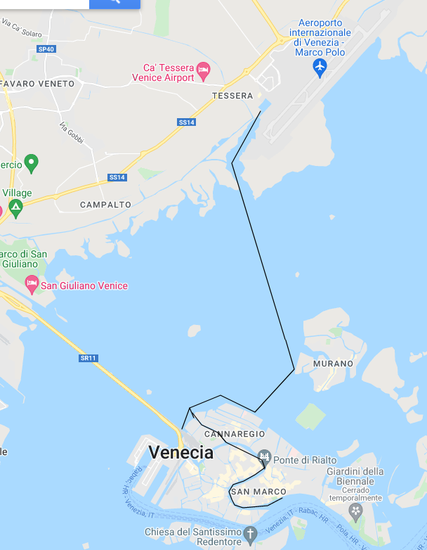

# Del aeropuerto a la Piazza
__*Del aeropuerto Marco Polo a la piazza San Marco, yendo hacia atrás en la historia de Venecia, por la laguna*__

> "Venecia nunca parece totalmente real, sino más bien un decorado de una
película suspendido sobre las aguas", Frida Giannini

Hay muchas formas de ir del aeropuerto a donde quiera que te alojes en
Venecia; los modos más populares, en el sentido estricto de la
palabra, son los trayectos en autobús hasta el Piazzale Roma y luego,
*vaporetto* hasta donde sea que te alojes. O bien andando, que muy
lejos tiene que estar uno en la isla principal para que no se pueda
llegar en media hora, disfrutando del paseo. Pero vamos a hacerlo en
barco, el camino más directo desde el aeropuerto hasta el corazón de
Venecia, la Piazza San Marco.

> El vaporetto que va a la estación de Piazza San Marco no es demasiado grande,
> cabiéndole unas 30-40 personas, siempre que las maletas no sean demasiado
> grandes. Al menos en el que nosotros nos montamos no es ideal para la visita
> panorámica, porque tiene una zona que consiste en dos bancos corridos a los
> lados, con los asientos mirando hacia el centro, y ventanucos (u ojos de buey,
> como quieras llamarlos) justo en el respaldo del asiento; el techo es bajo y
> es complicado ponerse de pie, aparte de que el suelo suele estar repleto de
> maletas, mochilas y todo tipo de equipaje. Aún así, de rodillas en el asiento
> y abriendo los ventanucos (no todo el tiempo, y sobre todo cerrándolos si ves
> que se acerca otra lancha taxi, porque te puede entrar la laguna entera en el
> habitáculo) se puede ver algo, y hacer alguna foto. Siendo como es a nivel del
> agua, se puede ver estupendamente el bajo de los puentes y poco más, así que
> no esperes que sea una visita panorámica para hacer fotos a saco de todos los
> lugares por los que pases.

Trataremos hacer de este paseo un recorrido por la historia de
Venecia, desde el presente hasta su inicio; un poco forzado, lo sé,
pero al menos es una pequeña línea temporal de brocha gorda, que
iremos afinando al pincel en el resto de los capítulos.

Comenzamos este paseo en la Italia actual, un país democrático, miembro de la
Unión Europea y de la OTAN, con un producto interior bruto per cápita superior
al de España (aproximadamente un sexto superior, con números de 2021) y el
noveno del mundo en números absolutos (datos de 2017, justo por debajo de Brasil
y por encima de Canadá). Cinco puestos por encima de España, o quizás cuatro
ahora mismo, si es que Rusia ha caído finalmente por debajo. Un país, por tanto,
rico y moderno, con sus problemas conocidos por todos, la mafia y su alianza con
algunas fuerzas políticas, el populismo y, sobre todo, las diferencias
norte-sur; aún así es un país vibrante, industrial, pero con una gran cultura
que hace que sea uno de los principales destinos turísticos del mundo. Que es de
lo que nos ocupa.

Y lo comenzamos también en el agua, flotando encima de ella, claro; el agua es
la razón de ser de Venecia, lo que la hace especial y la que ha traído su
riqueza y definido su cultura a lo largo de los siglos. Además, podremos verla
desde varios puntos cardinales, y pasear por el Gran Canal, que a modo de
serpiente (o de lazo) la divide por la mitad (o la ata). Por si fuera poco,
podremos echarle un vistazo a las marismas en los alrededores del aeropuerto, o
más cerca de Mestre, donde el puente se une con el continente.

Tomando la linea *arancio* (naranja) de Alilaguna, una de las empresas que
gestiona los *vaporetti* (la otra es ACTV, que vienen a ser los autobuses
urbanos; Venecia es una laguna, y los *vaporetti*, o pequeños vapores, lo más
parecido a los autobuses urbanos que hay. Navegando en uno de ellos, y por un
módico precio, podemos retroceder en la línea temporal de la historia de
Venecia, yendo desde la actualidad que representa el aeropuerto, hasta muy cerca
de los orígenes en San Marco Giardinetti, que es donde termina la línea. Un
paseo, además, sentado (si tienes suerte) y que tarda una hora y cuarto, más o
menos.

> Los primeros *vaporetti*, algo tan típico veneciano, fueron realmente barcos de
> vapor traídos desde París por una empresa francesa a finales del siglo XIX.

El camino por la laguna viene marcado por una serie de postes, que delimitan, a
modo de carretera, por dónde se puede circular y por dónde no. Estos postes,
cada uno de los cuales se llama una *bricola* o *briccola* (plural
*bricole*). Estos *bricole* delimitan los caminos que, a los largo de los
siglos, han ido descubriendo los venecianos en una laguna llena de bajíos y
marismas, y por tanto traicionera. Además, encima de cada uno de esos *bricole*,
aparentemente por ley, hay situada una gaviota.

> Al parecer, "tú eres mi bricola", o mi apoyo, es una frase común entre los
venecianos; las tres *bricole* están colocadas de tal forma que una de ellas,
inclinada, soporta a las otras dos.

Aparte de los postes
delimitadores, veréis un montón con una especie de bola en lo alto de un poste
cuyo letrero indica que se trata de algo relacionado con las
telecomunicaciones.

> En un *plot twist* inesperado, a estos postes se les llama "Duque de Alba" en
> español, o palabras parecidas en otros idiomas. Nadie sabe a qué se debe.

Vamos a abordar el vaporetto en el aeropuerto Marco Polo; qué mejor nombre, el
de un viajero veneciano del siglo XIII, que buscando nuevas rutas comerciales
acabó en la China e incluso más allá, en Mongolia y posiblemente Indonesia.

> Ya que estamos, no es cierto que Marco Polo trajera la pasta de la China a
> Italia. Fueron los árabes, en su conquista de Sicilia, los que la introdujeron
> unos siglos antes, a la vuelta del milenio. Sí es verdad que trajo los
> helados, aunque los que trajo serían más parecidos a los sorbetes de hoy en
> día: hielo con zumo de frutas. Los helados actuales son evolución de esos,
> cuando se les empezó a añadir leche para hacerlos más cremosos; así que los
> puestos de helados "Los Italianos" que hay en tantos puntos de la península
> (como en Granada) deberían llamarse, en realidad, "Helados Chinos traídos por
> Marco Polo a Italia", aunque como marca comercial no sé si engancharía mucho.

El aeropuerto, hoy en día, es el cuarto con más pasajeros de Italia, tiene
vuelos a América, y también a muchos de los lugares donde los venecianos
organizaron *fondachi* durante el apogeo de su imperio: el golfo pérsico, el
este de Italia, Croacia, Albania, Armenia... Los *fondachi* (palabra
que viene del árabe *funduq*, igual que la española *fonda*) eran puestos
comerciales que iban desde un edificio, hasta pequeñas ciudades con todo lo
necesario para que una colonia veneciana desarrollara su vida. Es curioso cómo
cambian los gobiernos y pasan los siglos, pero sigue habiendo relaciones entre
lugares y pueblos que se establecieron mil años atrás.

El edificio del aeropuerto es posiblemente el más moderno que se va a ver en
todo el viaje a Venecia.

> En la ciudad de Venecia hay pocos edificios modernos, y con modernos quiero
decir del último siglo. Pero los hay, y son bien visibles, incluso en los
*sestiere* más céntricos: al lado de San Moisè, por ejemplo, o en el Campo
Manin.

El aeropuerto en sí, que está situado fuera de Venecia, en la ciudad
de Tessera, se creó a finales de los 50, aunque el edificio se amplió
recientemente, con un proyecto de 2002 que se terminó unos años más
tarde. La ampliación, un poco brutalista, es decir, hecha con hormigón
armado expuesto, recuerda sin embargo a algunos de los palacios (o el
Arsenal, unos astilleros y fábrica en la misma ciudad de Venecia) que
encontraremos más tarde en nuestro viaje en el vaporetto, usando, como
en ellos, la piedra de Istria, pilastras y elementos decorativos
bastante apropiados al contexto. Para irse, más o menos, metiendo en
faena.

> Istria es una península que, si Venecia es el corvejón de una
pierna, saldría a modo de forúnculo en el interior del
muslo. Actualmente está dividida entre tres países: Italia, Eslovenia
y Croacia; en la época de mayor esplendor de Venecia era, en gran
parte o completamente, suya.

La línea *arancio* continúa su viaje parando en la isla de Murano primero, la
más cercana, o en Santa Maria dell'Orto, en Cannaregio.

> Murano es posible que se conozca por el cristal de Murano, que se
vende en todo el mundo, y también en múltiples tiendas en la ciudad de
Venecia, en forma de figuras decorativas, pero también colgantes y
joyas. Los comerciantes de estas tiendas son especialmente
convincentes, así que hay que tener cuidado con no acabar con un vaso
en el que beben pajaritos de 200€ que no te cabe en el equipaje de
mano. Durante mucho tiempo la fórmula de la fabricación del cristal se
mantuvo en secreto, hasta el punto que estaba prohibido que los
cristaleros abandonaran la ciudad, y que los extranjeros participaran
en la fabricación del cristal. Palabra que, precisamente, viene
del término *cristallo*, que significa simplemente "transparente", que
los vidrieros de Murano usaron para denominar a un tipo de vidrio que
era totalmente transparente. Otra palabra veneciana para todos los
lenguajes occidentales.

Vamos a continuar el viaje por la historia hacia la fundación de Venecia. Por
eso, no vamos a prestarle mucha atención a la isla de San Michele, que aloja el
cementerio, que dejaremos a la izquierda. Y que existe como cementerio desde que
Napoleón lo eligió personalmente como tal. Pero de esto hablaremos más adelante,
cuando lleguemos a esa época.

La siguiente parada es Madonna del Orto, en Cannaregio, que es uno de los
seis barrios de Venecia.

> En muchos idiomas, las palabras que se usan para designar a los barrios vienen
> a indicar que se trata de "un cuarto" de la ciudad, por los campamentos y
> ciudades romanas, divididas en cuatro por dos calles, el *cardus* y el
> *decumanus*. En italiano es también así: barrio o vecindario es
> *quartiere*. En Venecia y en veneciano, sin embargo, se dice *sestiere*. Por
> su especial configuración (véase el capítulo dedicado a la geografía), Venecia
> está dividida en seis "sextos" o sestieres: Cannaregio es el primero que
> veremos, pero además están Castello, San Marco, Dorsoduro, San Polo y Santa
> Croce. Pasaremos por todos ellos durante este viaje.

Pero pasamos un poco de largo para nuestra siguiente (y anterior en el tiempo)
etapa en este viaje por la historia de Venecia: el puente de la Libertad, *Ponte
della Libertà*. Si lo miramos desde la actualidad, Italia dejo de ser libre en el
año 1944. Ese fue el momento en el que depusieron a Mussolini, que había
presidido un régimen fascista, de hecho, *el* régimen fascista por excelencia,
desde veinte años antes.

No pasaremos debajo de él, si bien lo tendremos a la vista en cuanto que
salgamos de la parada de Madonna dell'Orto, a la derecha del barco. El puente
por el que van los automóviles y autobuses, sólo hasta el Piazzale di Roma, es
de los años 30; lo inauguró el príncipe Umberto de Saboya, a la sazón el rey de
Italia, con presencia, cómo no, de Mussolini, que era quien partía la pana (y
más cosas) en aquella aciaga época. Pero no era el primer puente que unía a la
hasta entonces isla con el continente o *Terraferma*: el puente ferroviario se
inauguró, en la época de la ocupación austríaca, unos 80 años antes, junto con
la estación de Santa Lucía.

> Terraferma, o tierra firme, era como los venecianos llamaban a los
> dominios de la zona de Italia, por oposición a los que estaban "en
> el mar", que había que llegar por barco, vamos.

Esta estación ferroviaria está enfrente (con una isla de por medio) de la parada
llamada Guglie, a la derecha del barco, y es de las más frecuentadas de
Italia. Al piazzale de Roma la une un puente del (posiblemente) famoso
arquitecto español Calatrava, nada menos, que tiene la peculiaridad de que,
siendo un puente frecuentado por gente con maletas, tiene escalones en vez de
una rampa. Pero no lo veremos sino a lo lejos. Quizás veamos la estación de
Santa Lucía, que evidentemente entró en servicio a la vez que el puente
ferroviario; el nombre de la estación se debe al convento de Santa Lucía que
ocupaba el mismo lugar.

> Entre estos dos momentos históricos Italia pasó por dos guerras mundiales. En
> las dos estuvo en el lado equivocado. En la segunda guerra mundial porque,
> hasta 1944, luchó (más o menos) al lado de los nazis. Y en la Primera Guerra
> Mundial porque tampoco había un lado que fuera mejor que el otro, y su
> intervención en la misma, luchando contra los austríacos, fue un verdadero
> desastre.

Los austriacos, sin embargo, ya no estaban allí cuando se abrió la estación,
en 1861. Italia surge (o resurge, por eso se llama Risorgimento) como país
unificado en marzo de ese año, adoptando la bandera tricolor que todos
conocemos. Para ello, antes tenía que desaparecer Venecia como tal, y eso
sucedió a finales del siglo XVIII con Napoleón, que fue realmente el único que
invadió con éxito Venecia, aunque no fue pertenencia francesa durante mucho
tiempo: Por un tratado secreto fue traspasada inmediatamente al imperio
austrohúngaro. Hay pocos edificios de la época de Napoleón en Venecia; hay uno
muy evidente y lo veremos en el siguiente paseo. Pero recogemos el testigo
lanzado más arriba sobre el cementerio. No construido *por* Napoleón, pero sí
*por causa de* Napoleón. Previamente, en Venecia (y en todo el orbe cristiano) a
la gente se le enterraba en las propias iglesias. Todas las lápidas que ves en
las iglesias actuales, albergan cadáveres de verdad; hasta que llegó Napoleón,
todos los suelos de las iglesias eran enterramientos colectivos o, si tenías
posibles, individuales. El llamado Edicto de Saint Cloud cambió eso por razones
de salubridad pública, para evitar infecciones y los malos olores que generaban:
tenía que haber un lugar designado específicamente para enterramientos, fuera de
la población y, sobre todo, fuera de las iglesias. Dado que Venecia perteneció a
Francia entre 1805 y 1814, se le aplicaron los decretos como a cualquier otro
lugar del imperio napoleónico.

> A España llegó un poco más tarde, con la invasión napoleónica en 1808.

Mientras tanto, seguimos hacia atrás en la historia cuando pasamos del Canale de
Cannaregio a Grande Canale, el gran Canal que, en este punto, separa Cannaregio
de otro sestiere, San Polo, que viene a ser san Paulo con ese apócope (o
acortamiento y a veces unión de palabras) que es tan característico de los
venecianos y su idioma. Y nos encontramos con el que los venecianos llaman el
Canalasso, que el mundo conoció, en el siglo XVIII, gracias a las pinturas de
Canaletto.

La verdad es que cuando escuché el nombre, o más bien el apodo, de este pintor,
pensé que se llamaba así por las muchas veces que había representado el Canal en
sus cuadros. Pero no, se llamaba Antonio Canal, y como su padre era también
pintor y tenía el mismo nombre, se quedó con el diminutivo cariñoso: Canalillo,
para entendernos.

Canaletto vivió en el siglo XVIII, que fue el último siglo del estado
veneciano. Sin mucho producto material que ofrecer al mundo, se convirtió en una
potencia cultural. El por qué sucedió es otro tema. Tiene que ver con el Gran
Tour del que hablamos antes, pero el que Venecia formara parte de ese gran Tour
está relacionado con el hecho de que el carnaval de Venecia duraba varios meses
y que, en un momento determinado, la cantidad y calidad de personas dedicadas a
la prostitución en Venecia era considerable. Los granturistas, a los que podemos
llamar simplemente turistas, volvían de Roma llenos de sabiduría y arte clásico,
y de Venecia llenos de experiencias mundanas, por decirlo de alguna forma,
habiéndose quitado "lo gordo" petroleándose los bajos a base de bien.

Pero también tenían que llevarse un recuerdo. Y ahí estaba Canaletto, con sus
diferentes vistas del Gran Canal, en el que estamos ahora mismo, y otras escenas
de regatas, carnaval, desfiles... También Piranesi, que se especializaba en
retratos de los granturistas, retratos que han pasado en las familias británicas
de generación en generación.

De Canaletto se conservan nada menos que doce vistas del Gran Canal. Esas
vistas, o *vedutas*, fueron otra de las aportaciones de Venecia a la cultura
mundial. Aunque parezca mentira, la idea de dibujar, así por las buenas, una
vista urbana real o imaginaria, no se encuentra ni en el Renacimiento ni
antes. Pinturas con tema mitológico, religioso, retratos de personas pudientes,
todo eso. Sin embargo, los granturistas no estaban tan interesados en el paisaje
(sí en los retratos, como hemos visto antes), como en llevarse una vista
detallada de los sitios donde habían estado. Donde hay demanda, acaba habiendo
oferta, y Canaletto y otros paisajistas acabaron cubriéndola. De hecho, las
*vedutas* evolucionaron en *capricci*, caprichos que incluían también elementos
imaginarios y que, por tanto, precedían al romanticismo.

Viajando por el canal podemos imaginar, por ejemplo, el ambiente del mismo en un
día de regata tal como lo pintó Canaletto; en el cuadro se muestra el canal
desde San Vio, justamente al final de la S que forma, y en dirección contraria
desde la que venimos; las góndolas son, en su mayor parte, cubiertas, pero ya
usaban el estilo de remo actual, la *voga veneta* o remado véneto, que permite
dirigir y propulsar la embarcación con un solo remo.

No obstante, antes tenemos que pasar por el puente de Rialto, un puente que
podría haber hecho el gran Palladio, el arquitecto que, él solito, creó
las reglas de la arquitectura como ingeniería (y que dejó algunas
obras en Venecia), pero que se hizo en realidad a finales del siglo
XVI y por otra persona, el apropiadamente llamado Antonio da Ponte, el
único entre todos los que participaron en la licitación (incluyendo al susodicho
Palladio) que propuso un puente de un solo arco.

A Palladio, por cierto, le dio bastante coraje no ganar el concurso. Puso mucha
ilusión en el puente aunque, con tres arcos en vez de uno solo, habría sido
imposible hacer pasar por él barcos del tamaño de los *vaporetti* de hoy en día
(y del siglo pasado), así que igual habría pasado por la piqueta, que los
italianos de según qué época no le tenían muchos miramientos a “lo antiguo”, y
los fascistas seguían mucho el manifiesto futurista que quería arrasar Venecia y
tirarla al mar. Si no sobrevivió ni al concurso ni habría sobrevivido a la
piqueta fascista-futurista, su imagen sí nos ha llegado. Palladio dedicó un
capítulo dedicado a los puentes en sus “Cuatro Libros de la Arquitectura”, la
obra donde vertió todas las reglas que luego se siguieron en la arquitectura
renacentista. Pero ese libro volvió a Venecia. El “cónsul Smith”, el cónsul de
Gran Bretaña en la república, lo reimprimió y lo puso a la venta; tanto éxito
tuvo la edición que el mismo Goethe llevaba una copia, según cuenta en su viaje
a Italia.

Pero Smith era un gran aficionado al arte, y también a los ducados y la libra
esterlina. Se le considera uno de los impulsores del Gran Tour en Venecia. Y
también fue agente de Canaletto, comprando muchos de sus cuadros. Canaletto,
mira tú por donde, pintó un *capriccio*, un paisaje imaginario, donde ponía la
versión de Palladio del puente de Rialto. Seguramente animado por el propio
Smith; además, Guardi también usó el mismo tema en uno de sus cuadros. De esa
forma, tenemos una visión, totalmente falsa, de cómo habría quedado este puente
y así ha pasado a la posteridad. Tan *real* como el real.

Frente a este puente que no existe, y el que se construyó de verdad, ya existía
allí un puente desde mucho antes. Mientras que San Marco y alrededores habían
sido el centro gubernamental, Rialto era el mercado y el centro financiero. El
diseño de un solo arco es todo un prodigio de la ingeniería de la época y
permite que, aún hoy, siga permitiendo la navegación de buques de cierto tamaño,
como el vaporetto en el que iremos navegando. Tan audaz era que, en su época, se
predijo su caída, que evidentemente no se ha producido. Los otros diseños
rechazados (por ejemplo, el de Palladio, o incluso uno del mismo Miguel Ángel)
tenían varios arcos y eran planos, y habrían cerrado el Gran Canal; cabe pensar
que sólo el diseño actual ha permitido que se siga usando el canal con su fin
original, el comercio, sin impedir el paso del tráfico por debajo.

En el canal y a ambos lados veremos todo tipo de palacios renacentistas,
barrocos y góticos. Cada uno de ellos tiene un nombre y una historia.
Pero quedémonos con uno: poco después de Rialto y a nuestra izquierda, un
palacio de fachada encarnada es Ca' Bembo, que
mezcla el gótico (recuerden, arcos ojivales, rosetones, arbotantes, todo eso)
con el bizantino (cúpulas con forma de "cebolla", arabescos) en una combinación
que es muy veneciana. Además, en el siglo XV, Venecia era la única heredera de
la cultura bizantina: Constantinopla, la actual Estambul, acababa de caer en
manos de lo que acabó convirtiéndose en el imperio otomano (recordemos, en parte
culpa de la propia Venecia), y ya no se construyeron más cúpulas, sino
minaretes. Bueno, también alguna cúpula, intentando hacer algo del porte de
Santa Sofía, pero ni el gran arquitecto Sinan logró llegar al mismo nivel.

Palacios (o *palazzi*, como debería decirse, porque el italiano hace
el plural de esa forma) hay en todos lados. Pero sólo hay *Ca'*
en Venecia. Ca' viene de casa, igual que en mi pueblo, que para ir a la casa de
alguien se va *ancá* o incluso, de la misma forma, *cá* no sé quién. "Vamos cá
la tía Petra", por ejemplo.

En Venecia tiene ese sentido, pero además significa "casa" en el sentido de
linaje o dinastía, como la Casa de Austria o la Casa de Borbón. Es decir, la Ca'
Bembo era la casa de, y a la vez del linaje de, los Bembo, hijos (siempre era el
hijo, claro, los linajes en general se transmitían por línea masculina, nietos,
bisnietos y tataranietos del Bembo original, el que instauró el linaje. Esta
casta, en todos los sentidos de la palabra, dio generales de la Armada,
cardenales, abadesas y hasta un dogo, un gobernante elegido entre las familias
que figuraban en el Libro de Oro por otros miembros de las familias, poca
sorpresa, que también estaban inscritas ahí. Este Libro d'Oro era,
efectivamente, donde se inscribían las familias venecianas que tenían derecho a
votar al dogo y a figurar en el Maggior Consiglio y por supuesto ser votados en
la institución más alta de la república. Este "libro" se creó en la *serrata* o
"cierre" de 1297, antes del cual la elección era, hasta cierto punto,
popular. Los venecianos, bien conscientes de que no había que confundir la
libertad de los nobles con el libertinaje del pueblo, dijeron, hala, se acabó, a
partir de ahora somos nosotros los que votamos, que vosotros votáis
mal. Sorprendentemente, eso dio lugar a un sistema de gobierno bastante más
estable que el de cualquier otra república, o para el caso ducado u otro tipo de
reino, italiano.

De hecho, la familia Bembo era de las llamadas "viejas" (*longhi* en
veneciano). Sólo había 24 familias de este estilo, y de entre ellas salieron los
dogos más conocidos, nombres de palacios, y también de topónimos que
encontraremos por toda Venecia: Morosini, Dandolo, Falier, Soranzo... De hecho,
un Bembo ocupó el palacio ducal, o de los dogos: Giovanni Bembo, aunque fuera
solo tres años, hasta 1618.

> Conviene quedarse con esa fecha en la historia de Venecia, al menos en su
> relación con España. Luego veremos por qué.

A la familia Bembo el palacio ducal le quedaba tan cerca como a nosotros en este
punto del viaje, más o menos. También a este palacio de la familia le queda muy
cerca en estilo: el palacio ducal, de los Dogos, donde está el final de nuestro
viaje, tiene el mismo estilo gótico-veneciano-bizantino.

Un poco más tarde llegamos al final del viaje, y más o menos al principio de la
historia. En la república Serenísima se elegía al gobernante, el Dux o Doxe en
veneciano (plural: Doze), de por vida, y había reglas muy estrictas para que no
se eligieran hijos a continuación de los padres, de forma que no se concentrara
el poder en unas familias; tenían el ejemplo de otras repúblicas de la península
italiana, los Medici, Sforza, Visconti y Borgia, demasiado presentes.

> Y estos son sólo los más conocidos. Nadie se acuerda ahora de las
otras tres repúblicas marítimas: Pisa, Ancona, Génova y Amalfi. La
familia Visconti estuvo entre los últimos gobernantes de Pisa, en el
siglo XV; Amalfi fue un ducado hereditario, que no pasó del siglo
XII. Precisamente Génova, la que mas duró, tenía un sistema similar,
que pasó más adelante a una república con un dogo elegido cada dos
años.

Hubo más de 120, y el primero se considera que
fue Paolo Lucio Anafesto, en el año 697. En realidad, este era un verdadero
duque del imperio bizantino, pero espabiló lo suficiente como para controlar el
territorio (una sola ciudad y su laguna, de hecho) y que se le considerara el
primer gobernante de Venecia.

Y llegamos así al final del primer paseo. El siguiente paseo empezará más o
menos por aquí, así que no se vayan todavía y pasen la página.
