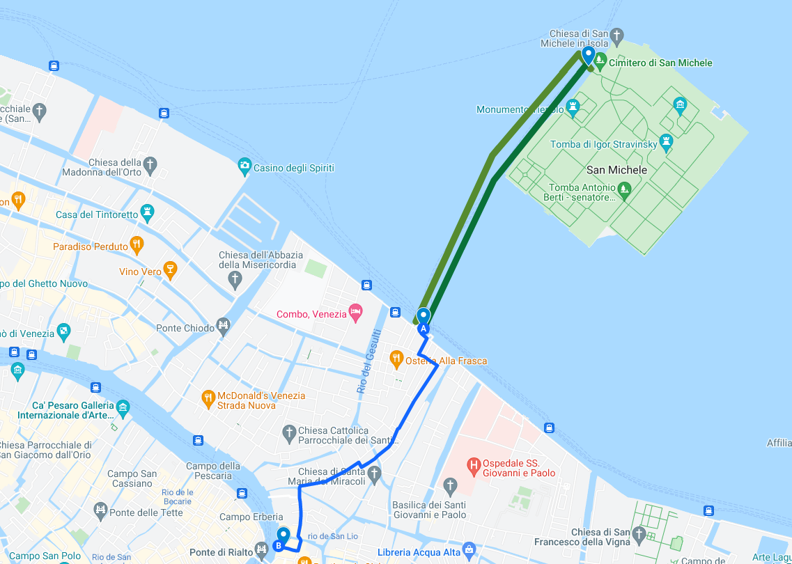

# Cementerio y Fondaco dei Tedeschi
__*El final de la vida y el final del día en un entorno incomparable*__

> "Venecia es el lugar más romántico del mundo, pero es incluso mejor cuando no
> hay nadie alrededor", Woody Allen.

Este va a ser un capítulo breve: el cementerio cierra a las 6, y además
ya hemos hablado de él. Seguro que os acordáis: Napoleón,
salubridad, todo eso. Vamos a buscar uno de los sitios en Venecia donde no hay
gente alrededor. O gente viva, al menos.

Los cementerios son siempre un sitio interesante. Por la tranquilidad, por el
arte, por ver qué hay escrito en las lápidas, ver las imágenes de la gente
insertas en las lápidas, descifrar las últimas despedidas. Los que tienen vistas
al mar son especialmente paradójicos. Piensa uno, qué sitio tan bello para pasar
la eternidad.

> Recuerdo uno, especialmente recoleto, en Cacela Velha, apenas una aldea en el
> Algarve portugués, con muros encalados, y un centenar de tumbas. Hacía falta
> empinarse un poco por encima del muro para ver el mar.

He de confesaros que visitar cementerios es una de las constantes en mis
destinos turísticos; a veces por ver las tumbas de celebridades, pero también
simplemente cuando están ahí, con sus cipreses y sus monumentos.

El de Venecia, habiendo sido cuna de tanto literato y artista diverso,
no es una excepción, ni en la belleza, ni en la tranquilidad, ni en el hecho de
haberlo visitado, en este caso en el segundo viaje que hice en abril de 2022.

Este cementerio, al ser el municipal, incluye
también tanto los enterramientos católicos, como los de otras
confesiones, o los de ninguna confesión. Todavía se sigue usando;
incluye tumbas de marinos británicos de la primera guerra mundial,
donde, recordemos, los italianos estuvieron con los aliados, igual por
la inquina que le tenían a los austrohúngaros, que dejaron de ser
austrohúngaros a consecuencia de la misma; también varias capillas, la
tumba del hijo de un emperador de México (sí, existe tal cosa), y la
de Helenio Herrera, conocido entrenador que ganó cuatro títulos de
liga en los años 50 con el Madrid y el Barcelona.

Por si fuera poco, contiene una historia de amor, un poco loca como lo son
todas, si bien esta más de lo corriente, porque incluye a un poeta, también
locos de por sí, pero en este caso de ser un americano que apoyó, hasta el punto
de participar en emisiones radiofónicas defendiéndolo, el fascismo y nazismo
durante la segunda guerra mundial. Ezra Pound es posiblemente uno de los mejores
poetas del siglo XX, y gracias a su actividad como editor se dieron a conocer
autores como James Joyce. Lo que no quita que estuviera realmente zumbado. Y
dentro de su estado general de locura, mantenía una relación tanto con su esposa
como con una amante, Olga Rudge, que fue quien le cuidó hasta el fin de sus
días, los cuales sobrevinieron aquí precisamente, en Venecia. Por eso están
enterrados los dos en este cementerio, uno al lado del otro.

También está aquí enterrado Stravinsky, y el bailarín Diaghilev, este último
condenado por el régimen soviético, y cuyo mayor miedo era morir en el
agua. Sobre estar muerto rodeado de agua por todos lados posiblemente no tenga
ninguna objeción; se le enterró donde murió, todavía más cerca del mar, en el
Lido. Ni sobre eso ni sobre ninguna otra cosa, una vez muerto.

Diaghilev usó al futurista Fortunato Depero para diferentes escenografías y
vestuarios. Finalmente, los futuristas tenían que acabar relacionados con
Venecia, aunque fuera por vía de los muertos enterrados en su cementerio.

No es casual tampoco que Diaghilev esté cerca de Stravinsky; primero, porque se
trata del cementerio “ortodoxo”, y los dos eran rusos; además, Diaghilev creó
varias coreografías para música de Stravinsky. Stravinsky, sin embargo, murió en
Nueva York y veinte años más tarde que Diaghilev. Fue enterrado, como pidió,
cerca de su amigo, y los dos no están sólo cerca, sino rodeados por el
mar. También al lado de su mujer. Su tumba está cubierta por monedas, conchas y
piedras, situadas en torno al borde de la misma, igual que en la de su mujer.

De todas estas tumbas logramos encontrar prácticamente todas, salvo la del hijo
del emperador de México. La de Ezra Pound está al pie de un arbusto, rodeada por
la vegetación, una placa de piedra ligeramente inclinada hacia delante, con su
nombre y ningún otro signo, y cuatro girasoles de plástico en la tierra, justo
delante. La tumba de su amante, Olga Rudge, está justamente al lado. Por qué
había girasoles delante de la lápida, o encima de la tumba, de Ezra Pound no es
fácil de averiguar, igual que no es fácil saber por qué hay monedas, conchas y
piedrecitas encima de la tumba de Stravinsky. Ezra Pound fue quien introdujo la
poseía china en la cultura occidental, haciendo traducciones de las que decían
que Ezra Pound era mejor poeta que traductor. El girasol es un símbolo de
longevidad y buena suerte. No es imposible que algún aficionado a la poesía
china los haya colocado.  Que nadie haya quitado estas lápidas puede que indique
que los italianos asumen el pasado y recuerdan a la gente por su ingenio
artístico, más que por su ideología; Ezra Pound colaboró con el régimen fascista
y fue encarcelado por ello al final de la guerra, cuando reconquistaron el norte
de Italia, donde vivía. En el mismo cementerio hay enterrados oficiales navales
austríacos, y seguro que más de un fascista. Nada extraño por otro lado en este
país: hay un monumento a Sissi, emperatriz consorte de la potencia que ocupó
gran parte de Italia durante muchos años, y que mandó al exilio y a la cárcel a
cientos de patriotas, en Trieste. Gabriele d’Annunzio, otro gran poeta que no
solo coqueteó con el fascismo, sino creó la simbología que este usó y, por si
fuera poco, montó una milicia e invadió la ciudad de Rijeka/Fiume, ahora en
Croacia, reclamándola para Italia, le da nombre al paseo marítimo el Lido, el
Lungomare Gabriele d’Annunzio.

Es posible que todo ello se interprete como que el fascismo todavía pervive en
Italia; o quizás que en realidad los italianos estuvieron en guerra los unos con
los otros durante siglos, se mataron fraternalmente, se invadieron y se
exiliaron, así que tampoco importa demasiado un invasor más o menos. Finalmente,
también se trata de separar la obra de la ideología, y no pensar que por admirar
a una se está introduciendo un germen que haga florecer la otra. Algo
posiblemente bastante sano.

En este cementerio, como todos los cementerios, hay también una zona dedicada a
las tumbas infantiles. Son las que más pena dan, pero también las que más llaman
la atención. Una, cubierta de arbustos adornados con corazones rosas; la
siguiente, con una estatua de un ángel niño, está rodeada de animalitos de
plástico; una Nala (del Rey León), un elefante…  En otra, un dálmata de
plástico, y también un girasol. En otra, una muñeca con un traje raído y ya gris
se apoya sobre el brazo de otro ángel cuya mano ha sido cortada en la muñeca;
detrás, un ángel más pequeño, de mármol, toca el violín. La combinación de lo
ingenuo y lo macabro resulta perturbadora y a veces supera a la tristeza que
provocan esas vidas, de las que no conoces, en realidad, nada.

También hay varias capillas: San Cristoforo, San Rocco, y San Michele; la
primera y la última son los nombres de las islas que, en realidad, forman la
única isla que hay hoy en día. San Michele tiene un origen bastante anterior, y
antes de ser una capilla funeraria alojó a una comunidad de frailes
camaldulenses, incluyendo a un tal Fra Mauro, que literalmente dibujó el primer
mapamundi.

> Tuvo que ser, por supuesto, un veneciano quien dibujara, en 1459, el mapa más
> preciso del universo conocido. Habiendo navegado en los buques y peleado por
> la Serenísima, era el único estado que permitía a alguien alcanzar esa
> formación y obtener datos para dibujarlos.

Lo que tiene su mérito, porque todavía no había ni siquiera una imagen clara de
qué había en el mundo, antes de que Magallanes le diera la vuelta.

San Michele, la capilla del monasterio donde pasó sus días Fra Mauro, es entre
otras cosas la primera iglesia renacentista que se construyó en Venecia. Por eso
el aspecto exterior, con una bóveda de medio punto y los dos arcos que unen los
dos paños de la fachada con el centro es una característica que encontraremos en
muchas otras iglesias en Venecia. Fue la primera iglesia de su arquitecto, Mauro
Codussi, que a partir de ese momento trabajó casi exclusivamente en Venecia.

Está construida con piedra de Istria, la que vimos por primera vez en el
aeropuerto, y es uno de los primeros ejemplos de arquitectura renacentista en
Italia. Al atardecer, vista desde el vaporetto, es una verdadera maravilla. Pero
la verás mejor desde el vaporetto que desde la propia isla; normalmente está
cerrada, o al menos yo no vi la forma de acceder. También la puedes ver en un
cuadro de Canaletto “San Cristoforo, San Michele y Murano”. Pintado en el siglo
XVIII, antes de que se convirtiera en cementerio, muestra una iglesia bastante
espectacular, dorada por los rayos del sol y reflejada en la laguna. Donde
estaban, ahora sólo hay tumbas. Pero con Canaletto, Guardi y otros, los Google
Photos de la época, podemos ver también la Venecia que desapareció.

El cementerio cierra a las 6 de la tarde, y de ahí al atardecer hay un buen
rato; puedes ir a Murano (en el capítulo siguiente), o tomar el vaporetto hasta
Fondamenta Nuove, y volver de ahí, andando, qué remedio, a Rialto.

Muy cerca, antes de llegar al puente y en lo que es todavía el sestiere de San
Marco está el Fondaco dei Tedeschi, o de los alemanes; en realidad, se les
llamaba alemanes a todo guiri que no fuera de la parte de oriente (esos eran los
*turchi*). Y ya hemos visto que un Fondaco o Fontego (en veneciano) era un lugar
que servía como alojamiento para comerciantes extranjeros, pero también contenía
oficinas, y almacenes.

No es mala situación para unos almacenes, justo al otro lado del canal del
mercado de Rialto. El apogeo de la república veneciana coincidió en tiempo con
la llamada Liga Hanseática: una alianza de una serie de ciudades en el mar del
Norte y Báltico, que comenzaron con un acuerdo entre las ciudades alemanas
Lübeck y Hamburgo para acabar con los piratas que asolaban el comercio entre las
dos ciudades, y terminó en un semi-estado que abarcaba desde Tallin, en la
actual Estonia, hasta Brujas, en Bélgica; un grupo que tenía su propio ejército
y que monopolizó el comercio en los mares que eran su zona de acción. Además,
usaba el oro como moneda de cambio; igual, precisamente, que
Venecia. Afortunadamente, sus nichos ecológicos eran diferentes, si no habrían
sido tan enemigos como Venecia lo fue de los turcos. No siendo así, se convirtió
en el centro de distribución de pieles, que los hanseáticos compraban en
Novgorod, y ámbar báltico, a todo el resto del Mediterráneo. Curiosamente, más
adelante devino el lugar donde los daneses y otros países nórdicos acudían para
pagar el rescate de esclavos capturados por diferentes corsarios mediterráneos,
tunecinos, marroquíes o argelinos.

El edificio tiene un aspecto bastante clásico, en el sentido de la antigüedad
clásica romana y griega. Como en aquella época no se iba al Ayuntamiento a
registrar el proyecto visado por el colegio de arquitectos, no se sabe
exactamente quien lo hizo. Pero se le atribuye al llamado Fra Giocondo, Giovanni
Giocondo de Verona, un fraile que además era arquitecto e ingeniero militar y
que nos encontraremos en otro capítulo (más adelante) diseñando las defensas de
Padua; y la atribución viene precisamente de su gusto por la arquitectura
clásica descrita por Vitrubio y se le considera la persona que la introdujo en
Venecia. Estuvo allí hasta que participó también en la licitación para
reconstruir el puente de Rialto; como no ganó, se pilló un rebote importante y
acabó yéndose a Roma. O, posiblemente, se quedó algo más y proyectó este Fondaco
del que estamos hablando.

> Es la parte buena y mala de las licitaciones: te llegan muchas figuras a
> participar; pero si no ganan, se cabrean y te arriesgas a perdértelos para
> cualquier otro proyecto. Pero la parte buena es que o reciclan los diseños (en
> el caso de Palladio, en sus libros de arquitectura) o se dan a conocer en la
> ciudad y, con eso, Venecia acabó reuniendo a los grandes arquitectos italianos
> a lo largo de bastantes siglos.

Durante un tiempo fue oficina de correos, y todavía los *nizioleti* que señalan
cómo se llega a correos apuntan hacia aquí. Hoy en día es un centro comercial,
en lo que se convirtió tras ser comprado por una empresa de productos de
lujo. Dentro hay mucho lujo, glamour, tiendas y restaurantes, pero no se
diferencia demasiado de cualquier otro centro comercial. Tampoco vamos a
pararnos demasiado en el mismo: vamos a la azotea.

> En mi último viaje, con la visita a la azotea ya planificada, llegué tan lejos
> como la cola que había para salir a la azotea, que yo achaqué al Covid y
> restricciones de aforo. Pero no, es que la visita, siendo gratis, hay que
> reservarla. Y acabo de caer en la cuenta para reservarla para la próxima
> visita, tú puedes hacerlo online o, al parecer, con un código QR que hay en la
> cuarta planta. Puedes reservarlo con hasta tres semanas de antelación, y si
> quieres ver el atardecer, consulta cualquier calendario que te diga a qué hora
> se va a poner el sol.

La azotea es uno de esos miradores que no recibe mucha prensa, aunque tendrá más
de mil imágenes en Google Photos en el momento que leas esto, se añade una casi
cada día; sin embargo tiene una de las vistas más bonitas de la ciudad a la hora
del atardecer, y a cualquier hora donde el sol no de te directamente en la
cara. Mirando hacia el canal, a la izquierda tiene el puente de Rialto, y a la
derecha la curva del Gran Canal; si el día está claro, igual ves un poco de
Murano y de la laguna. El Campanile se ve, como desde toda Venecia, y las
cúpulas de San Marcos.

> Todo esto lo dejamos para otros paseos.

Pero también veremos una cosa curiosa: unos charnaques (término totalmente
ubetense) o a modo de terrazas erigidas sobre pilares en lo alto de los tejados;
unas estructuras metálicas o de madera, con barandas alrededor, que se alzan
*sobre* los tejados a dos aguas. No son terrazas en sí, porque no forman en el
techo; están construidas por encima de los tejados y a ellas se accede... de
alguna manera. Se trata de las *altanas*, un curioso fenómeno arquitectónico
veneciano que surgió no de forma moderna, sino en siglos anteriores con el
objeto, *wait for it*, de que las mujeres se tiñeran el pelo al recibir el sol
sobre la cabellera en la que habían untado un ungüento llamado "agua juvenil",
que contenía... orina de caballo. Para este fin se ponían una visera alrededor
de todo el cuero cabelludo, porque se trataba de que el sol diera en el pelo y
nada más, y ahí se quedaban un ratico, hasta que el rubio era satisfactorio o se
habían terminado la revista del corazón que se hubieran subido.

> Esta historia, que he visto en varias webs y libros, hay que tomarla, como
> todas ellas, con un grano de sal. También puede ser que simplemente estuviera
> prohibido construir terrazas y esta fuera la forma de torcer la ley para tener
> una que no fuera ilegal. Igual que en fabular historias, los venecianos también
> son expertos en este tipo de cosas.

Estas altanas se ven en todo tipo de cuadros, y si te fijas un poco las acabarás
viendo. También desde la calle, claro, aunque por lo estrechas que son no son
tan evidentes.

Por supuesto, también puedes echarle un vistazo a las chimeneas, que estas sí
que no podrás verlas desde muchos más lugares. En cada edificio verás una buena
cantidad de ellas, a veces en forma de embudo; esta al parecer sirven para el
humo en sí, mientras que otras parece que simplemente se usaban como ventilación
en edificios que no parecían tener ni patios interiores ni espacio para los
mismos. En todo caso, muchas están decoradas y algunas tienen un tamaño
considerable.

Dependiendo del momento del año en que vayas, a la derecha verás también los
montes Dolomitas, nevados o simplemente grises, en la distancia. O, si se da el
fenómeno del *stravedamento*, mucho más cerca.

Esta azotea está verdaderamente solicitada a la hora del atardecer; las plazas
aparecen con unas tres-cuatro semanas de antelación. Así que si piensas visitar
Venecia, consulta la hora del atardecer de los días que vayas y reserva a esa
hora, que es la primera que se acaba. Por otro lado, en caso de lluvia o
simplemente si el suelo está húmedo por la lluvia caída horas antes, lo cierran
sin más contemplaciones, así que mi consejo es que reserves varios días, por si
acaso uno de ellos no pudieras visitarlo; si por cualquier razón el primer día
está cerrado, seguramente el resto de los días esté ya reservado a la hora del
atardecer. Sigue siendo bonito a cualquier hora, en todo caso.

> En mi viaje en diciembre de 2022, sólo lo conseguí a la tercera vez, después
> de estar cerrado el primer día, con un chaparrón considerable; el día
> siguiente era imposible a la hora del atardecer, así que reservamos por la
> mañana y volvía a estar cerrado por estar húmedo de la lluvia caída el día
> anterior, y finalmente lo logramos el tercer día, aunque una hora antes del
> atardecer. Un truco para visitar sin reserva es que te dejes algún dinero en
> el centro comercial; nos dio la impresión de que si te veían con bolsas de
> compras ni siquiera te pedían la reserva.

Con el sol poniéndose sobre estos *camini* y reflejándose en el Gran Canal,
terminamos este paseo, buscando algún lugar donde tomarnos unos cicchetti en
alguna tasca, de camino que hacemos la clásica passeggiata por alguna de las
calles de la animada ciudad.
