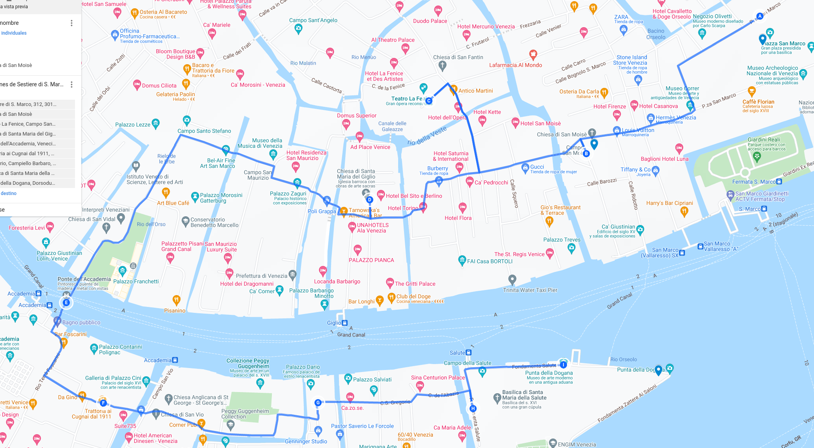

# De San Marco a la Punta de la Dogana
## Del número uno del sestiere San Marco al número uno del sestiere Dorsoduro

> "La piazza San Marco no parece ser parte de una ciudad, sino el salón de baile
> de algún palacio", Q, de Luther Blisset

Vamos a dar un paseo que va a incluir San Marco, puentes, el Gran Canal, y una
de los lugares con las vistas más bonitas de Venecia. Y dos *sestieri*. Por el
camino, trataremos de entender los mecanismos del poder, las aportaciones de
Venecia al arte, qué le tiene que agradecer la libertad de expresión a Venecia y
quizás un poco de su economía.

Empecemos entre las dos columnas donde la plaza de San Marco se
encuentra con el canal, en la llamada *piazzetta* de San Marco. Ya sabemos que
Venecia sólo tiene una piazza; sin embargo tiene dos piazzettas, a ambos lados de la
piazza. La otra, *piazzetta* dei Leoncini o Leoni (de los leoncitos o
simplemente leones), por la escultura de porfirio
que representa al consabido león. La estatua, a estas alturas, está más gastada
que los toros de Guisando, porque el porfirio es una piedra dura que lo aguanta
todo salvo la erosión constante de millones de niños que, siglo tras siglo, se
han subido a cabalgar a sus lomos, al menos desde el siglo XVIII que fue cuando
se pusieron ahí.

Pero volvamos a la primera piazzetta o placeta, y vamos a colocarnos en el punto
que sale obligatoriamente en todas las pelis en las que sale Venecia; como en
"The Italian Job", verbigratia, donde vemos a Donald Sutherland pasar entre esas dos
columnas dirigiéndose, como no, a tomarse un café en la plaza. Paso que, por
cierto, se consideraba de muy mal augurio en Venecia. Nadie quería verse entre
esas dos columnas voluntariamente. Mal augurio que se trasladaría, quizás sin
quererlo, a la propia película. Y esto no cuenta como spoiler porque si las
pelis no tuvieran giros de guión no serían pelis, y no estoy diciendo de qué
giro se trata de forma precisa. Como pista, no se trata de que le fueran a
cobrar 20 euros por un café en los cafés de los que hemos hablado más arriba.

En ese punto, sólo si giramos un poco, podemos ver a un lado el Gran Canal, las
islas de la Laguna y hasta el Lido. Del otro, la plaza. Estamos, por tanto, en
un lugar, privilegiado. Pero el último lugar donde, durante gran parte de la
historia de la República, un ciudadano querría estar.

Los malos augurios mencionados anteriormente son la razón por la que ningún
veneciano querría encontrarse allí; porque durante mucho tiempo, este espacio se
usó como picota: la *condanna alla berlina* consistía en ponerles un capirote a
los condenados y un cartel colgado con su delito descrito en pocas palabras. De
esa guisa, que pasarían un tiempo
establecido entre estas dos columnas, para escarnio público. Antes de ir a
galeras, o a la la cárcel ducal. Para muchos, sin embargo, era la peor parte de
la pena: sus conciudadanos siempre lo recordarían ahí, y su nombre sería siempre
deshonrado. Esto se aplicaba sobre todo a la gente del pueblo; en general, los
nobles se libraban de este tipo de afrenta, aunque sus condenas sí que eran
publicadas en la columna del Gobbo di Rialto (del que hablamos en el capítulo
dedicado a este barrio). Los delitos por los que podían condenarte eran, aparte
de los habituales, algunos bastante específicos: por ejemplo, las mujeres que
ejercían la prostitución no podían ir enmascaradas durante el carnaval; a un tal
Daniel lo condenaron por fabricar llaves falsas. A saber qué se consideraba
llaves verdaderas en aquella época. En todo caso, estas condena a la picota no
se inventaron aquí, pero sí fue en este lugar, y más adelante cerca, en la Riva
degli Schiavoni, donde tuvieron lugar.

Sigamos situados en el mismo lugar, *fra Marco e Todaro*, entre Marcos y
Teodoro, una frase hecha equivalente a nuestra "Entre Guatemala y Guatepeor",
aludiendo a lo que hemos comentado anteriormente, y miremos hacia arriba para
ver a qué se refiere: si estamos de espaldas al muelle, a la derecha, en la
parte más cercana al palacio de los Dogos, está el león que representa a Venecia, el
león de San Marcos, uno de los cuatro evangelistas y su representación, hoy
diríamos avatar o icono, más habitual.

> Uno de los mitos fundacionales de Venecia dice que paró allí
> viniendo de Aquilea, fue salvado de una tempestad por un milagro, y
> pidió que lo enterraran allí. Como resulta que murió en el quinto
> pino, en Alejandría nada menos, dos mercaderes venecianos tuvieron
> que rescatarlo en el siglo IX, trayéndoselo allí de contrabando,
> cubierto de panceta salada para que no miraran los aduaneros
> egipcios, o eso dice la historia. En realidad el tener a su propio
> evangelista enterrado allí, aunque no se sabe dónde anda hoy, le
> permitía cierta independencia con la iglesia de Roma (que tenía a su
> San Pedro) y de la oriental de Bizancio, o al menos legitimidad.

Aceptamos león, pero en realidad puede que fuera una quimera, que
tiene cabeza de león pero el resto se deja a la elección del
escultor; y en este caso a saber quién fue el escultor. Puede que
fuera sasánida, o sea de la zona del actual Irán, o una quimera
etrusca, o puede que un dragón chino. La palabra definitiva ahora
mismo, sin embargo, es que se trataba del dios Sandon,
de origen hitita, y se produjo en Tarso, en Asia menor (de donde era
San Pablo), en el siglo III antes de Cristo. El dios Sandon, Sandas o
Sandan se representaba con un león con cuernos (que a este parece que
le han arrancado), y era el dios de la guerra y del tiempo
atmosféricos. Cosas que le venían muy bien a Venecia. En la Wikipedia
inglesa dice, de una forma un tanto ingenua, que

> Un gran monumento a Sandon existía en Tarso hasta al menos el tercer
> siglo DC.

Me pregunto quién se lo llevaría, para que los venecianos a su vez se
lo arrebataran siglos más tarde. Quien roba a un ladrón y todo eso.

Sea como fuere, estaba claro que, en su afán ahorrativo, los
venecianos no estaban dispuestos a tirar una escultura vagamente
leonina siempre que se pudiera aprovechar como símbolo y
representación de San Marcos. Como tal símbolo, por cierto, fue
arrebatado por Napoleón y puesto en lo alto de una fuente, la Fuente
de los Inválidos, hasta que volvió a Venecia cuando se derrotó a
Napoleón. En esa devolución quedó destrozado por torpeza o a caso
hecho, y hubo que restaurarlo. Así que lo que vemos ahora mismo es
esencialmente del siglo pasado, pero ha pasado por tantos países y
tantos expolios que es difícil decir qué significa, salvo el hecho de
que a los imperios les gusta llevarse objetos de sus lugares
conquistados no sólo porque quedan bonitos, sino para mostrar claro
quién manda.

Resultado, como las propias columnas, del expolio de algún
palacio bizantino o castillo sarraceno.

> Debajo de las esculturas hay unos capiteles gótico-bizantinos como
> los que encontraremos por toda Venecia, y prácticamente
> imperceptibles, unas cruces venecianas, cruces con los extremos
> lobulados y con cuatro lóbulos también que salen del centro de la misma.

Pero en la otra columna hay un cocodrilo.

Al león alado lo vamos a ver por todos lados. Al cocodrilo, no. El
santo que va con él es San Teodoro, y el cocodrilo... Pues al parecer
es un dragón que el santo, que vivió en el siglo IV, se
cepilló. Evangelista vence a matadragones, así que San Teodoro dejó de
ser patrón y no tiene el pobre ni una iglesia en Venecia. San Marcos,
o su avatar, está hasta en la bandera de Venecia, una bandera que
parece un anuncio de esos que tienen tiritas con el teléfono, pero en
horizontal. ¿Por qué? Como era una bandera hecha para ondear en la
popa de los barcos, el estar dividida por la mitad y tener estos
flecos hacía que durara más y no se deteriorara con el viento. Estos
venecianos eran listos, ahorrando en banderas consiguieron conservar
su imperio.

El león de San Marco era tan simbólico de la república que aparecía en múltiples
páteras (medallones de piedra) y placas por toda la ciudad. Por eso Napoleón,
para eliminar todos los vestigios del antiguo régimen, ordenó cargárselos a base
de picarlos. Muchas placas hoy en día presentan un león desvaído, sea porque la
administración francesa no pagaba lo suficiente a los operarios venecianos, o
sea porque de por sí hacían las cosas con desgana. O quizás simplemente no
quisieron acabar del todo con ellos.

En este preciso punto fue donde se inició el
juego más o menos legal en Venecia. Y precisamente fue por las
columnas, el que se jugara entre ellas, igual que se ajusticiaba o
castigaba, viene de la misma historia de por qué están ahí. Las columnas, como otros muchos
elementos arquitectónicos y decorativos en Venecia, vinieron de fuera; estas, de
Siria. Y eran tres al principio. Una se hundió en la laguna, y las dos
que sí llegaron se quedaron ahí, tiradas en el suelo, porque a nadie
se le ocurría como ponerlas de pie. Pero llegó un tal Barattario o Barattiero
(que en aquella época el tema de la ortografía no lo tenían muy allá), que
fue también arquitecto de una versión anterior del puente de Rialto, y
las subió. Como premio o pago, le permitieron organizar juegos de azar
en un banco que se situó entre las dos columnas. Una vez más, la
pasión por el *low-cost* de la república mantuvo la hacienda pública
sana muchos años.

Pero avancemos hacia la plaza de San Marco. A la derecha, el centro del poder de
la república, el palacio de los dogos. A la izquierda, la biblioteca
Marciana, no de Marte, sino de San Marcos, aunque molaría un güevo que fuera marciana de Marte.

He estado mirando entre los cientos de fotos que saqué en Venecia y apenas tengo una de este edificio. Cuanto de cierto hay que la belleza ubicua, como sucede en Venecia, provoca primero asombro, luego curiosidad, y finalmente indiferencia. No tiene muchos puntos a su favor esta biblioteca; no hay ningún cuñado que te diga "Oye, no te pierdas los espaghettis de Carlo ni la biblioteca Marciana". Y eso que es tan veneciana como el palacio de enfrente. Está hecha con mármol de Istria, y de hecho es la única institución de la república que ha continuado, más o menos de la misma forma, como tal, en la nueva república italiana. Además, su arquitecto es uno de los venecianos por excelencia: Jacopo Sansovino.

Es quizás el estilo lo que la separa un poco del top 5, o incluso del top 10. El estilo renacentista se aleja de ese gótico "veneciano" que está en todos los palacios, especialmente en el canal. Pero, como tal edificio renacentista, es bastante notable; el mismo Palladio, arquitecto renacentista por excelencia, alabó su interpretación de las reglas clásicas, sacadas a veces literalmente de edificios clásicos.

Como tal librería, no creo que sea posible ver nada: hay manuscritos e incunables de antes del siglo XV, y seguro que hay muchos libros de Manuzio; los libros están alojados en la antigua Zecca, y actualmente se visita la biblioteca como un museo; la decoración interna habla, como en todos los casos, de la grandeza de la república, que en la época de la construcción, la mitad central del siglo XVI, estaba recobrándose de una serie de guerras (y avanzando hacia otras, que nunca estaba una guerra demasiado lejos en la historia de la república).

Realmente es para una segunda o tercera visita a Venecia. Pero merece la pena. Al menos lo suficiente como para que Alex de la Iglesia lo saque en una de las escenas culminantes de su Veneciafrenia, donde sale mucha Venecia y muy Venecia.

---

Del otro lado, el *Bacino* de San Marco. En mi pueblo un *bacín*, que es casi el
nombre en véneto, *basin*, es una escupidera. No sé la salubridad que tendrán
estas aguas hoy en día, pero lo cierto es que esta "piscina" es una no-zona
definida claramente por la piazzetta de San Marco en un lado, continuada por la
Riva degli Schiavoni, y delimitada no tan claramente por la Punta della Dogana y
San Giorgio.

Como tal no-espacio, no se puede decir que realmente haya *nada* ahí, salvo
quizá la tercera columna de la piazzetta (que a ver qué santo iban a poner ahí,
o qué animal). Muchas líneas de vaporetto, de cruceros y de lanchas y yates con
los permisos adecuados. Por aquí se paseaba el Bucintoro el día de la Ascensión
o Sensa, y Napoleón, de bastante mala leche, cuando llegó en el invierno de 1807
a visitar a Eugenio de Beauharnais.

Únicamente dejó de ser un no-sitio cuando se convirtió en un escenario para el
penúltimo concierto de la gira europea de Pink Floyd, en 1989. Un concierto que
seguramente sería alucinante, pero que tuvo bastante polémica y causó más
contaminación que goce estético. Los responsables de la ciudad decían que los
mosaicos de la basílica iban a ser incapaces de soportar más de 60 decibelios,
por ejemplo. Aparte del pifostio habitual en Venecia, se sumó toda la gente que
venia al concierto y una huelga de transportes. Así que memorable del todo, pero
si me pierdo, que no me busquen allí.

---

Estamos en el sestiere de San Marco. Y el urbanismo de Venecia tiene muchas
cosas peculiares, pero una de ellas es que los números de las casas no empiezan
y terminan en cada calle. Por alguna razón, los números van por sestiere, así
que no es difícil ver una casa en un callejón con números de cuatro cifras. Como
evolucionan esos números es un misterios que posiblemente no han desentrañado ni
los propios venecianos, pero lo cierto es que el número uno se asigna a algo con
relativa importancia: el de este barrio es el palacio. Qué mejor sitio.

> El último número, seis mil y pico, está al lado de Rialto. No, no
> busques la placa con el número uno en ninguna puerta. Pero seguro
> que si la tuviera sería awesómica. Y tendría al león de San Marco.

Según avanzamos, estaremos pasando por encima de un arroyo
enterrado. Cuando hay *acqua alta* el agua no sigue el mismo camino
que habremos seguido
nosotros, desde los muelles hasta la plaza, sino que veréis que sale
directamente de agujeros en medio de las losas que cubren la plaza. A nosotros
nos ocurrió el año pasado (a principios de agosto del 2021), y el efecto, sobre
todo combinado con las luces
nocturnas y el anochecer, es espectacular. Sólo cuando empieza a subir demasiado
y tienen que poner pasarelas de madera sobre la plaza es cuando el tema empieza
a no ser tan agradable, aunque veréis a los camareros tomárselo con filosofía y
unas botas de agua.

Vamos a dar la última vuelta de 90º, si estábamos mirando hacia la laguna, giremos en sentido de las agujas del reloj y miremos justo enfrente del palacio de los Dogos, a través de la piazzetta. Nos encontramos con otra cosa relacionada con San Marcos: la biblioteca Marciana.

---

Si nos colocamos de espaldas a San Marcos, justo enfrente, igual nos damos
cuenta de que el ala que cierra la plaza por ahí es algo más moderna que el
resto. La hizo Napoleón. Para darle en las narices al dogo (depuesto), a los
venecianos, y a quien encarte. Le vino muy bien luego a Sissi. Una emperatriz de
la potencia colonial a la que los italianos, por alguna razón que es posible que
no tenga nada que ver con las películas que protagonizaba Romy Schneider.

Merece la pena pasarse horas en San Marco, día y noche, al amanecer y al atardecer. Pero dentro de ella hay mucha historia y muchas historias. Pasado el Campanile, a la izquierda, hay un café que no es el más caro de la plaza, el Caffè Aurora. Oye, 8 euritos de nada por una cerveza, mira, echas un ratico y puedes usar el servicio (entra y sube la escalera a la derecha) todas las veces que quieres.

Pero para experiencia verdaderamente histórica justo al lado, el Caffè Florian. Primero, porque es un café que tiene ya cuatrocientos años, y lleva ahí, en el mismo sitio, desde entonces. Segundo, porque ahí sí que te van a meter un clave histórico en la cuenta. Pero tercero, porque es el punto para darle las gracias a Venecia por traer el café al mundo occidental.

No, Venecia no inventó el café, pero como si lo hubiera hecho. Se empezó a dar a conocer por las *relazioni* del *bailo* o embajador Morosini, en la Sublime Puerta, lo que viene siendo Estambul, ya en manos de los otomanos en el siglo XVI. Explicó la popularidad de este "elixir" y como lo tomaban a todas horas del día. De ahí a traer una muestra a Venecia había un paso, y de que se popularizara en la ciudad y se comenzara a exportar, otro paso, esta vez muy pequeño. Surgieron *botteghe de caffè* por toda la ciudad, y aunque los sacerdotes decían que era una "bebida de Satanás que conducía a la sodomía", o precisamente por eso, se extendió rápidamente por toda Europa, sobre todo cuando el Papa Clemente VIII decidió probarla y *bautizarla*, igual echándole agua bendita, o quizás haciendo un *corretto* con vino doe misa. A saber.

Tomarse un café en cualquier lugar de Venecia es un placer, y habitualmente un placer barato. Un espresso se sirve en un pispás y te da acceso a todas las facilidades sanitarias del lugar.

> Ya sé que me pongo muy pesado con el tema, pero es que ya tiene uno una edad.

Los venecianos, aparte de desarrollar la cultura del café como lugar de encuentro y de conspiración, empezaron a exportarlo a toda Europa y, seguramente, a América. 

Pasados estos soportales, quiero que miréis al suelo. Cuando uno va de turismo,
siempre hay que ir en plan Terminator: derecha, izquierda, arriba, abajo. Vale,
Terminator no miraba arriba y abajo, pero tú sí conviene que lo hagas. Puedes
encontrarte alguna pieza de arte callejero en una cornisa, una pátera bizantina
al lado de una ventana, o, como es el caso, un mosaico con un anuncio de
American Express y Alitalia en el suelo.

> Las piezas de arte callejero en Venecia son realmente raras, porque, como es
> natural, están muy prohibidas. Si tienes suerte, puedes encontrarte un slap de
> Blub en algún cajetín eléctrico.

Que seguramente no es lo que te hayas planteado cuando vayas a Venecia. "Sí, voy a Venecia a ver lo de siempre, ya sabes, anuncios de American Express y eso". Pero estos anuncios tienen su gracia. Para empezar, llevan ahí desde los años 60, al menos juzgando por el logo de Alitalia. Pero, lo más importante, es que son muy venecianos, siguiendo la tradición bizantina del mosaico, pero también una forma muy veneciana de anunciar cosas: los *nizioleti*.

*Nizioleti* es lo que los venecianos llaman a las placas de las calles, que tampoco son placas: están pintadas directamente sobre la pared. Y una vez que había que anunciar algo, se pone con el mismo estilo: por allí se va a Rialto, por allí a San Marco. Para no desentonar, otros anuncios tuvieron que ponerse en el suelo. Mirando al suelo encontrarás muchos más anuncios como este: de hoteles, restaurantes, incluso posiblemente de algún, wait for it, *night club*. Ya no existen los night clubs, pero eran los antecesores de las discotecas. Antros de perdición, en general, pero ya hemos dejado claro que durante mucho tiempo la gente iba a Venecia a perderse precisamente de esa forma, y no tratando de perderse encontrando los sitios donde perderse. Por eso estaban anunciados. Todo estaba pensado.

Estamos en el inicio de una calle, la Calle Larga, o sea, calle Ancha, más o menos. Las calles en Venecia se llaman, sorpresa, *calle*. Que viene, como en español, del latín “calle”, pero es que en toda Italia a las calles se les llama *strada*. *via* o cosas similares.

> En realidad, lo de tener nombres locales para las calles se estila mucho en Italia; he visto *stradone*, *contra* y alguna más.

Esta, además, es “calle larga”, o sea, ancha; las largas se llaman “lunghe”. Esta esquina es curiosa, porque tiene bastantes ejemplos de las denominaciones que se encuentran en Venecia

> Y acabamos de salir de una de las que *no* hay: *piazza*, que sólo está la de San Marco

De aquí, donde verás las tiendas de Gucci y otras marcas de lujo, sale una *salizzada*, es decir, esencialmente una calle pavimentada. El por qué le llamaban así a unas calles, que hoy en día están todas pavimentadas, viene de que las denominaciones, y los nombres de las calles, vienen desde hace mucho tiempo. En un libro, “Curiosità veneziane”, de la primera mitad del siglo XIX, podrás ver casi todas las calles que existen en Venecia hoy en día, con una página y pico dedicada a cada una de ellas.

> Más adelante hay un *sottoportego*, o soportal. También tienen nombre para eso.

De esta calle, que se llama de la Ascensión, cuenta dos cosas. Primero, por qué se llama así: una antigua iglesia que se tiró para hacerla; esto es bastante común, primero porque había bastantes iglesias, y segundo porque de esa forma se preservan los nombres antiguos de los lugares. Pero segundo, explica la importancia de la Ascensión en el mito fundacional de Venecia. Ese día se produjo lo que le llamaron “esponsales con el mar”, que fue en esencia el dogo, a principios del segundo milenio, tirando un anillo bendecido por el obispo al mar desde el *bucintoro*, una barca dorada ceremonial, que se cargó Napoleón a conciencia. Se trataba de celebrar la conquista de Istria, donde están las canteras de las que proceden todas las piedras que se usan en todos lados, así que las secuelas de ese hecho la vamos a ver continuamente en toda Venecia.

Bueno, pues todo eso ocurrió el día de la Ascensión, o *Sensa*. Así que, tras dejar de celebrarse a la caída de la república, hoy en día se celebra de nuevo, con menos boato, con menos bucintoros (antes había uno, ahora ninguno), pero con más guasa, cachondeo y turistas. Tiene sentido, por tanto, que una calle, y además importante porque es ancha, reciba ese nombre.

De ahí vamos a San Moisè, que igual está todavía rodeado de andamios con publicidad de Apple, y de ahí a Santa María del Giglio. Lo que nos interesa en esta iglesia está en la fachada: bajorrelieves con el plano de diferentes fortalezas venecianas, dominios de ultramar, algunos ya difícilmente reconocibles. Zara, como la tienda, es ahora Zadar, en Croacia, y Candia es Chania, en Creta. Pero es interesante, y te da una idea de cómo planteaban los venecianos la defensa de una plaza fuerte; de hecho, las fortalezas venecianas son también patrimonio de la Humanidad, y muy interesantes.

> Si tienes un día libre en Venecia (pista: no lo vas a tener) puedes acercarte a Palmanova, que no está muy lejos. Es la que ha conservado la forma más claramente, con unos baluartes sin puntos ciegos que nunca, en realidad, vieron combate.

---

El Campo de Sant'Angelo es uno de los más grandes de Venecia, aunque justo al lado, el de Santo Stefano no debe de andarle muy a la zaga. 

En uno de los laterales, la calle de curioso nombre *Va in Campo* viene a decir que es la calle que lleva a esa plaza. Para qué hace falta indicar más. Eso convierte al Campo de Sant'Angelo en el "campo", o plaza, por excelencia. También puede ser que sea lo contrario, que indique que va al otro campo, el de San Stefano. En esa plaza se celebraban espectáculos de caza de toros y otros eventos, así que al veneciano medio igual le venía bien que se lo indicaran. Qué sitio va a ser el "campo" por antonomasia, lo que viene siendo una plaza, más que la plaza de toros, ¿no?

Por su forma alargada, este campo era también el *listone* por excelencia. Ya hemos hablado en otro capítulo de esto: el *listone* o *listón* era lo que llamábamos en nuestro pueblo el *tontódromo*, o donde se iba a tontear en las largas tardes de verano o de cualquier otra estación donde hubiera ganas de tontear, paseando arriba abajo, echando miraditas a tu *crush* o, si eso no colaba, a su amiga menos fea y, en fin, pasando las tardes comiendo pipas y desgastando el pavimento. Seguro que en Venecia lo hacían con más *glamour*, y en las largas épocas de carnaval, con máscaras y disfraces. Pero al final la intención y el protocolo venía siendo el mismo.

La palabra *listòn* viene de aquí: era una fila empedrada, en medio de una zona que, en su época, era, literalmente, campo; por eso la gente paseaba por ahí, porque por lo menos no se ponían espercudíos de barro.

——-

Ya hablamos del puente de Rialto, y cómo fue creado para los siglos venideros,
en los que los vaporettos tendrían una altura considerable. Sin embargo, la
primera versión del puente de la Academia no tuvo la misma suerte. La versión
actual es de los años 30, tiene un solo ojo igual que el de Rialto, y por debajo
pasan todas las líneas de ACTV, Alilaguna y alguna otra más que tenga permiso,
sin mayor problema. Por encima, pasa la vida. A diferencia del de Rialto, con
las tiendas en el medio, este es un espacio diáfano apto para músicos… Y también
para trileros. Cuando pasé por él la última vez, una pequeña muchedumbre (quizás
no más de una bastantedumbre) se había concentrado alrededor de un charlatán que
movía vasitos de plástico con tanta rapidez como para poder engañar al ojo y al
incauto. Que el juego de azar, y los charlatanes, hayan persistido en Venecia a
lo largo de los siglos no causa mayor asombro que el sombrero de los gondoleros
o el precio del café en el Florian.

---

El puente de la academia lleva, *no surprise*, a la Accademia, o más en concreto
a la Gallerie dell'Accademia di Venezia, es decir, las galerías de la
Academia. Igual que en Florencia, lo que fue originalmente una academia para
artistas, donde se reunían pinturas y esculturas que servían para ilustrar algún
concepto o simplemente para, copiándolas, empezar a adentrarse en los vericuetos
del arte, es ahora un museo, exactamente igual que el de Florencia.

> A diferencia del de Florencia, este no lo he visitado cuando estoy escribiendo
> esta parte. Al paso que voy lo visitaré antes de acabar el libro, así que
> tendré que fiarme de la Wikipedia para escribir esta parte.

A diferencia de la institución y museo florentino, que realmente precedió al
Renacimiento y fue usado por los artistas que surgieron en el mismo, esta
Accademia es de mediados del siglo XVIII, cuando ya Venecia le veía las orejas
al lobo y se dio cuenta que o amarraba algún tipo de fuente de ingresos
alternativa al comercio, y por supuesto el turismo, o tenía poco futuro. Ahí
estuvo fina, porque realmente sólo duró unos cuantos años más, ejerciendo como
museo prácticamente durante toda su existencia; comenzando con las obras que se
habían adquirido para, efectivamente, servir de ejemplo, y siguiendo con las que
se fueron adquiriendo por la desamortización (es decir, la supresión de las
propiedades religiosas) llevada a cabo por el napoleónico Reino Italiano y otros
embargos y recogidas de la ocupación austriaca, y, eventualmente, del estado
italiano.

---

La Giudecca es una de las islas que forman el núcleo central de Venecia. A diferencia de Murano o de Lido, es principalmente barrio de viviendas, sin grandes palacios ni grandes eventos. Es posible que el nombre venga de que efectivamente estaba habitado por la comunidad judía, pero también es posible que se llame así por otra razón totalmente diferente. Pero también puede venir de la palabra véneta *zudega*, que significa algo así como sentencia, porque por una sentencia se le concedió ese terreno a una serie de familias.

Donna Leon sitúa allí al cuartel de carabineros en uno de sus libros, y también a algún mafioso y a mujeres ancianas que viven en sótanos insalubres. Tan fuera de Venecia está, que cuando Michelangelo quiso pasar desapercibido en Venecia fue a alojarse allí.

Con todo y con eso, tengo pendiente visitarla, aunque sea por ver San Giorgio Maggiore, con el claustro de Palladio. Más arquitectura renacentista que acompañe a la biblioteca Marciana. Si no quieres poner el pie allí, siempre puedes pillarte el vaporetto que va a la estación Santa Lucía en San Zaccaria, que va precisamente por el canal de la Giudecca. Así podrás ver un poco más de cerca San Salvatore y alguna otra cosa que hay por allí, como un muelle de la guardia costera; que también sale, por cierto, en el mismo libro de Donna Leon, "Esclavos del deseo", posiblemente el libro con el título (y portada) más engañosos de toda la serie del comisario Brunetti.

---

La Punta della Dogana es, efectivamente, el número uno del *sestiere* Dorsoduro; con su pequeña torre y su gran bola dorada en lo alto, son un buen punto de referencia para orientarse, y también bien visibles desde el sur de Castello y San Marco, y también desde el otro lado, la Giudecca.

Dogana no es la señora del Dogo, os prometo que yo pensaba eso cuando lo leí por primera vez; significa "aduana" y aquí se encontraba la *Dogana da mar*, aduana del mar que se encargaba de examinar y gravar los productos que llegaban de las colonias o de cualquier otro destino comercial, de los muchos que tenía Venecia. El edificio triangular que termina en la punta es el Palacio Grassi, que la verdad no he visitado nunca, porque las exposiciones que allí habían costaban un poco caras y, sinceramente, sólo quería entrar para ir al servicio.

Pero es interesante lo que había ahí *antes* que las actuales exposiciones fotográficas. ¿Qué se hacía en la aduana? Pues cosas de aduanas, claro; por cierto, la Dogana da Terra estaba cerca de Rialto, en San Polo. Pero una actividad interesante estaba relacionada con la sal, fuente de la riqueza de Venecia en sus primeros siglos. La sal era imprescindible como conservante cuando no existía el frigorífico

> No, los frigoríficos no los inventaron en Venecia, ni tampoco el bacalao salao, que seguro que lo inventaron los portugueses.

Los pecados y las carnes se conservaban a base de salar y secar, y los
venecianos se encontraron produciendo algo que tenía mucha demanda en toda
Europa, sobre todo en el interior, donde a falta de salinas sólo se podían usar
las minas de sal. Pero la demanda excedió la oferta, así que Venecia, en su
control de todo el comercio con origen y destino en ella, estableció el
*Magistrato da sal* y también la *ordo salis* por la cual los barcos traían de
las *mute* una carga de sal, que servía tanto de lastre como para importar sal
de forma centralizada y responder a esa demanda.

Pues bien, es natural que esa sal se almacenara en los llamados *saloni*
situados adyacentes a la Dogana. De los que no queda nada, igual que no queda
nada del monopolio de la sal, pero rodeados del Bacino de San Marco, es un buen
momento para rememorar esa historia antes de volver al punto de partida.

---

Vamos a aprovechar la vuelta a San Marco para probar ese medio de transporte tan
veneciano: la góndola. Aunque los gondoleros cantarines para parejas están fuera
del presupuesto del turista medio, a 100€ el viaje, existen los *traghetti* que
actúan como ferrys para pasar atravesar el canal en zonas lejanas de los puentes
principales; recordemos, sólo hay 4 puentes en el Gran canal. A dos euros por persona, el
gondolero no cantará ni te paseará por los canales secretos, explicándote todo
el salseo de los palacios que se encuentren al paso, ni te tenderá la mano para
ayudarte a montarte. Te regañará si sacas una mano de la góndola y te meterá
bulla para que te subas y bajes rápido. Pero góndola es. Y como experiencia, es
hasta más auténtica. Pero no saques la mano de la góndola. En serio.

Las góndolas siguen todas el mismo modelo y el mismo color, y sólo hay unas
diferencias mínimas en la decoración. Se hacen en Venecia, en los llamados
*squeri* o astilleros, tienen uno o dos gondoleros, y se manejan con un solo
remo, en el estilo de remada véneto del que ya hemos hablado. Por eso son
asimétricas, siendo más anchas por el lado por el que no cae el remo. Los
remeros de los traghetti, aunque cabe suponer que con estos se ganan la vida más
que con los paseos de turistas, te pueden pegar voces por sacar la mano para
tocar el agua o insultarte por no saber salir rápidamente de la barca; como te
vean haciéndote un selfie en lo que es esencialmente un autobús a tracción
humana.

Pero la góndola es la misma; la proa tiene el llamado *fero da prova*, que viene
a significar "el hierro de la proa", un
mascarón metálico con forma aproximada de un cayado (o de una S), con seis
flejes a modo de peine, en la proa, que representan los seis sestieri de
Venecia. Aunque vaya usté a saber. Encima hay algo así como un embudo, que puede
ser o bien el gorro de los dogos o una cabeza de dragón estilizada.

En el trayecto nos cruzaremos con lanchas, y hasta algún vaporetto. Pero cuando lleguemos al final, cerca de San Marco, habremos concluido este paseo. Así que a descansar y reponer fuerzas para el siguiente.

