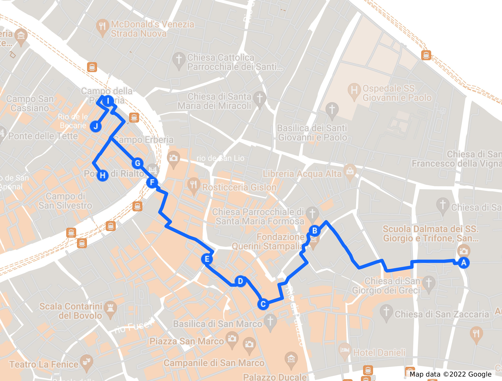

# Hacia Rialto
## Por el corazón económico de la antigua Venecia

> "Compraré contigo, venderé contigo, hablaré contigo, andaré contigo, y todo
> eso, pero no comeré contigo, beberé contigo, o rezaré contigo. ¿Qué hay de
> nuevo en Rialto?" Shylock en la obra "El mercader de Venecia", de
> Shakespeare.

El eje principal turístico, y también histórico, en Venecia va desde San Marco
hasta Rialto, del poder político al poder económico; aunque en realidad no había
una gran diferencia, porque el dogo presidía sobre lo que era en realidad un
cártel de diferentes empresas semi-estatales, sí es cierto que las transacciones
comerciales y las noticias sobre las mismas no podían tener lugar en el palacio
ducal, así que el eje se desplazó hacia Rialto. Seguiremos, más o menos, ese
camino en este paseo, que comienza muy cerca de San Marco.

No solamente es el pequeño tour dentro del gran tour, ese camino tuvo su
significación en la historia de Venecia: era el camino de los condenados por
robo, a los que azotaban y que, por tanto, se abrazaban al Gobbo porque era el
final del suplicio.

Y comenzaremos por la Iglesia de San Giorgio degli Schiavoni, también una *Scuola*
o gremio, y precisamente de los dálmatas o Schiavoni, que eran, entre otras
cosas, los soldados de la república. La iglesia es interesante, pero sobre todo
es interesante ver cómo la cultura de esas colonias influenciaba a la metrópoli,
que fue el primer crisol cultural, quizás la clave de su longevidad y éxito.

Ya hemos hablado sobre el puente de Rialto. Realmente, el puente en si, es un sitio tan lleno de
gente haciéndose selfies (habitualmente, para evitar aglomeraciones, ver el
capítulo sobre cuando visitar Venecia) que no merece mucho la pena pararse en él, salvo para
tener una panorama de dos ramos del Gran Canal, el que va hacia San Marco y el
que va en dirección contraria. Se puede tener una buena perspectiva desde el
vaporetto: el que llega del aeropuerto pasa por debajo, y hay otras muchas
líneas que también lo hacen. La mejor forma de ver un puente es siempre pasar
por debajo, no por encima. Otra opción es subir a la terraza del Fondaco de
Tedeschi, donde además tendrás una bonito panorama de toda Venecia. Eso sí, no
es de estos de "voy a acercarme a ver si me cuelo". Aunque la entrada es
gratuita, hay que reservar hora en la página web. Así que planéalo, como muchas
otras cosas en Venecia, de antemano.

Pero muy cerca encontraremos cosas como la cabeza
de Oro, un símbolo de una antigua farmacia, llamada precisamente "Alla Testa d'Oro", establecimientos que dieron a
Venecia su fama y que atrajeron a todo tipo de alquimistas y otros
engañabobos. Las farmacias, bien provistas por especias que llegaban de Oriente,
nada menos, tenían la receta para crear la llamada Teriaca, un bálsamo de
Fierabrás que era capaz de curar todas las dolencias. En su receta incluía
veneno de serpiente y alguna parte jugosa de un escorpión, y sólo se podía hacer
una vez al año, previa exposición al público de los ingredientes y bajo la
supervisión de la Serenísima. Un poco como las recetas de hoy en día, que llevan
siempre los ingredientes y tienen que tener la aprobación de sanidad. Hasta en
eso estaban bien avanzados los venecianos.

--
Los primeros pobladores de Venecia llegaron a Rialto; el nombre, inicialmente
*rivus altus*, significa canal profundo; está justamente en un recodo del Gran
Canal, lo que lo convierte en una zona fácil de defender para sus primeros
pobladores llegados de las barras de arena, los *lidi* que separan la laguna del
Adriático.

Rialto es, por tanto, más que un puente; el puente se llama así por la zona, no
al revés; se extendería desde la parte norte del puente hasta la zona del
mercado del pescado, englobando la iglesia de San Giacomo. Ya hemos visto que
aquí acababan, en el camino de la vergüenza, los condenados por robo, abrazados
al Gobbo.

> Voy a ahorraros el chiste de que la condena la leía una persona con acento
francés.

Pero, de estos orígenes, Rialto acabó convirtiéndose en un mito, una palabra
genérica que aludía al sitio donde iba el pueblo a entretenerse... Y por esa
razón lo vemos como nombre de múltiples cines, varios de ellos en España; una
costumbre que comenzó con un cine Rialto que se inauguró en el mismo Hollywood a
principios del siglo XX. De ahí pasó a otras ciudades americanas, y finalmente
un granadino creó el cine Rialto en Madrid antes de la guerra. Todavía funciona
como teatro. Y esto encaja con el concepto de Rialto en Venecia: el gobierno
estaba en la piazza, pero la gente iba a Rialto a ver que se cocía y a
entretenerse; ahí se leían los bandos o se ponían (en la columna del "jorobado",
el Gobbo). Hoy en día hay todo tipo de establecimientos que se llaman Rialto:
confiterías, restaurantes, hoteles y, por supuesto, pizzerías. Igual el nombre
transmite cierto *glamour*, que, *in situ*, se limita a alguna joyería y al
Fondaco dei Tedeschi, lleno de tiendas de lujo, muy cerca.

Porque el Gobbo, al que hemos mencionado al principio del capítulo, soporta un pedestal, desde donde se
leían edictos, condenas, y que hizo de esta plaza un foro público.

"¿Qué hay de nuevo en el Rialto?" se convirtió en una frase hecha, y de hecho es
el título de una novela que coloca al joven Shakespeare como agente del gobierno
en Venecia. Lo que no es muy exacto históricamente, no sólo porque no se conoce
que Shakespeare hubiera estado nunca en Italia, sino porque, de hecho, los
primeros agentes secretos, sí, eso también, ¡los creó Venecia! Agentes como un
servicio de inteligencia centralizado, cuya información se filtraba y se llevaba
a la sección burocrática que pudiera actual al respecto; el mismo título, "What
news on the Rialto", tiene un artículo de Ioanna Ioannou que habla,
precisamente, de ese servicio y sus implicaciones en la política local y
mundial. Servicios que tuvieron su papel en la conjura de Bedmar de la que
hablamos en el capítulo de Cannaregio.

> Si quieres, échale un vistazo ahora mismo. Yo te espero por aquí.

---

El comienzo del mercado del arte tiene lugar, dónde si no, en Venecia también. 
