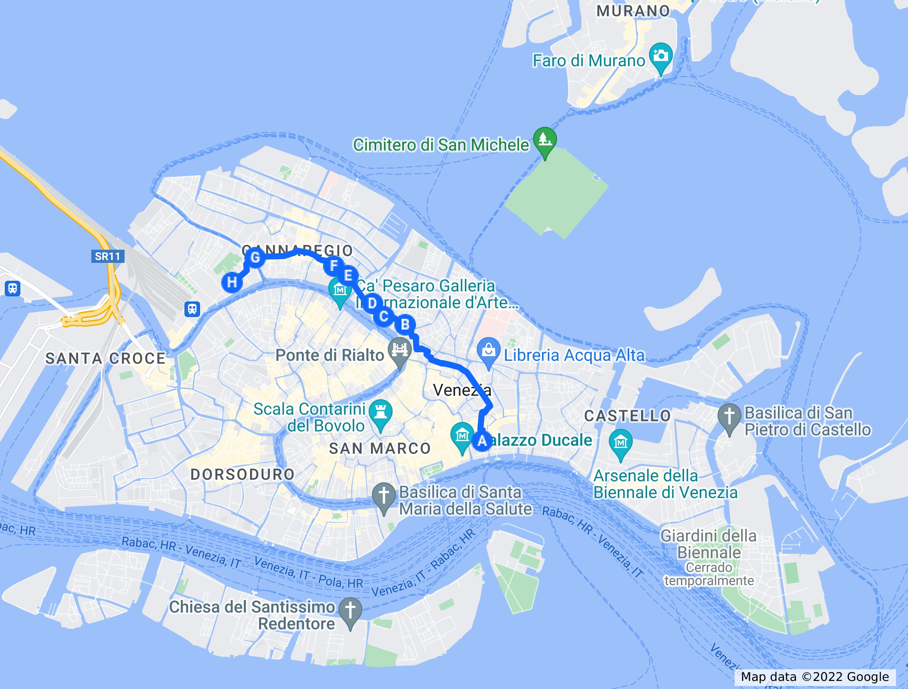

# Por Cannaregio
## Ghettos y conjuras granadinas

Todo viaje tiene un final. Y ¿por qué no aprovecharlo para visitar
alguna parte que haya quedado de lado? Así que vamos a hacer un viaje
por Cannaregio, la parte de Venecia que tiene más huellas
españolas... Y alguna que otra historia curiosa.

Cannaregio es el lomo del pez, cerca de la espina; esa parte pega a la
laguna, y es donde vamos a encontrar más huellas de la modernidad,
bloques de pisos, incluso el hospital. En una ciudad como esta, que
tiende a parque temático, es curioso que lo más auténtico, entendiendo
como tal donde desarrollan su vida las personas que viven en la
ciudad, es lo más moderno. Pero el turista sólo entrevé esa parte
desde el vaporetto o cuando viene de Murano.

También se puede ver, sin más remedio, cuando vas desde San Marco a la
estación del tren. La presencia, al final o al principio, de esa
estación, ancla este paseo a la realidad, a la autenticidad. También,
por supuesto, a las trampas turísticas más destacadas. Aún así, es
Venecia, y hay muchas cosas que ver.

Cuando se inauguró la estación ferroviaria de Santa Lucia, poco
después de la independencia de Italia, había que buscar una forma de
que los pasajeros llegaran fácilmente desde la misma hasta los dos
centros gravitatorios de Venecia: Rialto y San Marco. Por supuesto,
estaban los vaporettos, pero estos no tienen ancho de banda suficiente
para que se llegue de forma cómoda al centro; hay que proporcionar
caminos alternativos, y de ahí salió este.

Vamos a salir, por tanto, de algún punto del entorno del palacio
ducal; el indicado está simplemente cerca de donde nos alojamos en
esta última ocasión, *calle* delle Rasse, supongo que de los rasos. Un
camino relativamente directo es tomar Mercerie; el problema es que esa
calle, una de las más comerciales, está habitualmente repleta de gente
y no es cuestión de ir con las maletas por ahí. Así que vamos a tomar
unos pocos callejones. Si da la casualidad de que se va por la tarde,
a la izquierda está el Bra's Cocktail Bar, que tiene el techo decorado
con cientos de sujetadores, haciendo honor a su nombre; "Bra"
significa sujetador en inglés. Es posible que no quisieran complicarse
demasiado con el nombre, hacer referencia al pasado procaz y
sicalíptico de Venecia... O quizás hagan referencia a la piazza Bra,
una de las plazas principales de Verona, cuyo nombre viene a
significar simplemente *largo* o pequeña plaza. De hecho, la plaza
donde se encuentra no es demasiado grande; pero en ella merece la pena
acercarse a *Magna Bevi Tassi*: "Come, bebe y cállate" en veneciano,
un local de *cicchetti*, con cervezas artesanas, donde puedes tomarte
un Select Spritz (versión veneciana del Aperol Spritz) y probar unas
tapas a buen precio, mientras charlas tranquilamente con los
propietarios, que hablan una mezcla español-veneciano que es
totalmente comprensible.

> En general, cuando intentas dirigirte en tu italiano intermedio a
> alguien en Venecia, casi siempre te tratarán de contestar en
> español, especialmente si es del gremio de hostelería. O igual se trata en
> realidad de veneciano, o de un subconjunto que abarque a los dos idiomas. La
> experiencia es bastante interesante, y desde luego nada práctica para
> prepararte el B1 de italiano.

Una buena oportunidad, que no te faltarán, de probar esta bebida que,
sí, tiene origen veneciano; en inglés se le llama *Italian Spritz* y
el Aperol es sólo la versión más conocida, o la que tiene más
publicidad. En general, se trata de mezclar alguna bebida amarga, tipo
vermú, con vino blanco, prosecco (a veces lo he visto con sidra en vez
de esto), y gaseosa o sifón. Es fácil de identificar, al menos el de
Aperol, por el color butano, el tipo de copa característica y la
pajita, para que emborrache más.

> A mi no me gusta una pizca, pero si te va el Bitter Kas o el
> Martini, igual te mola.

El origen es precisamente el contrario: las tropas austríacas que
ocupaban Venecia y el Norte de Italia en la primera mitad del siglo
XIX no eran muy amigas de los vinos locales, bastante fuertes, así que
los rebajaban con sifón o agua con gas; *spritzen*, en alemán,
significa precisamente eso, añadir agua con gas

> Si no te van las bebidas alcohólicas, prueba a pedir en Alemania o
> Austria *gespritzter apfelsaft*, zumo de manzana con agua con
> gas. Muy rico, sólo un poco dulce.

En casi todo el resto de Italia, habrá solo Aperol; en Venecia, sin
embargo, habrá varios vermús. Y ya que estás, pídete el Select, que es
el del lugar, y que no podrás tomar en ningún otro lado. El Aperol es
de Padua, y entre los dos crearon este cóctel que llegaría a España
por el 2020 o así. Aquí no viene ya embotellado, sino que te lo hacen
sobre la marcha. Mucho más rico, para el que le guste eso, claro.

---

A lo largo del mismo, muchos *nizioleti* nos dirigen a correos, a la
*ferrovia*, y a San Marco y Rialto. Estos *nizioleti* son carteles pintados directamente sobre la superficie de la pared, en fondo blanco o amarillo con una simple línea negra de borde; son exactamente iguales que los que anuncian las calles, y a veces se sitúan en sus cercanías.

Lo que es curioso no es que haya tantos, sino que se hayan mantenido. Y también
su veteranía: llevan ahí siglos. Incluso el mismo nombre, *nizioleti* (o
*nisioleti*), es una palabra véneta que no existe en italiano. Pero el origen
exacto de los carteles debe haberse perdido en la noche de los tiempos, porque
no he conseguido averiguar cuando se crearon; cabe imaginar que los que dirigen
a la *ferrovia* (la estación del tren) o al *piazzale* Roma son, al menos, del
siglo pasado. Te animo a abandonar Google Maps, porque total, no te va a servir
de mucho en Venecia, y seguir estos indicadores hacia Rialto, o hacia
Correos. Que ya no está ahí, pero donde estaba, hay ahora un centro comercial
desde cuya terraza hay unas vistas estupendas; es precisamente el Fondaco dei
Tedeschi, en cuyo muro todavía hay algún buzón atestiguando ese pasado postal.

> Si quieres subir a la terraza, tendrás que reservarlo con antelación, al menos
> en tiempos de Covid. Es posible que ya esté totalmente abierto. Yo no lo
> logré...

Lo curioso de estos nizioleti es que han inspirado la aparición de otros muchos
que dirigen hacia monumentos, hacia los servicios más cercanos (también cerrados
en 2022 y 2021), algunos museos sin mucho éxito... Y, los más curiosos, los que
se encuentran en el suelo, una señalética en mosaicos creados con pequeñas
piedras de colores, que tras muchos años, se conservan exactamente igual. En la
Lista di Spagna hay decenas, dirigiéndose tanto hacia *alberghi* diversos, y
también hacia el casino *oficial* de Venecia. También algún *night club* y
similar. Esa calle que dirige desde la estación del tren hacia Rialto y San
Marco tenemos, sólo mirando al suelo, todo lo que un turista de un sólo día
podría desear. Y alguna cosa más que quizás no desees.

---

La palabra gueto, originalmente *ghèto* en veneciano, si no el concepto, se creó
originalmente en Venecia. Acogiendo a judíos que venían huyendo de *pogroms* en
otros lados de Europa, incluyendo España, acabaron en Venecia, que al no casarse
con nadie, acogía a todo el mundo, con el objetivo de que acabaran trabajando y
beneficiando a la república. En esta zona hay tanto sinagogas alemanas como
españolas, porque en la época medieval, el hebreo era solo un lenguaje
litúrgico, y cada uno hablaba versiones del idioma donde del país donde se
encontraban; el sefardí o ladino o judeo español, por ejemplo, parece castellano
medieval, y es una delicia de escuchar.

--

Pasamos por el Rio Terà Lista di Spagna, que es la calle por la que hay que pasar
casi obligatoriamente si llegas a la estación del tren andando desde Rialto o
desde San Marco; por tanto, calle obligatoriamente turística, llenas de hoteles
y hostales con calificación baja en Google, pero ¿sabes por qué se llama así? La
*lista* era una especie de cercado que marcaba la extraterritorialidad de una
zona. Y aquí, aunque habría que ver exactamente dónde, porque al ser un Rio
Terà, es decir, enterrado, por aquí pasaba un canal en su época, estaba la
embajada de España ante la república.

Posiblemente también otras embajadas. La república, sobre todo en sus últimos
siglos, estaba obsesionada con la seguridad y quería mantener a los embajadores
lo más lejos posible del palacio ducal. Aquí, en el llamado apropiadamente
Palazzo di Spagna, previamente Palazzo Friziero o Frigeri, porque pertenecía a
esa familia, y en el número 168, estaba la embajada.

Fui incapaz, sin embargo, de identificar nada que pudiera aparecer una embajada
del siglo XVII en la calle, a pesar de fotografiar varios candidatos. Y no he
sido capaz ni de encontrar el número 168 en Google ni en Apple Maps ni de encontrar ninguna
imagen que tenga ese tipo de etiqueta. Así que, lector o lectora, si estás en
Venecia con este libro (o lo que sea) en tus manos, acércate al número 168,
hazle una buena foto, y etiquétalo correctamente, para que las generaciones
venideras sepan donde comenzó, redoble de tambores, la Conjura de Bedmar.

> De hecho, parece que fue la embajada española *después* de la conjura de
> Bedmar, al final del siglo XVII. Según Curiosità Veneziane el marqués de
> Bedmar vivía en la llamada Ca' del Duca, justo en el Gran Canal, un poco
> después del puente de la Accademia, a la derecha (saliendo desde San
> Marcos). Como por ahí no pasa ningún paseo, meto aquí lo de la conspiración,
> hala. O sea, en realidad no comenzó allí, pero es el único punto identificable
> y nombrable como embajada de España.

La conjura de España, o de Bedmar, merecería un capítulo aparte. Heredera de la
tradición bizantina y hasta otomana, es una historia en la que aparecen como
personajes los llamados uscoques o piratas de la costa de Croacia, el duque de
Osuna y hasta Quevedo. Os animo a que la leáis en algún sitio, porque es muy
curiosa. Pero la principal historia que afecta al paseo, y a este en particular,
es que Venecia descubrió (o se inventó) esa "conspiración" debido a que era un
estado totalitario con sus súbditos y liberal con los extranjeros ya en esa
época de declive, y había creado un servicio secreto al servicio del Dogo, de
hecho el primer servicio secreto "oficial" creado en el mundo occidental; hasta
ese momento los diferentes estado, nobles e iglesias habían contado con algún
espía o aventurero al servicio de algún señor, rey o familia, pero no una
burocracia estatal y un servicio de
información centralizado como el que se creó en Venecia. La segunda idea es que,
a causa de esa mentalidad conspiranoica, las embajadas, incluyendo la de España,
se trataron de apartar lo más posible del palacio Ducal, y también reunir para
poder ser controladas mejor y con un número inferior de agentes. De ahí esa
calle, ese nombre, y la embajada de España si es que la lográis encontrar.

> Hay alguna otra *lista* en el callejero: Lista Vechia di Bari, que al parecer
> correspondía a la embajada austríaca. De hecho, está justo al otro lado del
> gran Canal, o sea, más o menos a la misma distancia del "centro".

---

Cannaregio es un lugar donde puedes entrar en contacto con la Venecia real. Es
decir, la Venecia donde todavía vive gente, va a comprar con una cesta de la
compra (porque los carritos, en esos puentes con escaleras, pueden ser un poco
complicados),y se para en las esquelas para mirar quién se ha muerto y de qué
familia es.

Igual hay que explicar qué es eso de la esquela, porque en este mundo moderno el
90% puede que no la haya visto nunca; quizás tampoco se usan en ciudades
grandes. Pero en pueblos pequeños, en mi pueblo, Úbeda, era uno de los servicios
que ofrecía la funeraria, es decir, la empresa de servicios funerarios que
había por allí: un folio con un borde en negro, y una cruz y a veces una foto del finado (aunque
cualquier parecido con el finado/a en el momento de la muerte era pura
coincidencia, porque igual ponían la foto de cuando estuvo en la mili o la
última foto de la renovación del DNI, 20 años antes) junto con la lista de los
deudos y cualquier otra persona que pasaba por allí. También el mote o mal
nombre, porque si no nadie sabía quién se había muerto. José Martínez Fernández
"Ciribulle" era mucho más informativo que el nombre normal. Estos folios se
pegaban por vallas, columnas diversas, y también puertas de comercios, y por
supuesto en la puerta de la iglesia donde se celebraba el funeral. Los más
tradicionales de la casa también publicaban las esquelas en los periódicos
locales.

> Y acabo de ver que hay páginas web que se dedican exclusivamente a publicar
> esquelas, lo que no deja de tener cierta guasa.

Bueno, pues eso mismo se ve en Venecia, en la Venecia milenaria, pegados a la
pared, al lado de anuncios de actuaciones folclóricas y de pasquines
políticos. Y la gente, con su bolsa de la compra, se para y mira a ver de quién
se trata, y si algún vecino más lo hace, comparan pareceres y frases como "Se
está muriendo gente que no se había muerto nunca antes" o "En lo que nos estamos
quedando" o "Que tanta gloria encuentre como descanso deja". En veneciano o
italiano, que estoy seguro que no es tan diferente del román paladino.

---

La estación de Santa Lucia es también parte de esa Venecia real: casi todos los
tenderos, camareros, taquilleros e incluso gondoleros que verás en tu visita
vivirán en Mestre, y tendrán que tomar ese tren todos los días para llegar a su
trabajo. De Mestre la separa sólo un puente, el puente della Libertà. Y también
refleja la historia real de Venecia: se inició en el periodo fascista, aunque se
terminó después de la guerra mundial; el estilo racionalista refleja los gustos
de la época. También le habría gustado a los futuristas, que decían que las
estaciones de tren y las pistas de carreras eran la verdadera arquitectura del
siglo, y abjuraban siempre que tenían ocasión de las columnatas y los
arbotantes. Habrían disfrutado del hecho que se tirara una iglesia, la de Santa
Lucia, de la que quedó el nombre y alguna placa. De hecho, el arquitecto que
hizo el proyecto inicial,
Angiolo Mazzoni, era algo así como el arquitecto oficial de este movimiento, el
futurismo, un movimiento italiano, bastante cercano y predecesor del fascismo,
liderado por un pintor y escultor llamado Marinetti. Sin embargo, las obras
fueron realizadas por otro arquitecto, Virgilio Vallot, que ganó el proyecto, y
terminadas finalmente por Paolo Perillo, ya en el año 52. Una estación cuya
construcción duró, al menos, lo que un palazzo en la época renacentista.

No es un sitio desagradable, si bien es un tanto anónimo. No se diferencia
demasiado de la estación de Florencia, que también es de la misma época; sin
embargo, no es suya, aunque se presentó al proyecto y quedó segundo.
