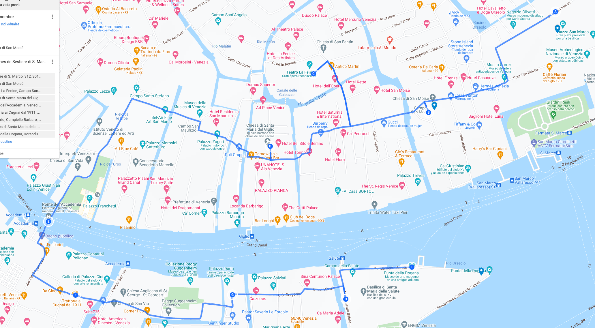

# Desde la Calle Larga a la Punta de la Dogana

__*Desde el shopping de lujo al número uno del sestiere Dorsoduro*__

> "Cada vez que describo una ciudad digo algo de Venecia", Marco Polo como
> personaje de "Las ciudades invisibles", de Italo Calvino.

Vamos a dar un paseo que sale de San Marco y pasa por puentes, el Gran Canal, y uno
de los lugares con las vistas más bonitas de Venecia. Todo ello es casi
inevitable, sin importar mucho por donde andes en Venecia.

Y dos *sestieri*. Por el
camino, trataremos de entender los mecanismos del poder, las aportaciones de
Venecia al arte, qué le tiene que agradecer la libertad de expresión a Venecia y
quizás un poco de su economía.

Partimos de los soportales, y nos colocamos de espaldas a la basílica (sí, tarde
o temprano hay que hacerlo; venga, va, un último vistazo y nos vamos).

Pasados estos soportales, quiero que miréis al suelo. Cuando uno va de turismo,
siempre hay que ir en plan Terminator: derecha, izquierda, arriba, abajo. Vale,
Terminator no miraba arriba y abajo, pero tú sí conviene que lo hagas. Puedes
encontrarte alguna pieza de arte callejero en una cornisa, una pátera bizantina
al lado de una ventana, o, como es el caso, un mosaico con un anuncio de
American Express y Alitalia en el suelo.

> Las piezas de arte callejero en Venecia son realmente raras, porque, como es
> natural, están muy prohibidas. Si tienes suerte, puedes encontrarte un *slap* de
> Blub en algún cajetín eléctrico.

Que seguramente no es lo que te hayas planteado cuando vayas a Venecia. "Sí, voy
a Venecia a ver lo de siempre, ya sabes, anuncios de American Express y
eso". Pero estos anuncios tienen su gracia. Para empezar, llevan ahí desde los
años 60, al menos juzgando por el logo de Alitalia. Pero, lo más importante, es
que son muy venecianos, siguiendo la tradición bizantina del mosaico, pero
también una forma muy veneciana de anunciar cosas: los *nizioleti*.

*Nizioleti* es lo que los venecianos llaman a las placas de las calles, que
tampoco son placas: están pintadas directamente sobre la pared. Y una vez que
había que anunciar algo, se pone con el mismo estilo: por allí se va a Rialto,
por allí a San Marco. Para no desentonar, otros anuncios tuvieron que ponerse en
el suelo. Mirando al suelo encontrarás muchos más anuncios como este: de
hoteles, restaurantes, incluso posiblemente de algún, wait for it, *night
club*. Ya no existen los night clubs, pero eran los antecesores de las
discotecas. Antros de perdición, en general, pero ya hemos dejado claro que
durante mucho tiempo la gente iba a Venecia a perderse precisamente de esa
forma, y no tratando de perderse encontrando los sitios donde perderse. Por eso
estaban anunciados. Todo estaba pensado.

Mientras que hasta el momento nos habíamos movido por islas,
cementerios, piazzas y piazzetas, estamos llegando por primera vez a
una calle. En "El lenguaje de las ciudades", Deyan Sudjic, en el
capítulo dedicado a las calles, dice que sus nombres son una
declaración de intenciones políticas. Y en este caso, las intenciones
parecen ser mostrar la permanencia de la ciudad, y la relevancia de su
historia. Italia tiene una visión, posiblemente sana, de la historia,
como una serie de capas que definen la personalidad de una zona, o de
su gente, pero no una causa de enfrentamiento entre los
ciudadanos. Por eso le dan calles tanto a emperatrices austrohúngaras,
como a personas que pusieron bombas a los mismos, y los monumentos
pueden recibir nombres de potencias coloniales de su época, de santos
o de revolucionarios.

Por su propia naturaleza, Venecia cambia poco. No tuvo, como la
mayoría de las ciudades en el mundo, que adaptarse a carruajes,
tranvías y más adelante el automóvil. El caballo ya se prohibió en la
edad Media (y eso dio lugar a un tipo específico de calle, que veremos
más adelante), y a partir de ahí nada cambió. Las calles reflejan el
nombre de un palacio, de una iglesia, de un gremio, o de algún hecho
curioso que sucedieran en ellas y contaran los cronicones de la
ciudad. Por eso el libro "Curiosità Veneziane", editado a principios
del siglo XIX, sigue siendo una fuente esencial para entender la
ciudad; un catálogo exhaustivo de las calles, y de la denominación que
reciben.

Por ejemplo, ahora estamos en el inicio de una calle, la Calle
Larga por antonomasia, que en realidad se llama la Calle Larga de la
Ascension.  Calle Larga viene a ser calle Ancha, más o menos; las
largas se llaman “lunghe”. Las calles en Venecia se llaman, sorpresa,
*calle*. Que viene, como en español, del latín “calle”, pero es que en
toda Italia a las calles se les llama *strada*, *via* o cosas
similares.

> En realidad, lo de tener nombres locales para las calles se estila mucho en
> Italia; he visto *stradone*, *contra* (en Palmanova) y alguna
> más. Pero, en general, *via*, *strada* y poco más es lo habitual.

 Y de ella "Curiosità Veneziane" cuenta dos cosas. Primero, por qué se llama
así: una antigua iglesia que se tiró para hacerla; esto es bastante común,
primero porque había bastantes iglesias, y segundo porque de esa forma se
preservan los nombres antiguos de los lugares. Esta era una iglesia eregida por
los templarios inicialmente, luego reconstruida en el siglo XVI por y
eventualmente destruida en el siglo XIX para construir, en parte, el ala
napoleónica; esta iglesia estaba pegada a la de San Geminiano, que también fue
destruida. No parece que la iglesia fuera especialmente notable; su principal
legado parece ser el nombre de la calle; se la recuerda en palabras de un noble
por ser el sitio donde estos iban a implorar algún carguillo, al estar cerca de
las *Procuratie* y del palacio de los Dogos. Según salimos de la plaza, esta
iglesia estaría justo donde ahora está a calle, a la izquierda, en la parte más
cercana al gran Canal.

Pero segundo, explica la importancia de la
Ascensión en el mito fundacional de Venecia. Ese día se produjo lo que
le llamaron “esponsales con el mar”, que fue en esencia el dogo, a
principios del segundo milenio, tirando un anillo bendecido por el
obispo al mar desde el *bucintoro*, una barca dorada ceremonial, que
se cargó Napoleón a conciencia. Se trataba de celebrar la conquista de
Istria, donde están las canteras de las que proceden todas las piedras
que se usan en todos lados, así que las secuelas de ese hecho la vamos
a ver continuamente en toda Venecia.

Bueno, pues todo eso ocurrió el día de la Ascensión, o *Sensa*. Así
que, tras dejar de celebrarse a la caída de la república, hoy en día
se celebra de nuevo, con menos boato, con menos bucintoros (antes
había uno, ahora ninguno), pero con más guasa, cachondeo y
turistas. Tiene sentido, por tanto, que una calle, y además importante
porque es ancha, reciba ese nombre.

Esta esquina es curiosa, porque tiene bastantes ejemplos de las
denominaciones que se encuentran en Venecia

> Y acabamos de salir de una de las que *no* hay: *piazza*, que sólo
> está la de San Marco.

Desde este punto, donde verás las tiendas de Gucci y otras marcas de lujo, sale
una *salizzada*, es decir, esencialmente una calle pavimentada.

El por qué le llamaban así a unas calles, que hoy en día están todas
pavimentadas, viene de que las denominaciones, y los nombres de las calles, se
pusieron en Venecia en tiempos inmemoriales. En el libro mencionado
anteriormente, “Curiosità veneziane”, podrás ver casi todas las calles que
existen en Venecia hoy en día con idéntico nombre, con una página y pico
dedicada a cada una de ellas.

> Más adelante, en la misma calle, hay un *sotoportego*, o soportal. También
> tienen nombre para eso.

Pero antes de llegar a la *salizada* o *salizzada* San Moisè, tenemos que cruzar
la calle Larga de la Ascensión, una calle tan moderna como el ala napoleónica, y
que no tiene salida. Así que procedamos al área de *shopping*: Por la parte de
la Calle Larga de la que estamos hablando hay múltiples tiendas de todo tipo,
galerías de arte, y también bares y restaurantes. En uno de ellos vi un cartel
que venía a decir, parafraseando, “No pidan aquí pizza ni pasta ni nada de
comida de turistas. Aquí sólo hay auténtica comida veneciana”. Porque,
recuerden, Venecia fue un estado que, cuando desapareció, había subsistido
durante muchos más años que cualquier otro estado de la península (si
exceptuamos, quizá, el Vaticano, que al fin y al cabo es un estado); por eso,
culturalmente tiene unas diferencias claras, empezando por el idioma, y eso
influye en la gastronomía.

Eso no quita que en pizzerías tales como Lala Pizza, en el interior del mercado
de Tallin, aparezca entre las típicas imágenes de Italia una ilustración de un
gondolero con una cúpula indistinta detrás, por un canal que parece
excesivamente estrecho. El turista actual, con poco criterio, iguala Italia con
esas comidas (que es cierto que se extienden de una punta a otra de la bota
itálica) pero que poco tienen que ver con la comida tradicional veneciana,
basada en el pescado, la carne que traían de *terraferma*, y esos *cicchetti* o
pequeñas tapas, pedidas individualmente, que merece verdaderamente la pena
probar.

Los propietarios del restaurante pueden parecer un poco bordes, pero el carácter
de estos posaderos venecianos aparece reflejado en las novelas de Donna Leon,
donde uno de los sitios donde va a comer el comisario no admite elegir la
comida, sino que pone exactamente lo que le da la gana. También te pueden
contestar con un poco de displicencia si preguntas qué tipos de cerveza tienen;
como a mi en Ai Cugnai, un sitio excelente, por otro lado, te pueden decir que
son un restaurante y que por tanto sirven vino con la comida; implicando que
tienen cerveza por si alguien se pone un poco caprichoso, pero debe ser algo así
como el que aquí en España se pide Coca Cola con el chuletón.

> Por otro lado, y esto lo comparten con toda Italia, el capuccino es
> para el desayuno *e basta*.

De los que yo he probado, el *fegato* que es hígado encebollado no
está malo. Pero la *polenta al nero de sepia*, yo qué sé, será para
quien le guste la polenta y la tinta de sepia, pero yo no voy a volver
a probarla. El protocolo para disfrutar la comida local en todo caso
es para mi siempre el mismo: pido lo que no entiendo o lo que no he
probado nunca.

> Si no tiene ni alcachofas ni alguna variedad de coliflor, por mi bien.

En cualquier caso, puedes comer y cenar fuera todos los días en
Venecia sin probar ninguna comida italiana para turistas. Hay
excelentes tabernas y restaurantes; sólo es cuestión de buscarlos. O
pedir variedades más locales, como pasta al *frutti di mare* o pizza
con marisco.

> Lala Pizza en Tallin tiene unas pizzas excelentes, por cierto. Muy
> artesanales, y hechas con cariño. Muy aconsejables.

Por esa calle, acabamos por llegar a San Moisè, una de las iglesias más
interesantes de Venecia, que terminó en 2022 un largo proceso de restauración.

Entre otras cosas, en ella está enterrado John Law, un economista o
estafador escocés, según se mire, que murió en Venecia en la
miseria. A él se debe la llamada "burbuja del Mississippi", un esquema
piramidal que consistía en la venta de acciones de la "Compañía del
Mississippi", un monopolio del comercio de los territorios franceses
en Norteamérica.

> Territorios que pasaron de los franceses a los españoles, pero esa es otra
> historia.

Pero no había dinero para comprarlas, así que el mismo Law era gerente
del banco central de Francia, que empezó a emitir papel moneda,
generando hiperinflación y un desastre general para el país. No duró
mucho en ningún puesto, y tuvo que emigrar de Francia, como es
natural.

Una vez destituido, se ve que estaba enganchado al tema del juego, porque acabó
en Venecia para poder recuperar parte del dinero, o perderlo, lo que sucediera
antes, en los *casini* que ya funcionaban allí; el *ridotto* de San Moisè, el
primero que se creó, precisamente, estaba muy cerca de esta iglesia.

> Un *ridotto* celebrado por Casanova, y representado por Guardi en uno de sus
cuadros. Estaba en el palacio Dandolo "à San Moisè", que creo que debería estar
en la que ahora se llama calle Ridotto, a las espaldas de San Moisè, comenzando
en la esquina donde está Luis Vuitton.

Allí murió
y tuvo lo suficiente para que lo enterraran en la iglesia de San Gimignano, que
se derribó para construir el ala napoleónica de la piazza San Marco. Todas las
tumbas que allí había fueron trasladas a San Moisè, así que por eso podemos ver
aquí su tumba, o más bien una placa, en una de los cuadrados blancos
del suelo, donde, en latín, se habla de "Joannis Law".

> Con un poco de suerte, claro. Yo traté de encontrarla y fui incapaz
> en mi última visita; pero también andaba buscando una placa o losa y
> no una simple baldosa en el suelo.

Como muchas otras iglesias, se construyó por iniciativa privada; y el
usar un "gran nombre" como el del profeta Moisés no corresponde a una
búsqueda de legitimidad del poder, sino simplemente a que la persona
que mandó su construcción se llamaba de esa forma, Moisè Valier. Pero
la fachada es del siglo XVII, y el barroco se nota; el contraste con
el funcional hotel Bauer, que hace esquina con él, es considerable.

Si avanzamos por la Calle Larga y torcemos al final a la izquierda, nos
encontraremos con una preciosa tienda de decoración con todo tipo de telas,
cojines, ropa, bolsos y complementos. La tienda Fortuny.

En Granada, Fortuny evoca inmediatamente a las “papas Fortuny”, un establecimiento
llamado así porque se encuentra en la plaza Fortuny; y la plaza se llama así por
Mariano Fortuny, el padre del fundador de la empresa cuyos artículos se exponen
en esta tienda. Mariano Fortuny padre era de Reus, pero Mariano Fortuny hijo era
granadino de pura cepa; uno más de la estirpe de personas que unen a Granada con
Venecia y que empezó con el embajador veneciano ante el reino nazarí, de nombre
desconocido, y que siguió con el infausto marqués de Bedmar.

Este Fortuny que nos ocupa acabó siendo más veneciano que granadino, y de hecho
murió aquí, aunque lo enterraron en Roma: inspirado por las imágenes clásicas y
los estilos orientales que tanto gustaron a su padre, creó una serie de
vestidos, estampados y telas que, tras su muerte, han seguido teniendo un nombre
propio en la escena veneciana. Fortuny pintó para las óperas italianas,
participó con cuadros en la Bienal, y si tienes buen gusto, sitio en la maleta y
una tarjeta de crédito con un límite alto o inexistente, entra a la tienda y
adquiere algún objeto, que seguro que te dice más de Venecia que un imán para la
nevera. Pero te compras también el imán para la nevera, claro, más tarde.

Pero granadino lo es, y Granada lo ha olvidado como olvida a tantos que no
entran dentro de un modelo de ciudad ensimismada en sus a veces rancias
tradiciones, algunas de las cuales, como las de las flores a la Virgen de las
Angustias, no sólo tienen unas decenas de años, sino que además son imitación de
otros lugares (Zaragoza, o Valencia). Donde un capataz de cofradía, una pianista
y un director de periódico desconocidos fuera de su estrecho círculo tienen su
propia calle, y donde granadinos que fueron un don para la Humanidad son
olvidados, desconocidos, y si se da el caso, despreciados. Por si
fuera poco, nosotros dedicaremos también espacio a Fortuny en el
capítulo dedicado a España y los españoles en Venecia, cuando
visitaremos su palacio.

Pero por lo pronto continuamos, dejando a la izquierda el ubicuo
Giobagnara, con tiendas por toda Venecia y dos de ellas en San Marco;
una tienda de artículos de diseño italiano. En la tienda de la
*piazzetta degli Leoni*, las patas de las mesas tienen unas botas altas
de agua calzadas; un toque de humor que posiblemente tiene una clara
función utilitaria, porque esta zona es la que está a menor altura y,
por tanto, tiene cierta tendencia a inundarse.

Llegaremos a un *campo* abierto al Gran Canal, y veremos a la
izquierda Santa María del Giglio. Lo que nos
interesa en esta iglesia está en la fachada: bajorrelieves con el
plano de diferentes fortalezas venecianas, dominios de ultramar,
algunos ya difícilmente reconocibles. Zara, como la tienda, es ahora
Zadar, en Croacia, y Candia es Heraklion, la capital de la isla griega
de Creta. Pero es interesante, y te da una idea de cómo planteaban los
venecianos la defensa de una plaza fuerte; de hecho, las fortalezas
venecianas son también patrimonio de la Humanidad, y muy interesantes.

> Si tienes un día libre en Venecia (pista: no lo vas a tener) puedes
> acercarte a Palmanova, que no está muy lejos. Es la que ha
> conservado la forma de fortaleza veneciana más claramente, con unos
> baluartes sin puntos ciegos que nunca, en realidad, vieron combate.

Si paseas por el mundo, por ejemplo, vienes a Narva, en el extremo
oriental de Estonia, pegando (literalmente) a Rusia, te encontrarás un
castillo que originalmente construyeron los daneses, pero que
finalmente se reconstruyó para usar “bastiones del nuevo estilo
italiano”, que era el estilo que se empezó a imponer en las
fortificaciones en el siglo XVI. Este estilo permitía defender unos
muros del castillo desde otro, teniendo proyecciones con diferente
forma, flecha o cilindros. En el diseño de este tipo de fortalezas
defensivas intervinieron todo tipo de ingenieros y artistas:
Michelangelo, por ejemplo, diseñó las de Florencia. Pero un tal Fra
Gioconda diseñó las de Padua, por entonces parte de la república. En
parte se debe a que la península andaba en guerra prácticamente
continua, y muchas de sus ciudades estaban en llanuras y eran
difíciles de defender. Pero esa innovación constructiva acabó
extendiéndose por Europa y llegando, entre otros lugares, a la ciudad
que nos ocupa, Narva, “la perla del Báltico”.

Es un tema totalmente aparte que cuando Venecia comenzó a construir
estas fortificaciones las guerras de asedio estaban llevando a su fin,
posiblemente por la existencia de un enemigo común, los otomanos, o
simplemente porque todas las potencias llevaron a sus excedentes de
aventureros y pendencieros a las colonias americanas, africanas o
asiáticas.

> Y con esto van ya tres ciudades estonias visitadas donde he hallado,
> y sin buscar demasiado, las huellas de Venecia.

También es una iglesia "privada", y también forma parte de Chorus
Venezia, así que se puede visitar tranquilamente. El interior es una
profusión de cuadros, frescos y arte, que cuando nosotros visitamos en
diciembre no tuvimos que compartir más que con el señor que picaba los
billetes. Además, se escuchaba la música navideña que un músico
callejero tocaba en la esquina del ábside, ya en la salida hacia el puente.

El hecho de que la iglesia sea privada se ve también en las estatuas de la
fachada: miembros de la familia que la construyó, con una pequeña mezcla de
*fake news*: la estatua de Antonio Barbaro está vestida con uniforme
militar. Siempre quiso ser capitán general, pero nunca lo consiguió; lo más que
llegó fue a *provveditore generale*). Pero dejó escrito en el testamento en que
legaba el dinero para construir esta fachada que tenían que hacerlo así, y ya
estaba muerto, así que no había nadie para llevarle la contraria.

> Estas iglesias privadas con estatuas a la mayor gloria de alguna persona que
> las había financiado son muy características de Venecia. El mismo San Moisè
> mencionado anteriormente tiene unos bustos de los hermanos Fini, que la habían
> financiado; también San Zulian tiene a la efigie sentada de Tommaso
> Rangone. John Ruskin, escritor inglés de la época victoriana, las llamaba
> "manifestaciones de ateísmo insolente".

Pasando Santa Maria del Giglio, cruzamos un rincón con mucho encanto y el puente
correspondiente, *ponte* Barbarigo; una esquina donde a veces hay músicos
tocando, y también *slaps* de arte callejero. Y da a un canal, y hay góndolas
paradas debajo del puente. Merece la pena pararse un rato, sobre todo si es por
la mañana temprano, cuando las hordas de *shoppers* y expediciones hacia el
puente de la Accademia todavía no han aparecido.

Desde ahí, nos podemos acercar al Campo de Sant'Angelo, que es uno de los más
grandes de Venecia, aunque justo al lado, el de Santo Stefano no debe de andarle
muy a la zaga.

En uno de los laterales, la calle de curioso nombre *Va in Campo* viene a decir
que es la calle que lleva a esa plaza, porque recordemos, no hay más
*piazza* que San Marco. Deyan Sudjic, en "El lenguaje de las
ciudades", dice que "los nombres de las calles son una declaración de
intenciones políticas, así como una herramienta para la orientación".

Qué mejor que indicar, en una calle determinada, a dónde va a
parar. Para qué hace falta decir nada más. El callejero veneciano abunda en
estas toponimias: *calle Va al Ponte dei Escudi*, o incluso simplemente "Calle
Traghetto", porque desembocan en el lugar donde se toma, o se tomaba, el
*traghetto* para cruzar el Canal.

Eso podría convertir al Campo de Sant'Angelo en el *campo*, o plaza, por
excelencia. También puede ser que sea lo contrario, que indique que va al otro
campo, el de San Stefano. En esa plaza se celebraban espectáculos de caza de
toros y otros eventos, así que al veneciano medio igual le venía bien que se lo
indicaran. Qué sitio va a ser el "campo" por antonomasia, lo que viene siendo
una plaza, más que la plaza de toros, ¿no? Las *caccia dei tori* sucedían en
toda Venecia; principalmente en San Polo, pero también, en ocasiones especiales,
en la *piazza*. Pero San Stefano fue, precisamente, donde terminó el toreo allí:
en 1802 se vino abajo una grada delante del palacio Morosini, lo que fue una
perfecta excusa para que se prohibieran por parte de las fuerzas de ocupación
austríacas y que nunca más volvieran a suceder.

Si el toreo, de por sí, ya es cafre, la versión veneciana era todavía más. Los
que cazaban al toro eran mastines junto con personas que, con lanzas, lo
alanceaban hasta que perecía. Venecia fue el último lugar de Italia donde se
llevaron a cabo: el concilio de Trento las prohibió a finales del siglo XV, y
desde entonces o dejaron de hacerse en Siena, donde tenían bastante fama y sobre
todo eran populares, y en Roma. Ahora uno puede circular por Venecia (y Siena)
sin más peligro de embestida que el de una persona con un palo de selfie andando
hacia atrás; lo que tiene mucho peligro también para él, porque puede acabar en
un canal.

Por su forma alargada, este campo era también el *listone* por excelencia. Ya
hemos hablado en otro capítulo de esto: el *listone* o *listón* era lo que
llamábamos en nuestro pueblo el *tontódromo*, o donde se iba a tontear en las
largas tardes de verano o de cualquier otra estación donde hubiera ganas de
tontear, paseando arriba abajo, echando miraditas a tu *crush* o, si eso no
colaba, a su amiga menos fea y, en fin, pasando las tardes comiendo pipas y
desgastando el pavimento. Seguro que en Venecia lo hacían con más *glamour*, y
en las largas épocas de carnaval, con máscaras y disfraces. Pero al final la
intención y el protocolo venía siendo el mismo.

La palabra *listòn* viene de aquí: era una fila empedrada, en medio de una zona
que, en su época, era, literalmente, campo; por eso la gente paseaba por ahí,
porque por lo menos no se ponían espercudíos de barro. Ahora parece el sitio
"oficial" para tomar Aperol Spritz; en las guías aparece como tal, y además hay
una terraza que se llama así, Terrazza Aperol, con profusión de color
naranja. Un lugar donde cuesta trabajo pararse simplemente en una mesa a tomar
un café: cuando preguntamos en algún sitio si podíamos tomar un café
tranquilamente, nos contestaron que estaba abierto sólo para comidas. Al estilo
granadino. Así que fuimos a una esquina enfrente de la iglesia, donde tomamos un
excelente *machiattone*.

A un lado de San Stefano está el campiello Morosini. Tiene el nombre de una
familia de tan rancio abolengo en Venecia “venuta fra noi nei primissimi tempi”,
“venida entre nosotros desde los primerísimos tiempos”, como dice “Curiosità
veneziane”, pero apenas merece un campo pequeño; seguramente no es intencionado;
los nombres que reciben los lugares se deben a algún *palazzo* que hubiera por
allí. Los Morosini también tienen una *calle stretta*, y una *corte*. Palacios
no le faltaban.

La iglesia de San Angelo, que daba nombre al Campo de San Angelo, la erigió la
familia Morosini cerca del año mil, así que ya lleva tiempo esa familia
instalada por estos lares. De hecho, hay también una *calle stretta* Morosini,
pero está en otro lugar diferente. Igual se ha equivocado Google Maps, oye (pero
me extrañaría). En esta plaza hay un monumento a Nicolò Tommaseo, un ilustre
escritor italiano... nacido en Croacia. Junto con Manin, fue parte del gobierno
provisional de la malhadada república de Venecia. Uno consiguió una fondamenta
en Murano, otro un monumento. Tampoco salieron tan mal parados, monumentalmente
hablando, aunque Manin murió exiliado y teniendo que ganarse la vida dando
clases a domicilio; Tommasseo murió ciego y en contra de la unidad de Italia
bajo los Saboya. Y en Florencia, fuera de Venecia.

Pero fue un escritor bastante prolífico, lo que el monumento muestra con un
montón de libros en equilibrio precario que acaban más o menos a la altura de la
rabadilla de la estatua. Así que, por supuesto, los venecianos le han puesto el
*caga libri*. El monumento que le erigieron en su ciudad natal, Sibenik, en
Croacia, fue destruido después de la segunda guerra mundial, donde Yugoslavia
estuvo enfrente del eje del que formaba parte Italia. Tommasseo, de estar vivo
en ese momento, habría sido seguramente antifascista, y de hecho fue un líder
revolucionario contra el imperio austríaco, que también fue parte del eje. Pero
la furia iconoclasta centrada en el presente no admite sutilezas, supongo.

> Por otro lado, la fortaleza de San Nicolò en Sibenik forma parte del
> patrimonio de la Humanidad dentro del conjunto de fortalezas venecianas, un
> patrimonio distribuido que va desde Bérgamo en el oeste hasta Kotor en el
> este, en el actual Montenegro.

Desde este *campo* hay un paseo corto hasta el puente de la Accademia; no hay
más que seguir el flujo de gente que va y viene. Antes de llegar al puente hay
un pequeño *campo* con un *rio* en el lado derecho, y puentes sobre el mismo
para llegar a las casas que tienen su encanto; al final de ese *rio* un entrante
permite atracar a las barcazas, que desembarcan mercancías destinadas a toda
esta zona del *sestier*.

Ya hablamos del puente de Rialto, y cómo fue creado para los siglos venideros,
en los que los *vaporetti* tendrían una altura considerable. Sin embargo, la
primera versión del puente de la Accademia no tuvo la misma suerte. La versión
actual es aproximadamente la de los años 30, tiene un solo ojo igual que el de
Rialto, y por debajo pasan todas las líneas de ACTV, Alilaguna y alguna otra más
que tenga permiso, sin mayor problema. Por encima, pasa la vida. A diferencia
del de Rialto, con las tiendas en el medio, este es un espacio diáfano apto para
músicos… Y también para trileros. Cuando pasé por él la última vez, una pequeña
muchedumbre (quizás no más de una bastantedumbre) se había concentrado alrededor
de un charlatán que movía vasitos de plástico con tanta rapidez como para poder
engañar al ojo y al incauto. Que el juego de azar, y los charlatanes, hayan
persistido en Venecia a lo largo de los siglos no causa mayor asombro que el
sombrero de los gondoleros o el precio del café en el Florian.

Este puente se construyó íntegramente en madera y se concibió como una solución
provisional mientras se podía financiar un puente que había ganado un concurso
nacional, y que nunca se construyó. La primera versión del actual se construyó
en poco más de un mes, y era el puente de arco en madera más grande de toda
Europa. Pero según que madera, la humedad no le va a hacer ningún bien, y los
costes de mantenimiento llegaron a ser altísimos, con sustitución continua de
los componentes, así que se reconstruyó *dov'era*, y también más o menos
*com'era*: se mantuvo la apariencia exterior, pero la estructura se hizo de
acero, lo que solucionó muchos problemas. Aún así, se restauró a principios de
este siglo, con la versión actual desplegada en el año 2018. Una muestra de que,
en Venecia, lo temporal se convierte en permanente, y parte del paisaje
finisecular, hasta el punto que te extrañarás de no encontrártelo en los cuadros
de Canaletto.

A falta de méritos propios, este puente tiene vistas singulares sobre unos de
los trechos del Gran Canal con una gran colección de palacios de diferentes
épocas. Mirando en la dirección de San Marco, a la derecha, en Dorsoduro,
tenemos una secuencia de palacios de todas las épocas: desde el palacio que
alberga el museo Peggy Guggenheim, situado en el palacio Venier dei Leoni,
incompleto, pero sobre un proyecto que homenajeara el estilo de Longhèna y de
Palladio; pasando por Ca'Dario, el palacio Barbaro, y el *palazzo* Salviati, con
apariencia de basílica bizantina, y sin embargo el más moderno: creado a
principios del siglo XX por un industrial que montó en él un horno, una vez que
se terminó el monopolio de la fabricación de cristal. Es uno de los pocos
palacios con el nombre en un mosaico en la fachada, aunque esto te resultará
complicado verlo desde el puente; cuando pasees por el otro lado, verás
claramente un nizioleto en el suelo que indicará también este nombre, animándote
a comprar sus productos en la tienda fantasma.

Y, más al fondo, la mole de la Salute, la obra maestra de Longhèna.

También es un buen punto este para mirar esos postes que se erigen justo delante
de los palacios; llegando hasta los primeros pisos, rodeados de bandas de
colores, a veces parecidos a las barras de los antiguos barberos (imitados por
los nuevos barberos *hipster*). Podría pensar uno que son postes para amarrar la
barca; pero hay que tener en cuenta que normalmente las barcas tienen un lazo
que se pasa por el poste y estos están demasiado altos para hacerlo. De hecho,
hay otros postes, sin tantos colores, a los que *si* están amarradas lanchas y
barcas. Además, estos postes tienen, a modo de fanal, un pomo en lo alto. Y es
que no se trata de amarraderos, sino *pali da casada*. En tiempos inmemoriales
se colocaban candiles o velas para dirigir a los visitantes. Las velas han sido
sustituidas hoy en día por adornos e madera, llamados *capellozzo*, o a veces
por nada. Por eso también, mientras que los palos de amarre suelen aparecer
inclinados en cualquier dirección, estos están bastante rectos. Estos *pali*
están hincados en la laguna, y como todo lo que afecta a esta, tiene cierta
regulación, porque afecta al suelo y al ecosistema. Sólo se autoriza una
cantidad determinada, y cuando hay que hacer algún cambio, hay que pedir
autorización a la autoridad. Los colores, que yo sepa, no significan nada, pero
hacen bonito; es posible que en su época representaran los colores heráldicos de
la familia.

> Ca' Corner, por ejemplo, que tiene oficinas municipales, tiene
*paline* pintados de azul con unos escudos en amarillo, que son
efectivamente los colores de la familia. El problema es que los
palacios han cambiado tanto de propietario que el significado de los
colores haya sido confinado al olvido.

Y precisamente por eso, son invisibles y hasta que yo no he
visto en Twitter que se referían a ellos no los he buscado en mis
fotos.

Estos palos, o *paline*, significan literalmente *palos de la familia*
(*casada*, abreviado *ca`*, es familia o linaje); es decir, son los palos que
hay delante de las *ca'* (para diferenciarlos de las *bricole* que sirven para
marcar caminos por la laguna)

Y encima de todo, los *camini*, las chimeneas que son tan características de
Venecia. Este tipo de chimenea, con un tubo y un cono truncado encima, y unas
pequeñas almenas en la base de la copa, son muy características de
Venecia. Saber hacerlas era una de las habilidades básicas que se les exigía a
los *mureri*, los albañiles; a este estilo se le llamaba *camin con la napa
francesca*, o chimenea con la campana francesa. Esta "campana invertida" se
usaba para proteger a la ciudad y sus tejados de chispas; así la chimenea tenía
tiro y el aire se las llevaba lejos o a algún sitio húmedo, lo que se encontrara
antes. Estas chimeneas se ven perfectamente encima de Ca' Dario, del palacio
Salviati y de casi todos los palacios por ese lado. No se verá desde el puente
de la Accademia, pero si en casi todos los canales: la conducción de la chimenea
irá, en parte, por el exterior, y en algunos casos tendrá forma de campana
cuando se acerque a la base; campana por arriba campana por abajo.

Pero estas campanas, lejos de ser simplemente estéticas, son una solución
interesante: el interior de la campana está hueco, y el humo sale por los
bordes; la parte alta de la copa está tapada y las chispas, al chocar con las
paredes, se enfriaban y llegaban extinguidas a la salida de la misma. Ya no eran
ningún peligro y, de hecho, los incendios en la edad moderna no fueron tan
comunes como en la Edad Media.

En todo caso, parece haber muchas más chimeneas que las estrictamente
necesarias; ¿no? Por muy palacio que sea, media docena de chimeneas parecen
muchas. Ca'Dario tiene 4 o cinco, dos de ellas con los fustes y las campanas
juntas. ¿Por qué? Supongo que también ayudarían con la ventilación; en caso de
que no estuviera encendido el hogar, airear esas casas sin espacio para patios
permitiría evitar humedades y enmohecimientos.

Estas chimeneas están por todos lados, igual que las altanas; a partir de ahora,
ve fijándote y las verás, con sus diferentes formas, tridente, o pirámide
invertida, o simples chimeneas. Incluso a veces son agujas (*guglie*) u
obeliscos; por ejemplo, en el mismo Gran Canal está el palazzo Papadopoli, un
poco más cerca de Rialto, con dos obeliscos encima de la portada. Este tipo de
chimeneas *ad obelisco* se empezaron a construir en el siglo XVI y tuvieron
cierta popularidad, hasta el punto que palacios de grandes familias, como los
Mocenigo, empezaron a usarlos. Eso hizo pensar y escribir a alguien (y así lo
pensaba yo al principio), que se trataba de marcar la presencia de capitanes
generales de la mar en la familia; cualquier familia linajuda tenía alguno. Pero
no: muchos palacios eran de comerciantes sin un solo militar en su estirpe, y al
final se trataba de algo puramente funcional: la forma permite dispersar mejor
las cenizas. El problema es que su forma en punta acabó atrayendo a los rayos en
las tormentas que asolan la zona; por eso en muchos casos las eliminaron y en
otros recibieron una bola con una punta metálica para actuar como pararrayos y
dispersar la fuerza de los mismos.

También es un buen sitio para contemplar la arquitectura de los palacios.

> Vamos a dejar de llamarlos *palazzi*, porque sólo el del dogo y el del
> patriarca lo son. Lo dejamos en castellano, porque llamarlas *casa* o *case*
> tampoco deja claro a lo que nos estamos refiriendo.

No hay mucha diferencia entre ellos; la ornamentación sí, y el aspecto externo;
internamente, la estructura y los cimientos son muy parecidos: los cimientos son
troncos de árbol hincados en el suelo de la laguna, y a partir de ahí hay cuatro
pisos, y a veces ático. El piso bajo se divide en dos niveles, el piso a nivel
de suelo y el *mezzà* o entresuelo; hay dos plantas “nobles”, y luego una
tercera planta (que a veces se usaba como almacén, sobre todo si eran productos
que podían ser sensibles a la humedad) y un ático.

En sentido perpendicular a la fachada, cuatro paredes actuaban como muros de
carga, y estaban espaciadas más o menos regularmente; el espacio entre las dos
paredes centrales se llama *portego*, y por eso los pasajes se vienen llamando
*sotoportego*, de *sotto*, que significa “por debajo”, porque iban justamente
por debajo de estas estancias centrales.

Esto se ve más o menos en los palacios que están más a mano: Ca’ Dario, por
ejemplo, tiene tres vanos al nivel más bajo: uno al nivel de la laguna, otros
más altos. Las ventanas redondas pueden perfectamente abrirse al *mezzà*. Las
otras plantas no son simétricas, tienen rosetones a la derecha, ventanas a la
izquierda, por lo que cabe pensar que los muros están a ambos lados de la puerta
principal, y de los porteros o pasillos en las otras plantas; la tercera planta
tiene un rosetón en forma de círculo pequeño con otros cuatro círculos
alrededor. No tiene ático, pero si una altana, apenas visible en la parte de
atrás.

Este está recubierto de piedra de Istria, pero esta se usaba sólo en forma de
placas sobre la fachada, no como material de construcción. El palacio de al
lado, Ca’ Bárbaro Wolkoff, muestra como están realmente construidos los
palacios: de ladrillo. Una elección, aparte de económica, estructuralmente
hábil: estos edificios tienen que adaptarse a los cambios que haya en los
troncos que forman su base, y los ladrillos hacen que la forma del palacio pueda
adaptarse a esos mínimos cambios. Por supuesto, llega un momento que los cambios
son tan gordos que el palacio se derrumba, pero en general este tipo de
construcción soporta mejor este entorno que uno hecho con hormigón armado o
piedra. Por eso están ahí, y por eso podemos verlos. Por lo menos desde fuera.

Si miras un poco Ca’ Dario, verás que está inclinado.

> O mucho; yo no me he dado cuenta hasta que no lo he visto en un artículo de
> Google Arts & Culture. De hecho, se ve mejor si miras desde San Vio o desde el
> canal que lo separa del palacio al lado.

Pero lo importante es que no ha colapsado sobre sí mismo, sino que se ha
inclinado grácil mente hacia un lado; el ladrillo es también ligero, lo que ha
hecho que el centro de gravedad no caiga fuera de la base y por tanto se acabe
cayendo.

> También “lo importante” puede ser que se ha inclinado porque, en vez de tener
> la base clásica de troncos, se ha construido nada menos que sobre un
> cementerio templario. Lo que explicaría la maldición, por supuesto.

A cualquiera de los dos lados del puente puedes mirar, y piensa si destaca
alguno de los palacios. Puede que algún detalle, o alguno se ajusta más a tu
gusto, porque te va el barroco (sí, picarón, reconócelo, que siempre has sido tú
mucho de barroco) o el gótico (desde que estabas en el instituto y te pintabas
de negro las uñas). Pero todos los palacios tienen el mismo tamaño, las mismas
plantas, la misma fachada, y como hemos visto, la misma arquitectura. En
Florencia veremos los palacios que pertenecieron a los Pitti o a los Medici, y
en Ferrara el castillo de los Este. Pero aquí, dentro de la nobleza, es difícil
decir cuál sobresalía sobre las demás; si bien familias como los Morosini o los
Contarini dieron montones de funcionarios y dogos a la república, no se puede
identificar un palacio de estas familias al primer vistazo. Muchos, incluso,
como los Dandolo, tuvieron que vender sus palacios. El dogo, al fin y al cabo,
era el primero entre los pares, e incluso, como tenían que poner parte de su
fortuna personal para apoyar las empresas de la República, servía como un
reparto de riqueza entre la nobleza. Igualdad que, por supuesto, no se extendía
a los *popolani*, que, por otro lado, gracias a la pujanza de la república, y al
nivel de educación y especialización laboral, y derechos laborales, eran
bastante más iguales entre sí que el pueblo en cualquier otra ciudad estado
italiano o, para el caso, del resto de Europa.

Si lo juzgamos con el prisma de hoy en día, o de hace cien años, es difícil
ponerle el calificativo de “democrática”. Y de hecho, a partir del siglo XVII se
convirtió progresivamente en un régimen cada vez más autocrático; pero si
comparamos la Venecia del siglo XV con la España (y la Granada nazarí que
todavía existía), o la Inglaterra, o la Suecia, sí es cierto que Venecia era
mucho más igualitaria y que, de hecho, eso la mantuvo a flote durante muchos
años, con un pueblo que estaba dispuesto a remar en sus galeras o batirse el
cobre contra otomanos y uscoques a mayor gloria de la República.

Cruzando el puente de la Accademia llegamos, *no surprise*, a la Accademia, o
más en concreto a la Gallerie dell'Accademia di Venezia, es decir, las galerías
de la Academia. Igual que en Florencia, lo que fue originalmente una academia
para artistas, donde se reunían pinturas y esculturas que servían para ilustrar
algún concepto o simplemente para, copiándolas, empezar a adentrarse en los
vericuetos del arte, es ahora un museo, exactamente igual que el de Florencia.

> Pero este no lo he visitado cuando estoy escribiendo
> esta parte. Al paso que voy lo visitaré antes de acabar el libro, así que
> tendré que fiarme de la Wikipedia para escribir esta parte.

A diferencia de la institución y museo florentino, que realmente
precedió al Renacimiento y fue usado por los artistas que surgieron en
el mismo, esta Accademia es de mediados del siglo XVIII, cuando ya
Venecia le veía las orejas al lobo y se dio cuenta que o amarraba
algún tipo de fuente de ingresos alternativa al comercio, y por
supuesto el turismo, o tenía poco futuro. El futuro alcanzó a Venecia
antes de lo previsto, y por tanto una academia de Bellas Artes como
fuente de ingresos tampoco acababa de tener una razón de ser:
realmente sólo sirvió como tal unos cuantos años más, ejerciendo como
museo prácticamente durante toda su existencia. Como tal museo empezó
exponiendo las obras que se habían adquirido para, efectivamente,
servir de ejemplo; continuó con las que se fueron adquiriendo por la
desamortización (es decir, la supresión de las propiedades religiosas)
llevada a cabo por el napoleónico Reino Italiano y otros embargos y
recogidas de la ocupación austriaca, y, eventualmente, del estado
italiano.

Por eso, el museo incluye una serie de pinturas que sólo podrían haber
sucedido, en el momento que se realizaron, en Venecia. En la historia
del arte se dice que durante el florecimiento del arte que se vino en
llamar Renacimiento, Florencia dominaba la forma, mientras que Venecia
dominaba el color. Y había una razón para ello. Los pigmentos que se
usaban para crear las pinturas al óleo estaban entre los muchos
productos con los que Venecia mercadeaba, y eran mucho más baratos que
en otros lugares. El azul real, el rojo divino, y otros muchos colores
que se usaban con frugalidad y, por tanto, con un significado
simbólico muy estricto, en Venecia se usaban con generosidad e incluso
un punto de derroche.

El azul real, por ejemplo, se extraía de la piedra semipreciosa
llamada *lapis lazuli* o lapislázuli; por eso, sólo se usaba para la
representación de la Virgen; lo comenzaron a importar los egipcios,
que pensaban que contenía "el alma de los dioses", desde
Afganistán. No hay museo con objetos egipcios donde no encuentres
múltiples amuletos y estatuillas esculpidas en esta piedra. De allí
pasó a Bizancio y a Venecia; tanto se usaba en la Virgen que llegó a
llamarse "azul mariano". En Venecia es donde primero vemos el uso de
este color en Europa occidental; de ahí se vende al resto de la
península. Los azules reales o marianos que se usaron durante el
Trecento (por Giotto, por ejemplo) o Quattrocento (por Botticelli),
habían sido importados de esta manera.  Diferentes tonos tenían
diferente precio: el "ultramarino" usaba lapislázuli y por tanto era
el más caro; otros azules usaban simplemente azurita, un mineral
bastante más barato.

> Entre otros pintores famosos, Vermeer usa extensivamente este carísimo
> pigmento, seguramente comprado a mercaderes venecianos que lo traerían de
> Afganistán en una *muda* y lo llevarían en otra a Brujas o Amberes,
> donde se encontraban los extremos de estas expediciones comerciales..

El rojo se usó para Jesucristo aunque, al principio, usaba rosa; su
 significado está tan relacionado con la majestad como con el fuego
 del infierno. Si el significado es complejo, el precio tampoco le
 andaba a la zaga al azul, o al dorado, para el que se usaba
 directamente pan de oro. Para aquel, el pigmento que se usaba se
 conocía como "rojo chino", se importaba de India y era muy venenoso;
 a partir del siglo XIV se empezó a producir de forma sintética. ¿Qué
 pasaba en Venecia? El rojo era uno de los productos que se producía
 localmente: en una cantera muy cerca había arcilla roja que, seca,
 constituía la base de este pigmento, que se vino en llamar más
 adelante "rojo veneciano". La cantera existe todavía, y el rojo
 veneciano se ha usado desde el Renacimiento hasta los impresionistas:
 Matisse tiene un "Interior en rojo veneciano" pleno de este color. El
 rojo oscuro, casi óxido, sale del óxido férrico, que suele ser un
 componente habitual de las arcillas.

> Como tal, era bastante barato, hasta el punto que las "casacas
> rojas" del ejército británico lo adoptó para su uniformidad.

En estos colores es, entre otras cosas, en lo que tenemos que fijarnos
en la Accademia.

> Para el caso, en cualquier otro museo con obras desde el
Renacimiento también. Solo que aquí son producto local.

Vasari, en su "Vida de artistas", sólo metió a uno veneciano, Tiziano,
y en la segunda edición. Date un garbeo por la Accademia de Florencia,
y luego por aquí, y ya me dices, o mejor, sólo por aquí, porque en la
de Florencia, fuera del David de Michelangelo, tampoco hay mucho que
ver entre tablas góticas y esculturas románicas.

> Una hora de cola para entrar a la Accademia de Florencia para ver
> una escultura que soy incapaz de distinguir de la copia, y que
> además está fuera de contexto, lejos del lugar para el cual fue creada,
> delante del Palazzo della Signoria, con el rostro vuelto hacia el
> río, desde donde provenían los Goliats, los colosos a los que hacía
> frente la "pequeña" Florencia.

Estas Gallerie no están entre las mayores atracciones del lugar, y es
más probable que te encuentres multitudes en museos de menos entidad
pero más céntricos, como el Correr, que aquí. Yo lo visité un domingo
de diciembre; era el primer domingo de mes y la entrada era
gratuita. Aún así, no había ninguna cola y tampoco había que ir
esperando que se dispersaran las multitudes para disfrutar de las
grandes obras que aquí hay.

Aquí puedes ver, por ejemplo, la "Cena en la casa de Levi" de Veronese. A
Veronese le encargaron una última cena, con Cristo y los apóstoles y Judas con
cara de malo y todo eso. Y fue y pintó algo que parece una boda de provincias,
con un montón de peña dando vueltas por ahí, y escenas chuscas que poco tenían
que ver con la divinidad. Así que dijeron que de Santa Cena nada, que el encargo
se cancelaba, y que se buscara la vida. Así que se quedó en una cena en casa de
una persona de nombre judío.

En el resto de las salas, encontrarás muchos ejemplos de arte religioso, pero
pocos de desnudos hasta que llegamos a Canova. Y eso que la era del desnudo en
la pintura sin tema mitológico la inició el propio Giorgione aquí expuesto, así
que habría venido bastante a cuento una sala dedicado a ello.

> Más sobre Giorgione más adelante. Un poco de paciencia.

Al pintar a una mujer desnuda en un campo y salirse con la suya, se vino arriba
y en la llamada "Venus de Dresde" o "Venus dormida", que ni siquiera le dio
tiempo a acabar y fue por eso finiquitada por Tiziano, usa excusas y atributos
mitológicos para, simplemente, pintar una mujer desnuda en el campo. El color,
la forma, el motivo, hizo que este cuadro inspirara todo un género de pinturas
que siguió con la Venus de Urbino, de Tiziano; una vez más, al terminar esta se
ve que le pilló el gusto y fue capaz de hacer un desnudo, de postura y tema muy
similar, para los duques de Este, en Ferrara. De ahí a la de Velázquez,
Manet... toda una estirpe de Venus que comenzaron con este mismo Giorgione, y
que salvo una "Venus y Adonis", será complicado que veas en estas galerías.

Pero el arte de Venecia es el arte del mundo y cuando veas cualquiera de ellas
sabrás que en su origen hay góndolas... Y la Accademia. Uno de los pósters que
hay en mi casa es de "Il bacio" (“El beso”), de Francisco Hayez. Lo compró mi
mujer en el 93, en la tienda de la pinacoteca de Brera. Un cuadro que llama la
atención, por la torsión de las figuras, tan clásica, y también por su
intensidad y su color. Pues bien, a pesar de su apellido, Francesco Hayez nació
en Venecia, en Murano en concreto, y desarrolló parte de su labor allí, habiendo
estudiado con diferentes pintores venecianos y en la Academia de Bellas Artes,
predecesora de esta galería. Así que, por supuesto, podemos ver el cuadro que
entregó como evaluación para su cuarto año de residencia en Roma a la academia,
"Rinaldo y Armida", un cuadro neoclásico, de tema mitológico, pero que engancha
muy bien con la tradición de Venus venecianas y de los paisajes de Tiziano en el
renacimiento. Está en la sala 11, y merece la pena pararse allí, aunque sea unos
minutos. En la misma sala hay varios cuadros más del mismo: "La destrucción del
templo de Jerusalén" se pintó cincuenta años más tarde, y es también
espectacular.

> Dentro del romanticismo, la figura del dogo caído, Marin Faliero, también
> llamó la atención de Hayez. Este cuadro está en la pinacoteca de Brera y,
> según la web de las *gallerie*, formaría junto con el cuadro anterior el
> testamento espiritual de Hayez.

Ahora, que las
esculturas de Canova son también maravillosas. Muy clásicas, y seguramente las
conocerás del Louvre (o no), pero Canova es una persona muy veneciana, que
planificó en parte la tumba de Tiziano que se puede ver en algún otro lugar en
Venecia. Muy triangular, eso sí. Se ve que le gustaban los triángulos.

Y claro, tienes que ver a Canaletto. Qué mejor sitio donde verlo.

> Bueno, también Londres es buen sitio, y también hay muchos cuadros
> suyos con Londres como objeto. De hecho, hay muchos cuadros suyos
> repartido en museos de primera y de segunda por todo el mundo. En
> España, en el Thyssen, por ejemplo.

Y es el mejor sitio porque puedes sacar una foto del cuadro y directamente darte
un paseo por Venecia y ver desde dónde se ha "tirado" y lo poco que ha cambiado;
también como Canaletto sabe captar el ambiente y la luz y el color y la
atmósfera y la gente. Por ejemplo, puedes salir de las Gallerie e ir, muy cerca,
a Campo San Viò y encontrar una perspectiva muy parecida a la del cuadro; esté
está aparentemente "tirado" desde una de las ventanas al lado del *rio* a la
izquierda del *campo*; pero el objeto de la foto y casi el color del Gran Canal,
serán parecidísimos.  En general, todo. Las *vedute*, en general, se hacían
buscando la precisión. Un sobrino de este Canaletto, al que también se llamaba
en ocasiones Canaletto "El Joven", de nombre Bernardo Bellotto, dibujaba
*vedute* tan precisas que, de las que hizo de Dresde, se crearon los planos que
usaron para reconstruir la ciudad tras quedar arrasada por los bombardeos
aliados en la segunda guerra mundial. Las de Varsovia, donde murió, también se
aprovecharon para la reconstrucción. Bellotto fue un estudiante bastante
aprovechado de su maestro, y también tío. No solo viajó por el resto de Europa;
también pintó en Venecia. Su "Il rio dei Mendicanti e la Scuola di San Marco"
está expuesta en la galería, junto con las pinturas de su tío.

Hay varios cuadros de Canaletto; normal, cuando el artista pintó cientos de
cuadros a lo largo de la historia. Pero sólo hay una *veduta*, que fue por lo
que se hizo famoso, en este museo; verás más en el Thyssen-Bornemisza de este
estilo. Las vedutas, recordemos, eran paisajes urbanos, creados del natural a
partir de los "ojos mágicos" que se empezaron a usar en aquella época. También
un invento veneciano, pero tampoco uno que pueda ir al capítulo respectivo,
porque tampoco es que vayamos todos los días usando *vedute* ni tenemos ni idea
de lo que son.

> Yo tenía un póster de Canaletto comprado en el Thyssen, precisamente, y no
> tenía ni idea de que era una *veduta*, ni que tenía el póster, de hecho; llevaba
> en mi pasillo expuesto desde que nos mudamos y no me llamó la
> atención hasta que no lo cambiamos de sitio.

Esta veduta es la "Prospettiva con portico", y está en las galerías sólo porque
Canaletto lo donó cuando lo admitieron en la Accademia, en 1763. Tampoco es una
veduta típica; estas suelen incluir perspectivas más amplias, y sobre todo
sitios reales. Aunque el soportal rococó está inspirado en el Ca' d'Oro,
realmente no existe. Es decir, es ciencia ficción, o pintura-ficción, o incluso
arquitectura ficción. En historia del Arte hay un término para este género:
*capriccio*, que aunque parece capricho no lo es, sino que viene de *capretto* y
se refiere al movimiento, bueno, caprichoso, de una cabrito. O sea, como
encabritarse, vamos.

El resto de las pinturas de Canaletto que podemos ver en las Gallerie
son del mismo género. Aunque no lo inventó él, fue uno de los pintores
más prolíficos del mismo, junto con Piranesi; no hay ninguna pintura
en estas galerías de este último, pero sí de Marieschi, un
"*Capriccio* con edificio gótico y obelisco", pinturas donde se
agrupan ruinas, monumentos, edificios, y gente; en esta pintura
aparece, en el fondo desvaído, un promontorio construido en una isla
que podría ser Desembarco del Rey. Estos tipos de pinturas claramente
inspiraron al clásico entre los friquis Escher, que también recibió
inspiración del propio Piranesi, aunque de otro género de *capricci*,
las "cárceles". Puede que a través del propio Escher, o directamente,
influyeron también en el cómic y en la ciencia ficción, sobre todo la
postapocalíptica. Realmente son interesantes porque reflejan
aspiraciones de los autores y de la época, pero sobre todo porque se
escapan del canon pictórico que dice que las pinturas tienen que
mostrar la realidad.

> Venecia no fue capaz de ofrecerle alternativas laborales a Piranesi,
> que tras nacer y formarse en parte en la ciudad, marchó a la Ciudad
> Eterna, Roma, donde llevó a cabo toda su producción, principalmente
> grabados, pero también esculturas. Eso explica que no se guarden en
> las Gallerie ningún original suyo, aunque durante la pandemia hubo
> una exposición de la fundación Giorgio Cini que proyectaba grabados
> de Piranesi sobre las paredes de una ciudad totalmente confinada.

Sin embargo, si hay una pintura que no puedes perderte, es “La Tempestad” de
Giorgione. Por varias razones, aparte de por considerarse el primer paisaje de
la pintura occidental. Giorgione no es como Canaletto o Van Gogh, con pinturas
innumerables repartidas por todos los museos de todos los continentes. Fue un
pintor que murió joven, con unos treinta años, a principios del siglo XVI. Y se
le atribuyen de forma fehaciente sólo seis pinturas; mirando “La Tempestad”
estarás mirando la sexta parte de su producción conocida.

> De hecho, cuatro de esas seis pinturas están en las Gallerie, así que
> aprovecha. Hay varias decenas que se le atribuyen, pero sin ninguna certeza;
> también alguna que hizo en colaboración con Tiziano, como la “Venus dormida”,
> que, sin embargo, no está en este museo.

Puedes estar horas mirando esta pintura, y no acabarás de entenderla; hay una
mujer desnuda amamantando a un niño, un hombre con un traje que puede ser de
bufón, de carnaval o de soldado. Y un paisaje que late y acecha, con rayos,
nubes negras, que parece totalmente desvinculado de las figuras y que, sin
embargo, se cierne sobre ellas y ciertamente las acabará afectando.

Giorgione fue uno de los primeros pintores manieristas, y posiblemente se formó
en el círculo de Catarina Cornaro (una veneciana que llegó a reina de Chipre, y
de la que hablamos en su lugar). Puede que aprendiera de Leonardo da Vinci cómo
pintar paisajes, o puede que fuera al revés. En cualquier caso, estarás enfrente
de una obra maestra. Y si a continuación te acercas a ver “La vieja”, del mismo
autor, o “El concierto”, estarás viendo la mayoría de sus obras. El realismo de
“La vieja” te fascinará. O te espantará, pero no te dejará indiferente.

Como las estrellas de otro arte, el rock, Giorgione muere joven, durante una
epidemia de peste, posiblemente en el Lazaretto Nuovo, donde sería aislado junto
con sus pertenencias al percibirse los síntomas de su enfermedad. Dejaría
algunos cuadros sin terminar, cuadros que fueron retomados por Tiziano, que era
entonces su aprendiz. Aprendiz que superaría al maestro en muchas cosas, lo que
no quita que Giorgione sea pionero tanto en los paisajes, como en la pintura
manierista, como en el inicio de la serie de desnudos femeninos tumbados o
dormidos, que tantos ejemplo ha dado a la historia del arte y que tanto ha
inspirado a generaciones de pintores.

"La Tempestad" es un cuadro pequeño, que no suscita multitudes; en general, se
puede visitar las galerías con tranquilidad, incluso asomándonos al patio, que
muestra la arquitectura armoniosa de Palladio, con los órdenes arquitectónicos
en la sucesión correcta (jónico sobre dórico sobre corintio) y las proporciones
de las alturas de los pisos también.

> Algunos arquitectos venecianos parecían hacer todo lo posible por contradecir
> a Palladio: tanto el palacio ducal como algunas iglesias barrocas, las de San
> Moisè por ejemplo, trataron de poner las proporciones que buenamente les
> apetecieron.

También hay cuadros de pintores venecianos menos conocidos, y que por lo mismo
podrás contemplar con tranquilidad. Guardi, por ejemplo, es un pintor que, hasta
que lo he visto hoy en el museo Gulbenkian, no me había llamado nada la
atención, y eso que lo mencionan casi siempre en la misma frase que
Canaletto. Evidentemente, detrás: Canaletto consigue con el color lo que Guardi
no acaba de lograr. Sin embargo, Guardi estudió con un pintor que también era
arquitecto. Y eso tiene que aparecer por algún lado.

Y, en concreto, apareció en el Gulbenkian. Pero dejemos Lisboa y volvamos a la
Accademia, que tiene mejores piezas de Guardi y en más cantidad, quizás por no
ser tan cotizado, que de Canaletto. Guardi se concentraba más, aparentemente, en
la pompa y el boato del dogado que en cualquier tipo de escena popular.

Con estas pinturas del XVIII cada vez nos acercamos más a divisionismo, los
*machiaioli* y a los impresionistas, que no son de aquí. Ni los otros. Así que
no vamos a encontrar ninguna pintura de estos géneros, ni de finales del
XIX. Pero igual tienes suerte y puedes ver "Nebbia in Piazza San Marco", de
Coffi; un pintor del romanticismo que normalmente no está expuesto, pero que
muestra en esa pintura todo el drama de la oscuridad, la niebla, las luces... Y
la Piazza de San Marco, donde empezamos nosotros y, para el caso, toda Venecia.

> La niebla tiene nombre propio en Venecia. Con ella no se puede navegar por las
> zonas más abiertas, como el canal de la Giudecca, y los *vaporetti* lo hacen
> por el Gran Canal; fue lo que nos ocurrió en el segundo viaje, en el cual
> tuvimos la oportunidad inesperada de contemplar todos los palacios que allí
> había mejor que desde el semisótano del Alilaguna, aparte de lanchas fúnebres
> y repartidores mañaneros. Como no se puede navegar, los gondoleros o
> pescadores tenían, en su tiempo, que amarrarse en el puerto: "Qui me lego", de
> donde viene una denominación actual en veneciano,: *caìgo*, y la expresión
> *perderse par el caìgo* (o *całìgo*), usada como excusa para llegar tarde.

El edificio en si, como casi todos en Venecia, también tiene su
interés: está en Santa Maria della Carità, un complejo de convento e
iglesia, que en parte está diseñado por Palladio, la persona que
prácticamente trajo el Renacimiento a la arquitectura a través de sus
"Cuatro libros de arquitectura". El claustro es la única parte que
queda diseñada por él, con un estilo bastante libre típico de su
última etapa. El resto de la iglesia se comenzó en el siglo XII, pero
la orden que lo habitaba, los lateranenses, fue disuelta en el siglo
XVIII, así que se la quedó el estado, que eventualmente dedicó el
edificio a la Accademia. Los ríos que la rodeaban en aquella época han
sido enterrados, o sea, son *rii terà*. Así se ve en los nombres de
las calles que la rodean.

Estas pinturas forman parte de lo que la ciudad ha legado a la Humanidad. El
gran tour del pintor también incluía Roma y Venecia, y grandes pintores han
pasado por ahí, llevando la imagen de Venecia a galerías de arte grandes y
pequeñas de todos los continentes. Incluso en museos relativamente pequeños y
centrados en artistas locales como Tartmus, el museo de arte de Tartu en
Estonia, se muestra una pintura del artista local Abo Vabbe que representa
Venecia. Los viajes de este y de otros artistas fueron iniciáticos, por el
paisaje, la luz y el color de la ciudad. Abo Vabbe, de camino, llegó en plena
efervescencia del futurismo, y se contagió de su virus, teniendo obras realmente
futuristas. El que fuera a la Venecia pasadista para más tarde (o durante, o
antes) contagiarse del virus futurista es otra de las contradicciones que genera
esta ciudad.

No podemos dejar de visitar la sala de Canova, que es la perfección del
clasicismo en la escultura. Es de las últimas salas que se visita, justo antes
de una escalera de caracol que habla del esmero arquitectónico del lugar.

> Otra cosa que hace que merezca la pena visitarla, incluso por encima de las
> galerías Uffizi, mucho más solicitadas y repletas de gente.

El complejo también comprende la que era la Scuola Grande della Carità, que era
precisamente una de las más antiguas, habiendo sido fundada en el siglo XII y de
hecho la primera que recibió el nombre de "Grande". Las "Grande scuole" eran una
especie de instituciones de educación superior, que llevaban desde bellas artes
hasta las ciencias, pasando por la música y la formación profesional de todo
tipo. Pero no sólo eran instituciones de enseñanza, también aplicaban, en
algunos casos, reglas profesionales, y ayudaban a los ¿asociados?  ¿cofrades? En
realidad se parecían más a una cofradía o gremio, o a una mezcla de los dos, ya
que siempre tenían a algún santo de protector y lo llevaban en profesión en
fechas señaladas.

Siendo esto Venecia, estos gremios también se dedicaban a invertir el
dinero de sus cofrades para posteriormente repartir los beneficios en
obras de caridad; esta Scuola, en concreto, llegó a construir esta
sede y a adquirir algunas obras, que ahora están expuestas en las
galerías. Se ve que originalmente estas Scuole no tenían ningún
objetivo concreto, sino que eran de propósito general. En este
edificio, por ejemplo, hubo un hospicio. De dónde sacaron tanto dinero
es un misterio, pero tratándose de la época es muy probable que los
cofrades se dedicaran al tráfico de esclavos y por eso haya sido
borrado de las crónicas. De hecho, lo que he encontrado es justamente
lo contrario: la Scuola se fundó con el objetivo de *liberar* a
esclavos cristianos de los otomanos, y por eso su santo patrón era san
Leonardo, que es patrón de los cautivos y esclavos. Sin embargo, en el
mismo siglo XIII en que se fundó Venecia no era precisamente un
ejemplo de bondad con la especie humana, así que habría que ver
exactamente cómo se desarrolló todo realmente.

Pero la más grande de todas las grandes, la Scuola de San Marco, en realidad se
parece a lo que en Francia se llamaron, mucho más adelante, Grand Ècoles, o
grandes escuelas. Dos de ellas, la Ècole Nationale d’Administration, o ENA, dio
lugar a toda una estirpe de *alumni* llamados “enarcas”, que iban a formar parte
de la élite de la política y la administración desde principios del siglo XIX.

> O cuando fuera, yo hablo de memoria, pero eso tuvo que hacerlo
> Napoleón, fijo. Como no me fío de la memoria, resulta que se creó
> después de la segunda Guerra Mundial. Así que es poco probable la
> inspiración veneciana, pasada por Napoleón. Además, desapareció en
> el 2021.

Pues bien, lo estáis viendo venir, ese concepto ¡lo inventó Venecia! A
mediados del siglo XIV el estado invitó a unos cuantos profesores de
universidades conocidas, como Padua, a impartir el “currículum
humanista” en la Escuela de San Marco. A ella acudieron funcionarios
de bajo nivel para intentar elevarlo, dentro de lo posible. Se trataba
de una formación interna más que otra cosa, pero con ello se creó la
primera escuela estatal, que acompañó a las diferentes iniciativas
privadas (más o menos un menda que daba clase a los hijos de los
nobles) y las eclesiásticas, sobre todo enfocadas a la formación
religiosa. Y a los aprendizajes profesionales en los diferentes
gremios, claro.

> La Scuola de San Marco es un edificio renacentista que, junto con
> San Zanipolo y la estatua del Condottiero Colleoni, merece la pena
> visitar. Lo menciono aquí porque queda fuera de los paseos de este libro.

¿Otra novedad de estas escuelas? Las lecciones eran en veneciano, no en
latín. Se trataba de que aprendieran cosas, no que aprendieran otro lenguaje. En
esta escuela aprendían poesía, oratoria e historia. Además, abrió otra escuela,
la Scuola de Rialto, en la primera década del siglo XV. En esta escuela se
enseñaba filosofía y lógica. Esta escuela venía a ser como una enseñanza
universitaria o pre-universitario: para graduarse, había que ir posteriormente a
la Universidad de Padua; una vez graduados, ya podían ocupar un puesto en el
gobierno de la ciudad. Se buscaba la estabilidad, y con funcionarios
profesionales, procedentes de las familias patricias, con formación para
entender lo que se traían entre manos, se garantizaban esta estabilidad. Un
gobierno no dura mil años sin una clase funcionarial que continúe las
tradiciones de las generaciones anteriores.

Entre los profesores privados, por cierto, ya se enseñaba *abacco* o ábaco,
matemática “comercial”. Porque por amor al comercio se fue expandiendo la
república. Así empezó Luca Pacioli, aprendiendo aritmética de un tal Domenico
Bragadino, y trabajando con alguien llamado Rompiasi. Ábaco que se ha seguido
enseñando durante siglos, y que se sigue usando en muchos lugares; prácticamente
antes de ayer vi yo en Japón tenderos calculando usándolo. En realidad tiene
origen oriental, pero su enseñanza como método de cálculo rápido siguió usándose
en Europa durante muchos años. En el castillo de Kuressaare se muestra un ábaco,
por ejemplo, usado en las escuelas de Estonia entre el siglo XIX y XX. Yo lo he
visto también como juguete de niño; en las máquinas de futbolín se usaban
también para contar los goles. Lo que se introduce como una tecnología para
calcular más rápido, acaba como método de registrar goles o como juguete de
niño. Nunca desaparece del todo; pero donde empezó en Occidente fue en Venecia.

Muchos maestros ejercían su profesión a domicilio o en locales propios, cobrando
por sus servicios. Siendo la ciudad del comercio, muchas personas iban allí a
aprender de esta forma. En el caso de las mujeres, no quedaba otro remedio: no
se les admitía ni en las universidades ni en las escuelas públicas; o se metían
a monjas y aprendían…  algo, o iban a alguno de estos profesores
particulares. De hecho, muchas escritoras en el siglo XV y XVI aprendieron así y
acabaron siendo notables en la lengua véneta o en italiano. Isotta Nogarola, que
se convertiría en la humanista más importante del renacimiento italiano,
Cassandra Fedele y Laura Cereta fueron todas escritoras de cierta fama en
Italiano; otras como Veronica Franco escribieron, sin embargo, en véneto.

Poco se sabe, por la lengua que usaron, de estas dos últimas. De Isotta
Nogarola, sí: Desgraciadamente, su conocimiento y su nivel intelectual no le
acarreó ningún éxito, ni siquiera respeto. La misma Venecia en cuyas
universidades adquirió el conocimiento recibió denuncias anónimas que la
difamaban y, para preservar su seguridad y una cierta paz mental, tuvo que huir
de Venecia en 1441, volviendo a Verona (que era una colonia veneciana en aquella
época). Todavía tuvo tiempo de publicar su obra principal, una disquisición
sobre la imposibilidad lógica de que Eva, representando a la mujer, sea a la vez
débil y más culpable del pecado original que el hombre. En esas elucubraciones
andaban los humanistas del siglo XV, qué se le va a hacer.

> Como prácticamente de todas las mujeres mencionadas hasta ahora (y en los
> capítulos que quedan por leer, con la excepción quizá de Artemisia
> Gentileschi), yo no sabía absolutamente nada de esta mujer y su aportación al
> humanismo renacentista. Una pena, y la Wikipedia italiana, por alguna razón
> que me sospecho, es bastante menos prolija en la biografía de estas mujeres
> que la inglesa o incluso la española. No me voy a extender sobre el resto de
> las mujeres mencionadas, porque me barrunto que siguieron un sino similar, a
> la vez producto de la excelencia del sistema educativo veneciano y víctimas de
> la cerrazón mental de las figuras religiosas de aquella época. Animo al
> lector, sin embargo, a que lo haga y escriba extensamente sobre ellas.

En una de estas escuelas, la de Santa Úrsula, comenzó Vittorio Carpaccio.

> Sí, Carpaccio como la carne cruda. O al revés. Mira el capítulo de Inventos
> para conocer la historia completa.

Carpaccio estuvo activo a finales del siglo XV y principios del XVI, y aunque
fue bastante prolífico, la mayoría de sus pinturas tienen asuntos relativamente
oscuros y relacionados con las *scuole* que se lo habían encargado. Por
ejemplo, en esa escuela una serie de nueve cuadros contaba la historia de Santa
Úrsula. La intención era, claro, que contemplando los cuadros, como en una
serie, la gente entendiera una historia. Los cuadros, por tanto, son muy
narrativos, cuentan algo. Varios de estos cuadros de la serie de Santa Úrsula
están aquí, en la Accademia; llenos de personajes, de pequeños
detalles. Salpicados del color rojo. Como el Carpaccio.

> En el momento en que lo visité en diciembre de 2022 no se podían ver los
> Carpaccio, al parecer por una retrospectiva en Nueva York. Una pena.

Saliendo de las galerías (por una pequeña y coqueta tienda, donde puedes
adquirir centros de mesa con el cuadro de Veronese, por ejemplo) puedes ir en
dirección contraria del puente, y en un momento te plantas en la otra orilla de
la isla, en Zattere o Zatàre en veneciano. Balsas fueron las que usaron los
venecianos en el siglo IX para derrotar a las tropas de Pippino, el emperador
del Sacro Imperio etcétera etcétera. Ese mismo año, Angiello Partecipazio
trasladó la sede del poder a Rivo Alto y empezó a pensar en construir el palacio
de los dogos; andando por esta *fondamenta*, hasta la Punta, veremos ese palacio
justo enfrente. Hoy en día Zattare es una versión menos concurrida de la
Schiavoni; ea la única orilla de Dorsoduro donde se puede andar; por la otra
ribera hay palacios que dan al Gran Canal.

También puede ser que se llamara Zattere por las balsas que traían sal, leña y
otras cargas a los almacenes de la Dogana, que es la aduana que está en la punta
susodicha. En todo caso, es una versión en pequeño y con menos aglomeraciones de
la riva degli Schiavoni: hay heladerías, cafés tranquilos, puentecitos sin mucha
historia, ¡incluso un supermercado CONAD! Aprovecha para comprar leche y
galletas, que no hay muchos sitios en Venecia donde pueda hacerse eso, y mucho
menos si estás por la zona de San Marco.

Si en vez de ir hacia la Punta della Dogana vas en dirección contraria, acabarás
viendo cada vez menos Venecia y más edificios modernos, hasta llegar a la
estación marítima, el párking e incluso la universidad. No creo que te apetezca,
así que vamos en dirección contraria, hacia la Punta.

Pero también puedes mirar enfrente mientras consumes el helado posiblemente más
caro que hayas adquirido nunca mientras paseas. Casi tan cerca que podrías
alcanzarlo a nado (no lo hagas, está prohibido), se encuentra la isla de la
Giudecca, que es otra de las que forman el núcleo central de Venecia.

> Como todas, es un conjunto de varias islas separadas por canales o
*rii* y unidas por puentes, sin embargo, en el extremo este, la isla de San Giorgio
Maggiore está claramente separada y no se puede llegar a ella a pie.

A diferencia de Murano o de Lido, esta isla es principalmente un
barrio de viviendas, sin grandes palacios, infraestructuras turísticas
ni grandes eventos. Es posible que el nombre venga de que
efectivamente estaba habitado por la comunidad judía, pero también es
posible que se llame así por otra razón totalmente diferente. Pero
también puede venir de la palabra véneta *zudega*, que significa algo
así como sentencia, porque por una sentencia se le concedió ese
terreno a una serie de familias.

Donna Leon sitúa allí al cuartel de carabineros en uno de sus libros,
y también a algún mafioso y a mujeres ancianas que viven en sótanos
insalubres. Tan fuera de Venecia está, que cuando Michelangelo quiso
pasar desapercibido en Venecia fue a alojarse allí.

Con todo y con eso, tengo pendiente visitarla, aunque sea por ver San
Giorgio Maggiore, con el claustro de Palladio, e Il Redentore, diseñada
por el mismo arquitecto, que no todo va a ser Sansovino. Más
arquitectura renacentista que acompañe a la biblioteca Marciana.

> Palladio es el arquitecto renacentista por excelencia; examinando la
> arquitectura romana y griega, fue la persona que introdujo
> *patrones* en la arquitectura, diseño repetitivos que ayudan a crear
> formas armoniosas que acabaron definiendo la arquitectura
> renacentista. Vicenza, que no está muy lejos de Venecia, es donde
> desarrolló gran parte de su actividad, hasta el punto que es
> patrimonio de la Humanidad por ese hecho.

Si no quieres (o sí quieres, pero igual no tienes tiempo) poner el pie allí,
siempre puedes pillarte el vaporetto que va a la estación Santa Lucía en San
Zaccaria, que va precisamente por el canal de la Giudecca, y te colocar a
estribor (a la izquierda, para entendernos).

> Los *vaporetti* 2, 4.1, 4.2, 8 y N tienen parada en la Giudecca, así
> que cualquiera de ellos te llevará por esa zona.

Así podrás ver un poco más de cerca las dos iglesias mencionadas anteriormente,
y algún otro exponente de arquitectura contemporánea, así como un muelle de la
guardia costera; que también sale, por cierto, en el mismo libro de Donna Leon,
"Esclavos del deseo", posiblemente el libro con el título (y portada) más
engañosos de toda la serie del comisario Brunetti.

Las *calli* que llevan desde aquí al palacio Venier dei Leoni son bastante
solitarias y empedradas, lo que significa que únicamente verás a un veneciano o
veneciana paseando el perro y a una pareja española con sus hijos buscando algo
que no está claro qué es (y a nosotros, claro). Para mi, estas calles solitarias
son las más interesantes, sin embargo, y hay que irse fijando en los pomos de
las puertas, los porteros automáticos y la ropa tendida, para ver un poco del
arte y de la cultura que no aparece en las guías.

> Muchos de los pomos serán *leoni*, pero también, por alguna razón, *mori*,
> bustos con turbantes y aspecto vagamente mediooriental.

Realmente no hay mucho de Venecia, aparte del continente y la fundadora, en el
museo Peggy Guggenheim; un museo que alberga obras del siglo XX, y que es
realmente maravilloso. Si hay alguna cosa *en contra* de Venecia:
Imperdonablemente, aloja una obra del futurista Boccioni; los futuristas odiaban
Venecia y querían que fuera arrasada y convertida en estaciones de tren,
hangares y yo qué sé, atracaderos para portaaviones o pistas de carreras de
bicicletas. Pero Boccioni, fundador del movimiento y autor de diversos
manifiestos futuristas, estudió en la Accademia en Venecia. Sólo volvió allí
para soltar panfletos desde la torre del Reloj y morderle a los turistas, pero
en este museo tiene una obra, "Dinamismo de un caballo a la carrera y casas".

> El 8 de julio de 1910, Marinetti y otros futuristas se subieron a la torre del
> Reloj en la plaza San Marco y lanzaron exactamente 800.000 octavillas "contra
> la Venecia pasadista" (ya sabéis, pasadista, lo contrario de
> futurista). Después dio un discurso en el teatro de la Fenice hablando de
> "matar al claro de luna". Yo tampoco lo entiendo, pero se ve que a alguien le
> sentó mal y acabaron a palos. Eran una gente un poco especial, estos
> futuristas.  "Queremos herir y cicatrizar esta ciudad putrescente", "quemar
> las góndola" y otras lindezas declamaron Marinetti, Balla, Carrà y otros que
> tuvieron que salir por piernas en dirección a la estación de tren que tanto
> amaban.

El futurismo es un movimiento interesante, porque lleva aparejado todo un
entramaje teórico y un nuevo lenguaje pictórico y escultórico, uno que está en
muchos de nuestros bolsillos: una escultura de Boccioni está en la moneda de 20
céntimos de euro italiana; hay una probabilidad muy alta de que te la den en
alguna vuelta. El mismo Balla que vimos arriba, y que además fue mentor de
Boccioni, también tiene una obra en este museo: "Velocidad + sonido abstractos",
una obra claramente futurista, que intentaba representar el movimiento absoluto
como parte misma del objeto, y que aquí precede a los cubistas y al
expresionismo abstracto. También es una obra meritoria, que no habría podido
exponerse si, como estos futuristas querían, se hubiera arrasado toda la Venecia
pasadista.

El palacio Venier dei Leoni, que alberga el museo, de hecho, estaba más cerca de
ser arrasado que lo contrario; tiene esa apariencia de inacabado porque,
efectivamente, lo está: el proyecto inicial del siglo XVIII era ambicioso y
ecléctico, tratando de incluir en la fachada influencias del ya mencionado hasta
la extenuación Palladio, de un tal Longhèna, que no dejaremos de ver, barroco,
renacimiento... Una mezcolanza de la que quedan ventanas que dan al jardín en
una fachada decididamente palladiana. Se quedaron sin dinero bastante antes de
concluirlo, así que quedó como lo vemos.

El aspecto de palacio inacabado y quizás inaccesible recuerda al siguiente
pintor; no sólo de futuristas anti-venecianos vive el hombre. Ahí tenemos a De
Chirico, un pintor metafísico, cuyas imágenes se acercan al surrealismo; pero
con una relación más cercana con Venecia. Participó en la bienal de 1948, pero
no sólo eso. De Chirico pinta maniquíes y arquitecturas imposibles; pero en eso
se parece a los autores de capricci como Guardi y Canaletto, que vimos en la
Accademia; "La Torre Roja", una de las que se expone aquí, tiene ese aspecto de
paisajes urbanos de ciudades vacías de gente y de sentimientos, con sólo una
estatua de un jinete recordando la existencia del ser humano. "Nostalgia del
poeta" y "Una tarde tranquila" son otro par de obras que merece la pena ver. Los
colores básicos y sólidos son también muy venecianos; al final casi todos los
italianos acaban bebiendo de estas fuentes.

Y también es veneciana la sucesión de Fibonacci; ya lo hemos visto en
otro capítulo. La escultura de Donald Judd, sin título, que está en el
pasillo que bordea el patio muestra una barra plateada sobre un
conjunto de prismas dorados que muestran una progresión, tanto en las
barras como en los huecos, cada uno en sentido contrario. Una bonita,
y simple, escultura que parece simplemente una estantería dejada por
casualidad en un pasillo, y cuya relación con la ciudad, mayor que la
de la mayoría de las otras obras, queda inexplicada. Como la de la
pintura de Gino Severini, "Mar=Danza"; el mar representa la
sublimación del movimiento en arte, y Venecia es la sublimación del
mar como fuente de riqueza para todo un pueblo. Nos olvidaremos por el
momento que Severini, como futurista, quería arrasar Venecia hasta los
cimientos (los troncos de roble, pues), para contemplar esa hermosa
pintura.

> Que, por supuesto, adquirí como un imán para el frigorífico.

Saldremos del museo por la tienda, que, por cierto, he visitado más veces que el
propio museo, y torcemos a la izquierda. Muy cerca está Ca’ Dario, que hemos
visto desde el puente, y pasaremos por su buzón lleno de propaganda, por su
dueño ausente o quizás difunto.

Seguiremos por la calle de l’Abazia; cruzamos el puente y llegamos a la
Salute. A la izquierda, veremos la luz del Gran Canal, y enfrente, la obra de
arte barroca por excelencia: la Salute, o basílica de Santa María de la Salute,
en el campo del mismo nombre, el que se abre al canal.

La Salute es obra de Longhèna. No sé si cabe calificarla de obra maestra, porque
si empezamos a usar esa denominación vamos a agotarla antes de salir de un
*sestiere*, pero si es cierto que fue donde Longhèna pudo desarrollar todo el
programa a su gusto.

Fue así porque se trata de una iglesia votiva, construida por cumplir una
promesa que obispo y dogo Nicolò Contarini hicieron a la Virgen para que los
librara de la peste. Peste que mató a más de ochenta mil personas en la ciudad,
un tercio de la población, y al propio dogo. Pero que terminó como terminan
estas cosas, cuando la gente es inmune y todos los que tenían que morir
murieron. Pero una promesa es una promesa, y el siguiente dogo, Francesco
Erizzo, el que tiene el corazón enterrado en San Marco, el que vio el comienzo
de las obras, que terminaron cincuenta años más tarde, casi al final del siglo.

La obra tiene forma de octógono, el símbolo de Stella Maris, la estrella del
Mar; la Virgen, pero también Venus, que es la diosa de Venecia. A cualquiera de
ellas, o a las dos, los venecianos peregrinan el día 21 de noviembre de todos
los años, el día de la Presentación de la Virgen María, durante muchos años
sobre un puente de barcas que se erigía sobre el gran Canal; hoy en día por los
puentes habituales, que poner puentes cortaría la circulación y no está el horno
para bollos. También es tradición tomar la sopa *castradina*, una sopa de berza
y cordero salado. También se hacen unos dulces especiales para el día, y es en
general una ocasión festiva. Siendo como es la estrella de los mares, lo que
parece simbolizar es el amor del pueblo veneciano por el mar; un matrimonio bien
entendido, y totalmente opuesto al matrimonio de los dogos; la Punta de la
Dogana, al lado, se llamaba, en aquella época, Punta da Màr, así que la
simbología está bastante clara para mi.

> Pero para mí solo, y esto no lo verás en ningún lado, así que como cualquier
> otra teoría personal que encuentres en este libro (y, para el caso, en
> cualquier otro) tomadla con un grano de sal o dos.

Por unas cuantas callejuelas llegaremos a un edificio con aspecto de almacén, y
finalmente a la Punta della Dogana que es, efectivamente, el número uno del
*sestiere* Dorsoduro; con su pequeña torre y su gran bola dorada en lo alto, son
un buen punto de referencia para orientarse, y también bien visibles desde el
sur de Castello y San Marco, y también desde el otro lado, la Giudecca.

Dogana no es la señora del Dogo, o algún dogo de sexo femenino, porque
no hubo ni uno a lo largo de la historia. De hecho, a la esposa del Dogo se le
llamaba dogaresa, que también es un título de una zarzuela perfectamente
olvidable, escrita en 1920, y que tiene tal cantidad de tópicos que seguramente
saldría de algún ejercicio de esos de "crea una zarzuela con estos elementos:
amores perdidos, bufones de la corte y gobernantes perversos". Un poco como
Shrek (la primera), pero con alguna máscara metida por medio.

Os prometo que yo pensaba eso cuando lo leí por primera vez; significa
"aduana" y aquí se encontraba la *Dogana da mar*, aduana del mar que
se encargaba de examinar y gravar los productos que llegaban de las
colonias o de cualquier otro destino comercial, de los muchos que
tenía Venecia. El edificio triangular que termina en la punta es el
Palacio Grassi, que la verdad no he visitado nunca, porque las
exposiciones que allí habían costaban un poco caras y, sinceramente,
sólo quería entrar para ir al servicio.

Pero es interesante lo que había ahí *antes* que las actuales exposiciones
fotográficas. ¿Qué se hacía en la aduana? Pues cosas de aduanas, claro; por
cierto, la Dogana da Terra estaba cerca de Rialto, en San Polo, a diferencia de
esta, era donde iban a parar los bienes que llegaban de Terraferma, es decir, el
continente. Pero una actividad interesante estaba relacionada con la sal, fuente
de la riqueza de Venecia en sus primeros siglos. La sal era imprescindible como
conservante cuando no existía el frigorífico.

> No, los frigoríficos no los inventaron en Venecia, ni tampoco el
> bacalao salao, que seguro que lo inventaron los portugueses.

Los pescados y las carnes se conservaban a base de salar y secar, y los
venecianos se encontraron produciendo algo que tenía mucha demanda en toda
Europa, sobre todo en el interior, donde a falta de salinas sólo se podían usar
las minas de sal.  Pero la demanda excedió la oferta.  Y eventualmente se dieron
cuenta de que ese exceso de demanda no se podía cubrir con producción
propia. Además, el comercio de la sal era mucho más productivo que la
comercialización de la misma, así que Venecia, en su control de todo el comercio
con origen y destino en ella, estableció el *Magistrato da sal* y también la
*ordo salis* por la cual los barcos traían de las *mute* una carga de sal, que
servía tanto de lastre como para importar sal de forma centralizada y responder
a esa demanda.

El olfato comercial de la república pero, sobre todo, la centralización del
poder *y* el comercio llevaron de la comercialización a la búsqueda del
monopolio. Venecia, a base de manipular el mercado, monopolizando la
comercialización en territorios ocupados, cerrando salinas o incluso
destruyéndolas cuando había exceso de oferta, priorizando la carga de sal frente
a cualquier otra mercancía en las *mute*, se hicieron con el comercio de la
misma. Los genoveses lo intentaron, estableciendo salinas en Ibiza y en otros
lugares, pero con su derrota eventual y la primacía naval en el Mediterráneo,
Venecia *era* la sal del Mediterráneo. En su momento álgido, entre el 30 y el
50% del tonelaje comerciado por Venecia era sal.

> Mark Kurlansky, en “Salt: a world history”, viene a decir que es posible que
> el monopolio de la sal, que ya se hacía en China, llegó a Venecia a través de
> los Polo. Es posible, pero conociendo como funcionaba la república, y siendo
> los Polo parte de la nobleza, más o menos, es relativamente plausible, aunque
> no muy probable. Después de ser excluida en la *Serrata*, la familia volvió a
> formar parte del patriarcado después de la guerra de Chioggia, que fue
> precisamente donde Marco Polo cayó preso, fue a parar a una cárcel genovesa y
> narró su historia, o inspiró la historia que reinventó Rustichelo. Il Milione,
> aunque inspiró a Colón y a Fra Mauro para su mapa, no parece que tuviera
> ninguna influencia real en la política comercial veneciana.

Es natural que esa sal se almacenara en los llamados *saloni*, unos
almacenes situados adyacentes a la Dogana; como el comercio de la sal
era monopolio del estado, los navíos que llegaban a pasar el control
aduanero y de sal depositaban, allí mismo, su carga. De estos
almacenes, sin embargo, no queda nada, igual que no queda nada del
monopolio de la sal. Su declive fue parejo al del comercio de especias
y de la República, en general; sin embargo, pero rodeados del Bacino
de San Marco, es un buen momento para rememorar esa historia antes de
volver al punto de partida.

Pero vamos a aprovechar la confusión acerca del significado de la
palabra Dogana para hablar de los derechos de la mujer en Venecia,
como quien aprovecha que el Pisuerga pasa por Valladolid. No hay
muchas estatuas de personajes femeninos, ni mujeres metidas en la
política ni en la milicia. ¿Qué derechos tenían, pues?

Pues bastantes más que el resto de las mujeres a su norte y oeste, por
no mencionar el este. Para empezar, tenían la patria potestad de sus
niños y derecho a elegir a sus maestros; podían tener posesiones,
montar negocios y de hecho, muchas lo hicieron; por ejemplo, varias
crearon cafés cuando empezaron a ponerse de moda. Todo esto bastante
de acuerdo con el lema de la república, que parecía ser "por amor al
comercio". Lo importante era ganar dinero; el resto tenía mucha menos
importancia. Pero eso hizo que el techo de cristal estuviera un poco
más alto en la república que en otros lugares. Por ejemplo, fue en
Venecia donde una mujer, además veneciana, logró el primer doctorado:
Elena Lucrezia Corner (o Cornaro) Piscopia, obtuvo el doctorado por la
universidad de Padua, una de las más prestigiosas de esa época: en
ella había enseñado, unos años antes, Galileo Galilei. Elena consiguió
graduarse en teología, pero al enfrentarse la iglesia, dijeron las
autoridades universitarias ni pa ti ni pa mi y le dieron un doctorado
en filosofía en vez de eso. En 1678, ahí es nada. Pero no tuvo tiempo
de vivir mucho más. Murió seis años más tarde, de tuberculosis.

Algo lejos de aquí y cerca del puente de Rialto, hay una placa que la recuerda,
bajando desde Rialto por la *riva* en dirección a San Marco te la encontrarás
enfrente.

Al lado de la punta de la Dogana, mientras esperas el *traghetto*, igual ves
algo que parece una taquilla de feria, o de hecho la billetería del susodicho
*traghetto* si no fuera porque realmente no se puede acceder a ella, ni hay
ventanas abiertas ni nadie en la misma. De la página de la Wikipedia
(herramienta imprescindible para todo escritor que se precie hoy en día) saqué
que se trataba de la “Estación Mareográfica Punta de la Salute”.

> De camino, me entero que la punta de la Dogana también se llama “de la Salud”,
> por la cercanía a la susodicha iglesia.

Es una estación octogonal, de madera, con diferentes antenas en el techo, y unas
ventanas más bien sucias que dejan adivinar más maquinaria dentro.

> La versión en la imagen que viene en la Wikipedia, que está al otro lado de la
> punta, es hexagonal, y sólo tiene unas ventanas altas de seis paneles;
> pareciera que guardan más o menos el estilo, pero cambiando la configuración
> específica.

No es realmente un monumento, pero sí es cierto que estas estaciones tienen cien
años. También tienen su importancia, porque estas estaciones establecen el nivel
Del Mar, el “cero mareográfico punta de la Salud”, o ZMPS por sus iniciales en
italiano.

La otra estación de medida está en Génova. Las dos últimas repúblicas marítimas
compiten por establecer el nivel del mar en Italia. En esta es especialmente
relevante conocerlo en tiempo real, para predecir la *acqua alta* que tan
pintorescas escenas genera pero que tantos problemas causa para los habitantes
que aquí quedan.

En todo caso, es sorprendente y muy veneciano que este artefacto tecnológico
pase totalmente desapercibido y se camufle tan bien en su entorno. Que sea
octogonal como la Salute es todo un detalle.

Llegado al final del recorrido, todo termina, este paseo también, y tendremos
que volver a San Marco. Si te acuerdas lo que has andado, quizás no tengas ganas
de desandarlo, así que vamos a aprovechar la vuelta para probar ese medio de
transporte tan veneciano: la góndola. Aunque los gondoleros cantarines para
parejas están fuera del presupuesto del turista medio a 100€ el viaje existen
los *traghetti* que actúan como ferrys para pasar atravesar el canal en zonas
lejanas de los puentes principales; recordemos, sólo hay 4 puentes en el Gran
canal. A dos euros por persona, el gondolero no cantará ni te paseará por los
canales secretos, explicándote todo el salseo de los palacios que se encuentren
al paso, ni te tenderá la mano para ayudarte a montarte. Te regañará si sacas
una mano de la góndola y te meterá bulla para que te subas y bajes rápido. Pero
góndola es. Y como experiencia, es hasta más auténtica. Pero no saques la mano
de la góndola. En serio.

Las góndolas siguen todas el mismo modelo y el mismo color, y sólo hay unas
diferencias mínimas en la decoración. Se hacen en Venecia, en los llamados
*squeri* o astilleros, tienen uno o dos gondoleros, y se manejan con un solo
remo, en el estilo de remada véneto del que ya hemos hablado. Por eso son
asimétricas, siendo más anchas por el lado por el que no cae el remo. Los
remeros de los traghetti, aunque cabe suponer que con estos se ganan la vida más
que con los paseos de turistas, te pueden pegar voces por sacar la mano para
tocar el agua o insultarte por no saber salir rápidamente de la barca; como te
vean haciéndote un selfie en lo que es esencialmente un autobús a tracción
humana.

Pero la góndola es la misma; la proa tiene el llamado *fero da prova*,
que viene a significar "el hierro de la proa", un mascarón metálico
con forma aproximada de un cayado (o de una S), con seis flejes a modo
de peine, en la proa, que representan los seis sestieri de
Venecia. Aunque vaya usté a saber. Encima hay algo así como un embudo,
que puede ser o bien el gorro de los dogos o una cabeza de dragón
estilizada.

En el trayecto nos cruzaremos con lanchas, unas lanchas preciosas de
madera laqueada, muchas de ellas construidas en la propia Venecia y
hasta algún vaporetto. Pero cuando lleguemos al final, cerca de San
Marco, habremos concluido este paseo. Así que a descansar y reponer
fuerzas para el siguiente.

