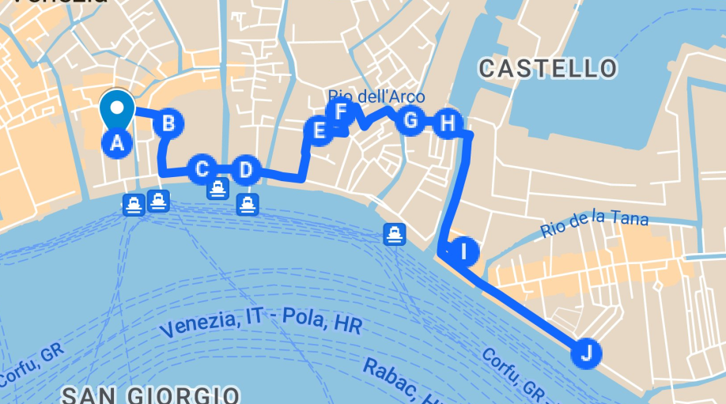

# Castello y las puestas de sol

__*Paseando por la orilla de la laguna, el Arsenal y más allá*__

> "Estuve de pie en Venecia, en el puente de los suspiros, un palacio
y una prisión en cada mano" Lord Byron, "Childe Harold's pilgrimage"

Las puestas de sol tienen algo entre estético y metafísico que siempre llama la
atención; y la combinación de algunas ciudades con las mismas, como Granada, o
París, o cualquier ciudad que tenga la etiqueta de "romántica", es siempre una
combinación ganadora. Si se combinan los reflejos dorados del sol en el agua, la
gaviota pasando delante del sol en el momento justo, la silueta a contraluz de
algún monumento señero... Todo ello es combinación ganadora.

Iremos, pues, desde la piazzetta San Marco, bordeando la Laguna, que a partir de
ahora dejaremos en minúsculas porque todos sabemos a qué laguna nos referimos,
caminando hacia el sur-este. Como el sol se va a poner por el Oeste, como es
natural, veremos, dependiendo de la época del año y de por dónde andemos, al sol
bajar por las cúpulas de San Marcos, el Campanile, o La Salute. Se aconseja
consultar la hora de la puesta de sol antes, que ese no espera. Se pone a su
hora sin esperar a nadie. Estamos relativamente al norte, y afortunadamente el
sol desciende con cierta parsimonia; un ratico antes.

El sureste es también donde se sitúan todas las colonias, o casi
todas, de Venecia. Aunque en la época de mayor auge las posesiones de
Terraferma estaban al norte y oeste, ni duraron mucho (apenas unos
siglos) ni llegaron a representar el foco de las miradas
venecianas. Así que, si os apetece, podéis hacer la metáfora de que
"el sol se está poniendo sobre Venecia", al contemplarla desde su
sureste, sus colonias. Si no os apetece, echad fotos y ya. O disfrutad
del momento. Llevaros una rebequita, que de noche tan cerca del agua
refresca.

Vamos a comenzar justo enfrente del Puente de los Suspiros, que no
tuvo tal nombre hasta que lo contempló un romántico empedernido, Lord
Byron. En este puente, llamado Ponte della Paglia, era donde se
exponían los cadáveres de personas desconocidas ahogadas para su
identificación; de hecho, justo delante de la cárcel, al otro lado. Si
partes una hora y pico antes del atardecer, estará repleto de gente
echando fotos y pasando con maletas yendo hacia o viniendo desde la
parada de vaporetto de San Zaccaria, justo al lado.

Llegando al otro lado, estaremos en la *riva* degli Schiavoni; el
conjunto de todos los muelles que bordean la laguna, hasta
prácticamente el Arsenale (de hecho, hasta el puente de la Ca' di Diò)
se llama la Riva degli Schiavoni. Una *riva*, otra de esas palabras
que designan espacios que sólo se encuentran en Venecia, es más ancha
que una *fondamenta*, y por lo tanto es un sitio ideal de paseo. Por
esta riva pasará todo el mundo, tarde o temprano, desembarcando de los
*vaporetti* tras pasar el puente (*ponte* della Paglia, o de la paja)
donde hay buenas vistas del otro Puente de los Suspiros, y quizás
refleja la importancia de los *schiavoni*, o eslavos, en el esquema
del estado veneciano.

> De la forma veneciana de designar a los eslavos, *schiavoni*, viene
> tanto la palabra *esclavo* como la palabra inglesa, *slaves*. Es
> más, la palabra *ciao* que se usa en italiano para hola y adiós, es
> una abreviatura de *s'ciavo*. El que haya sucedido así es porque,
> efectivamente, los eslavos durante la baja Edad Media eran
> capturados y vendidos como esclavos por venecianos y otomanos, para
> remar en galeras o servir en el ejército. Esta herencia del
> veneciano es sólo un ejemplo de las muchas palabras que esta ciudad
> ha dado a lenguajes usados en todo el mundo.

Estos *eslavos* provenían en realidad de los Balcanes, principalmente de la
costa croata, eslovena, montenegrina y albanesa, y en Venecia servían como
comerciantes y en todo tipo de tareas.  Hoy en día es un apellido relativamente
común en Venecia y el resto de Italia. Y podríamos preguntarnos, ya que los
eslavos eran esclavos, ¿qué pasó con la esclavitud en Venecia?

Pues no es fácil de averiguar, en realidad. Se supone que se abolió el tráfico,
e incluso el transporte de esclavos, ya en el siglo IX, lo que haría a Venecia y
a sus gobernantes un grupo realmente iluminada entre los de la época. Sin
embargo, la *posesión* de esclavos se prohibió cinco siglos más tarde, en el
XV. Si estaba prohibido, ¿dónde se hacían con los esclavos los patricios,
artesanos y comerciantes venecianos? En realidad, parece bastante claro que
Venecia se benefició de la venta de esclavos durante sus primeros siglos de
existencia, hasta el punto de ser una de sus principales fuentes de ingresos,
vendiendo los esclavos europeos que capturaban los carolingios, los del Sacro
Imperio Romano Germánico, que era sacro y todo lo que tú quieras, pero que venía
siendo un poquito hijo de puta, con perdón, y vendiéndole esclavos a los
bizantinos, incluso a los egipcios y a los otomanos. En general, a quien
quisiera comprarlo. Quizás no tanto como los genoveses, pero tampoco están tan
limpios como la historia que ellos mismos escribieron da a entender.

> En España se abolió en el siglo XIX, así que tampoco es como para que echemos
> las campanas al vuelo. Y como casi todos sabemos, en Estados Unidos no sucedió
> hasta después de la guerra civil.

Porque entre otras cosas de dálmatas, los *schiavoni* formaban una parte
considerable del ejército de la República, así que es totalmente apropiado que
se sitúen "protegiendo" la sede del poder, el palacio de los Dogos. Las unidades
se denominaban *oltremarini*, que, literalmente significa "ultramarinos", como
las tiendas de alimentos en España a principios del siglo XX.

A esa *riva* salen muchos callejones con nombres relacionados también con la
misma área geográfica. Por ejemplo, calle delle Rasse, calle de las "rascias",
que al parecer es un tejido de lana que se usaba para cubrir las góndolas y que
se llama así porque procedía del principado de Rascia, el nombre que recibió
Serbia allá por el siglo XI; en esta calle era donde se vendían, o teñían,
tejidos de esta procedencia. Y la anterior según se sale desde el puente de la
Paja, a la izquierda, con una entrada estrecha que es fácil perderse, es la
calle *degli Albanesi*, o de los albaneses; los topónimos, por tanto, reflejan,
en este urbanismo inmutable de Venecia, la historia de la ciudad y son una
puerta a la misma.

Será porque se ve muy bien desde la Punta della Dogana y desde otros puntos de
Dorsoduro, o porque el puente de la Paja es un lugar tranquilo donde colocar el
caballete, esta *riva* un motivo que aparece repetidamente a lo largo del siglo
XIX en la pintura francesa, con el nombre “Quay des Esclavons”, empezando por
Corot en 1828, que se plantó en el puente de la Paja y miró hacia la
*piazzetta*, y siguiendo por impresionistas como Ziem, prácticamente desde el
mismo lugar y Boudin, también desde el mismo lugar, aunque abriendo un poco más
la perspectiva hacia la izquierda; pintores ingleses, como Bennington, también
lo representaron en la época romántica. De esta forma, se ve la evolución de la
visión de una zona desde los diferentes géneros pictóricos; así el grand tour de
los pintores incluía, de forma inevitable, Venecia, incluso en la época de la
ocupación austríaca, después del final de la República Serenísima. Que hoy
podamos aplicarle los filtros de Instagram que más nos gusten andando por el
mismo sitio es parte de la metafísica de Venecia, y parte de la fascinación que
ejerce sobre todos.

> Antes de ellos hay al menos dos cuadros de Canaletto que llevan a esta riva en
> el título: uno que usa un punto de vista curioso, aparentemente desde en medio
> del *bacino*, enfrente del puente della Paglia, y otro en sentido contrario,
> desde la derecha del *molo*, también tomado desde un puente de un barco. La
> perspectiva que podrías tener hoy si te subes al techo de la parada de
> *vaporetti*, aproximadamente.

Por uno de esos callejones, llamado precisamente San Zaccaria se llega a un
*campo* y a una iglesia del mismo nombre: San Zacarías. No es normal que en
Venecia haya tantos santos inéditos, incluso para la misma Italia. Empezando por
los santos inexistentes que son *portmanteau* de dos nombres, como San Zanipolo (Giovanni e
Paolo), Marcuola (Hermágoras y Fortunato), San Trovaso (Gervasio y Protasio),
hay otros santos que no se prodigan muchos en otras latitudes, pero que aquí
tienen su oportunidad. San Barnaba es uno de ellos; otro, este San Zacarías. Dado que la organización urbana de Venecia era a base de parroquias con un *campo* como centro y una extensión relativamente pequeña, acabó habiendo cientos de parroquias, y como llamarla “San Juan de aquí” o “San Juan de allí” no parecía apropiado, acabarían adoptando nombres inéditos en los alrededores. Me imagino el de la parroquia número sesenta y uno proponiendo Giacomo, Giovanni y Sebastiano y, harto, acabando con San Alvise o San Viò.

Esta iglesia, en concreto, se supone que aloja los restos de San Zacarías, padre de San Juan
Bautista, cuyo cadáver fue donado por un emperador bizantino a los primeros
gobernantes de Venecia, los ínclitos Partecipazio. De esa época queda la cripta,
una cripta inundada, pero poco, yo creo que más por la puesta en escena que por
otra cosa. La bóveda primitiva, que aloja un pequeño altar, tiene una pequeña
pasarela pegada a la pared trasera, con una valla en la parte que pega más al
altar, pero ninguna en la más alejada. Si, por un casual, quieres alejarte para
tomar una perspectiva un poco mejor para la foto, puedes acabar con un pie en el
agua, como un servidor. Afortunadamente, no tiene más de unos cuantos
centímetros. Suficiente para empaparte el pie, pero como en Venecia conviene
llevar siempre unos calcetines de repuesto para este tipo de eventualidades, un
cambio rápido sentado en los bancos de la iglesia.

Antes de bajar a la cripta habíamos entrado, sin ningún impedimento, a la
sacristía; una mesita expedidora de tickets, a esas horas últimas del día y con
la escasez de turistas que caracterizaba a la estación, no tenía a nadie. Y es
que esta es una de las iglesias de Chorus Venezia; una organización de la
diócesis que te permite visitar hasta tres iglesias con un solo ticket, o hasta
9 (creo) con un ticket un poco más caro. La verdad es que por 5€ tienes acceso a
tres museos increíbles, porque cada iglesia tiene Tizianos, Veronese, Tiepolos,
Palma il Giovane y una docena de grandes pintores del Renacimiento y
barroco. Incluso si vas a última hora puedes encontrarte que el que recoge los
tickets ya ha dado de mano y no haya quien te los pique, como nos sucedió a
nosotros en el susodicho San Zaccaria.

> Otra iglesia con bastante interés que forma parte de Chorus es la de Santa
> Maria del Giglio, donde un miércoles de principios de diciembre estuvimos
> totalmente solos. Realmente las iglesias no parecen ser la principal atracción
> de Venecia, pero sin ellas te pierdes una parte importante de su cultura y de
> su historia.

Como se trata de la iglesia de San Zaccaria, donde se supone que están sus
restos, hay cuadros relativos a su historia. Recordémosla en dos palabras:
Zacarías y su esposa, Isabel, no tenían hijos en una edad bastante
avanzada. Cuando servía en el templo, se le apareció a Zacarías un ángel que le
dijo que tendría a un servidor de Dios y que lo llamarían Juan. Este sería Juan
el Bautista. Pero Zacarías le exigió pruebas al Ángel, y éste, por chulo, lo
dejó mudo. El nacimiento de San Juan Bautista lo vemos en un cuadro de
Tintoretto en la sacristía; un cuadro cuyo tema debió gustarle mucho a
Tintoretto, porque otro con el mismo título se expone en el Armitage de San
Petersburgo. Pero este cuadro es diferente: Sólo aparece el busto de San
Zacarías, asomando por la parte derecha del mismo, mirando a su mujer, Santa
Ana, que acaba de dar a luz; mientras tanto, tres mujeres se encargan del bebé,
formando un triángulo protector a su alrededor. El cuadro parece querer
demostrar la importancia de las mujeres en el nacimiento de la iglesia,
relegando a un plano muy secundario, y pasivo, la del titular del templo, San
Zacarías.

Se transmite un mensaje bastante claro, y tiene su explicación. San Zaccaria era
la capilla adjunta a un convento de benedictinas, uno de los más influyentes en
la ciudad. Por su cercanía al palacio Ducal, pero también porque el terreno de
San Marco lo donó este convento a la República; por eso, un día al año, el dogo
ofrecía un corno ducal enjoyado a las monjas. Que, por otro lado, eran las
clásicas monjas venecianas de clausura, procedentes de familias nobles, que
organizaban todo tipo de juergas y actos culturales en el convento. Pero el
cuadro tiene también otros detalles venecianos: el gallo bebiendo agua, que se
correspondía con la tradición veneciana; el día de San Juan Bautista se
celebraba con pasteles en forma de pollito. En el techo del cuadro, el espíritu
santo y ángeles muestran la relación divina con los personajes del cuadro, y
supongo que también, en general, con las monjas del convento. El cuadro es bien
visible, entre columnas, y está en un lugar prominente en la sacristía. Pero
está rodeado de más de una docena de otros cuadros, con escenas religiosas de
todo tipo, y es difícil fijarse. En Venecia tienes que desarrollar una visión
especial para lo que es Realmente Importante. En este caso, posiblemente echar
un vistazo a los azules de la sábana que cubre a Santa Ana, los fuertes
contrastes entre la oscuridad en la habitación y la luz de la aparición y las
posturas nos hablan del manierismo del autor. Pero para seros sincero yo tuve
que mirar en la guía para saber en qué fijarme. También conviene mirar las
descripciones de los cuadros. Una cosa buena que tienen las iglesias de Chorus
es que suelen estar bien etiquetadas, con autorías y épocas. Una razón más para
no perderse, al menos algunas de ellas.

El exterior no es tan antiguo, y tiene el aspecto clásico del Renacimiento
veneciano que Codussi creó para todo el mundo; también participó en esta iglesia
junto con Antonio Gambello; los arcos de círculo que coronan la fachada y
cierran los paños laterales de la misma los veremos repetidos por otras muchas
iglesias en toda la ciudad.

Desde ahí, volvemos a la *riva* y seguimos andando por ella, hasta llegar al
Arsenale. Dependiendo de la época del año y del fondo que quieras, hay que buscar el punto exacto para ver al sol ponerse detrás de San Giorgio Maggiore, o de la Salute, o de la Punta della Dogana, o cualquier otro punto en el movimiento anual. En el punto preciso suelen reunirse media docena de fotógrafos con cámaras de alto octanaje, trípodes y toda la tramoya. No tiene pérdida: donde te los encuentres a la hora precisa, allí es donde te tienes que plantar con tu móvil para sacar una foto que, si no se acercará en calidad a la que va sacar esa gente, sí te proporcionará un recuerdo bastante indeleble cuando Google fielmente te recuerde, un año más tarde o siete años más tarde, que estuviste ahí.

En realidad, podíamos seguir así, bordeando la laguna, hasta llegar a nuestro
destino final, pero vamos a seguir la ruta escénica para ver algunos de los
lugares más curiosos de Castello, que es donde nos encontramos. Al pasar el
ponte della Paglia hemos cambiado de *sestiere* y nos encontramos en
Castello. Si Venecia tiene forma de pez, estaríamos avanzando por la barriga y
de camino hacia el bajo vientre; y Castello formaría la parte de la cola. Ha
sido, tradicionalmente, un barrio industrial y de pescadores, centrado en el
Arsenal.

> La "cola" del pez apuntaría hacia el sureste, y estaría muy cerca del Lido. La
> distancia entre el extremo de la cola y el Lido es más pequeña que la que hay
> entre Murano y Cannaregio, por ejemplo.

Una forma muy interesante de verlo es tomar el vaporetto en San Zaccaria en
dirección a San Michele o a Murano. Este vaporetto da toda la vuelta al barrio,
pasando por el Arsenal, llegando a la escuela naval de la Marina Italiana, y
siguiendo por la "cola" del pez; avanzando por ella al otro lado del Arsenal,
donde está una estatua de Lorenzo Quinn (que aquí en España hemos conocido como
"el hijo de Anthony Quinn", pero que es un escultor de cierta fama que ha
participado repetidamente en la Biennale de Venecia, el certamen de artistas
contemporáneos que se celebra cada dos años allí) compuesta de unos antebrazos
gigantescos, blancos, con sus manos entrelazadas encima de un canal,
"Construyendo puentes", se llama. En una ciudad con tantísimos puentes, otro
puente más tiene su punto, aunque esté en el lugar de donde salían los barcos de
guerra que alimentaban las aventuras coloniales venecianas que no se
caracterizaban precisamente por tender puentes, salvo para tomar al abordaje las
naves enemigas.

El Arsenal, otra de las palabras que ha pasado del veneciano a muchos otros
idiomas, incluyendo el nuestro (véase el capítulo dedicado a las mismas), se nos
presenta desde la otra ribera como una gran portada flanqueada de leones, un
muro tras el cual hay mundos ignotos e ingenios malignos, y un canal que lo
atraviesa y que separa el barrio en dos partes. Por eso nos vamos a quedar en la
puerta, viendo al León del Pireo, que aunque parezca muy adecuado al contexto
veneciano, en realidad se trajo del puerto de Atenas, el Pireo, es decir, estilo
museo británico que se llevaban de Grecia todo lo que podían. No se llevarían
mucho más después de esto, sin embargo; sucedió en la expedición contra los
turcos de Francisco Morosini, a finales del siglo XVII, última guerra de cierta
entidad en la que participaron los venecianos. Tras eso, la decadencia, el Gran
Tour, Napoleón y el fin de Venecia. El rugido de piedra de este león es, por
tanto, el canto del cisne de Venecia.

Pero este león, aparte de su tamaño, tiene una cosa curiosa: inscripciones en lo
que parecen runas, que puede parecer algo que no viene muy a cuento ni en
Venecia ni en Grecia. Resulta que las inscripciones, que han sido traducidas,
hablan de unos guardias vikingos, mercenarios de los emperadores bizantinos, que
los enviaron al Pireo para darle p'al pelo a los levantiscos griegos. Y ya que estaban
allí, grabaron este graffiti que acabó a las puertas de unos astilleros
venecianos unos siglos más tarde. Y los venecianos vieron: león, *good* y
veneciano. Gratis, porque nos lo traemos en barco, más good todavía y también
bastante veneciano. Así que a la saca y a adornar esa puerta del Arsenal que
lucía demasiado sobria.

Esa sobriedad exterior, sin embargo, esconde una capacidad de innovación y
potencia industrial que no tuvo rival durante varios siglos. El
dominio/matrimonio con el mar necesitaba barcos, y esos barcos se fabricaban,
prácticamente de forma exclusiva, en el Arsenale, donde también se creaban,
diseñaban y ensamblaban continuamente nuevos sistemas de armas
navegables. "Sistemas" como una galera, que inicialmente era más o menos
simplemente un navío para colocar tropas cerca de otros navíos y, de esa forma,
abordarlos; pero por obra y gracia del Arsenale se convirtieron en plataformas
móviles de artillería, con la colocación de una serie de bombardas, cañones
primitivos, lo que les ayudó a derrotar a los genoveses en la batalla de
Chioggia, y de camino acabar para siempre con esa rivalidad tradicional. "Sólo
podía quedar una", como en "Los Inmortales", pero en este caso se trataba de
repúblicas marítimas, o al menos de potencias navales en el Adriático. Con la
ayuda del Arsenale, esa última fue Venecia, a finales del siglo XIV.

> Chioggia está en el extremo de la laguna que se acerca más a la pantorrilla
> italiana. Al estar, de hecho, prácticamente unida a tierra firme era una plaza
> de asedio y toma más fácil, abriendo la puerta al resto de la laguna. Si lo
> hubieran logrado, claro.

De la navegación y combate en galeras puede que proceda una expresión muy típica
veneciana: *duri i banchi*, palabras en idioma vernáculo que vienen a ser
“agárrate al banco”. Cuando en una galera se iba a disparar el cañón, que solía
haber uno solo, en la proa, se gritaba eso para que los que remaban se
agarraran, efectivamente, al banco en el que estaban sentados. Pero de ahí, se
ha convertido no sólo en una frase habitual de saludo, sino también en título de
un LP de la banda veneciana “Pittura Freska”, una banda de reggae que canta en
ese idioma.

> En español se dice “amarrarse a los machos”, que en todos sitios veréis que se
> trata de un término taurino. Y no digo que no, pero un “macho” es la parte
> baja de un mástil y amarrar significa atar con una maroma, una cuerda de las
> que se usan en las embarcaciones, y más aún en las de vela. Así que puede
> tener un origen similar, y esto lo habréis leído aquí por primera vez y
> posiblemente también única.

Otra innovación del Arsenale fueron las galeazas, en italiano *galeazza*, una galera (que, en
italiano, se dice *galea*) especialmente grande, una *galerota*, para
entendernos. Si una galera es un navío de propulsión mixta, remos y
vela, muy adecuada para navegar en el Mediterráneo, la galeaza es… más
de lo mismo. Pero con el volumen mayor que denota el aumentativo
vienen una serie de ventajas. Primero, la potencia de fuego; como tal
navío más grande, puede cargar muchas más armas, sobre todo armas de
tiro indirecto. No es lo único que la hacía superior a otros navíos de combate de
la época, pero para entender esas otras virtudes vamos a dar un paso
atrás para ver cómo funcionaba una galera en combate, y en general los
combates navales, hasta prácticamente el siglo XIX, cuando empezó a
usarse el vapor para propulsar los barcos.

> Y no, a pesar de que la palabra *galeón* parece venir del mismo origen, no
> tiene nada que ver. Un galeón no tiene remos; también es diferente el origen
> de este navío, que es español, no veneciano.

La mayoría de los combates en los que se vería involucrada Venecia tenían lugar en el Mediterráneo; en este mar
nuestro, los barcos habían sido tradicionalmente de remos. Quienes remaban eran
generalmente o esclavos, o prisioneros capturados en escaramuzas anteriores, o
las dos cosas a la vez: prisioneros esclavizados. En resumen: que eran “de los suyos”.

> Las galeras venecianas, sin embargo, a menudo iban tripuladas por los propios
> *arsenalotti* o incluso voluntarios de los diferentes gremios de la
> ciudad. Pero esa es otra historia.

Por eso, los combates navales no perseguían hundir a los barcos
enemigos. Perseguían desarbolarlos, es decir, inmovilizarlos de forma que no
pudieran moverse más que a propulsión de remo. Para desarbolarlos, se disparaba
con uno o los dos cañones que tenían, habitualmente, en la proa; como hemos visto
antes, así era más fácil estabilizar tras el disparo, pero lo que se buscaba era
despejar la zona donde iban a entrar los infantes al asalto. Finalmente, se
maniobraba para embestir la galera enemiga con el espolón de la proa, con lo
cual se inmovilizaba. Y se lanzaban escalas, tablones y lo que fuera menester
para tomar al asalto.

> En los “itinerarios secretos” del palacio ducal, que aconsejo vivamente, hay
> en la estancia de la esquina una serie de vitrinas con armas navales, entre
> ellas varios garfios dobles, que seguramente se usarían para esto.

Se quería capturar la galera contraria como se captura un
territorio. Si los prisioneros eran de “los suyos”, se liberaban, si no, los
pobres, serían de nuevo vendidos como esclavos; también se capturaba a los
enemigos y, por supuesto, también se les vendía. Al capitán y a los oficiales
también les sacaban un rescate. Al final la guerra no era tan diferente del
negocio.

Pero volvamos a la galeaza. Primero, muchos cañones. O sea, que no se trataba
tanto de “limpiar la era” de la galera que estabas a punto de abordar, sino de
reblandecer las galeras enemigas que, posteriormente, iban a ser asaltadas por
otras galeras. Segundo, los cañones podían disparar desde la borda, no
necesariamente desde la proa, con lo cual podían atacar a más navíos a la vez, y
también desde mayor distancia. Finalmente, eran mucho más altas que las galeras
normales. Era prácticamente imposible tomarlas al asalto; aunque alguna galera
enemiga pudiera colocarse a su lado, todavía tendrían que lanzar garfios y
escalar por la borda.

Un sistema de armas no es nada sin un desarrollo doctrinal que lo acompañe;
tiene que colocarse en un lugar determinado y aparecer en el momento preciso
para tener el máximo efecto táctico. Los venecianos lo hicieron… Y lo pusieron
en práctica en la batalla de Lepanto por primera vez.

Los mapas de despliegues tácticos son cosas aburridas y difícilmente
comprensibles. Pero los mapas de la batalla de Lepanto muestran filas de figuras
geométricas que representan los barquitos, unos rectángulos con un triángulo en
la punta, como una casita alargada y tumbada. Azules, a la izquierda, están la
liga Santa, que tienen que ser los buenos porque, jolines, es que es santa. A la
derecha los otomanos… Y entre ellos, seis “supositorios “algo más gordos que
cualquiera de los equivalentes rojos o azules: las seis galeazas que, a razón de
dos por ala, fueron decisivas en el encuentro. Cuatro de ellas se encontraban en
vanguardia, delante de todas las galeras, y dos de ellas en retaguardia, las que
se encontraban en el ala que controlaban los genoveses, y la que peor parada
quedó.

> Por alguna razón, las galeazas no estaban bautizadas. Eran “las galeras de”,
> sus armadores o quienes las habían pagado. Fueron dos galeras de los Bragadin,
> otras armadas por Diodo y Guoro, y otras de de Cesare y de Pisani. A uno de
> ellos, Diodo, Juan de Austria le confesó que el éxito se había logrado gracias
> a dichas galeazas. Si lo ha dicho el *boss*, no hay mucho más que hablar.

Los venecianos fueron el estado o nación o grupo (porque de todo hubo
en Lepanto) que más galeras aportó, 106, aparte de las seis
galeazas. La tecnología o las armas no ganan, por sí solas, la guerra,
la ganan las botas en la tierra, o en este caso, en la cubierta. Y
esas botas eran, en su mayoría, la infantería de marina española. Pero
tanto los *fanti da mar* como la doctrina que empleó a las galeazas
cuando eran necesarias, eran venecianas. Así que pueden muy bien
apuntarse la victoria, como bien lo hicieron en los cuadros que hay en
el palacio de los Dogos.

Esto necesitaba una infraestructura industrial considerable, con una
buena cantidad de trabajadores.  A los trabajadores del Arsenale se
les llamaba *arsenalotti*, y eran un caso aparte en la ciudad y en el
mundo. Para empezar, eran lo más parecido a un funcionario. Una vez
admitidos, desde un orfanato o desde familias de otros trabajadores,
trabajaban de por vida en el gremio en el que hubieran comenzado: de
carpinteros, fabricantes de remos, de pólvora o de cuerdas. Tenían,
como los vidrieros de Murano, una serie de privilegios: se les seguía
pagando aunque estuvieran enfermos, y no los echaban salvo que
cometieran algún delito. A cambio, eran trabajadores estratégicos: no
podían dejar la ciudad.

Lo más curioso y que no acabo de explicarme es que actuaban también
como fuerza paramilitar. Sus obligaciones incluían proteger el palacio
ducal en ciertas ocasiones, y durante las reuniones del Maggior
Consiglio, así como la seguridad del propio Arsenale. En parte se
explica porque el concepto de policía no existía; sólo magistrados y
las diferentes guardias y soldados profesionales. Pero de hecho, se
empleaba a los *arsenalotti* como suboficiales en los barcos, algunas
veces los mismos que habían construido. No se sabe si entre calafate y
remo, harían instrucción de orden cerrado, pero el hecho es que del
personal del Arsenale salía un regimiento, unas doscientas personas,
que guardaban la Piazza por la noche y, en caso necesario, actuaban de
bomberos o destacaban un grupo para rescatar en caso de catástrofes.

Dentro de un colectivo tan grande, de varios miles de personas, que
además eran casi una ciudad dentro de la ciudad, con una décima de la
superficie de la misma, es normal que hubiera toda una jerarquía y
división de poderes. Pero lo cierto es que el Arsenale fue el primer
complejo militar-industrial, mucho antes que el soviético o el
estadounidense, además de un *zaibatsu*, concentrando investigación y
desarrollo, aprendizaje, diseño y producción en un solo lugar, un
complejo fabril que no solo llenó de barcos el Mediterráneo y hasta
Inglaterra y Flandes, sino que también llenó tales barcos de
tripulantes e infantes de Marina.

Igual el entrenamiento les venía de su adscripción a una de las dos facciones, o
equipos, o pandillas, que operaban en Venecia: los *castellani*. *Castellani*
eran los de Castello, que es donde estaba el Arsenal, de hecho, prácticamente lo
partía por la mitad y ocupaba gran parte de la superficie. De forma natural,
cualquier grupo popular que saliera de ahí acabaría teniendo un montón de
*arsenalotti*. El otro grupo eran los *nicolotti*, inicialmente pescadores de la
parroquia de San Nicolás, pero al final un grupo más grande situado, en general,
al oeste de la ciudad.

Entre uno y otro, el Gran Canal y una serie de puentes, o campos de batalla para
enfrentarse a puñetazos, a palos o como fuera. Uno de ellos llamado,
precisamente, *ponte* dei Pugni, en Dorsoduro.

> Este puente divide más bien el norte con el sur, así que las fronteras entre
> los dos grupos serían más complicadas de lo que aparentan; se suponían que las
> peleas tenían lugar sobre los canales que los separaban.

Venecia es una ciudad creativa, una ciudad que crea símbolos y mitos; hay varios
puentes de la Guerra repartidos de una forma un tanto compleja. Si esas eran las
zonas donde se encontraban los dos grupos, no parece que establezcan ningún tipo
de frontera. Pero los puentes no eran los únicos sitios donde se producían
encuentros violentos: también organizaban *caccia dei tori* y algo llamado
“Forze d’Ercole”.

Quizás merezca la pena dedicar un poco de tiempo a este deporte. Por
las imágenes que he visto, y por las descripciones alternativas que
hay en otro lado, eran torres humanas. Para entendernos, como los
*castellers* en Cataluña. Una imagen de estas aparece, precisamente,
en un artículo sobre los castellers de Xavier Torbadella-Flix. Pero
vamos a ver… si la *forze d’ercole* la ejecutaban los *castellani*…
¿No serán los castellers una invención veneciana? Pues no, jolines,
que todo no lo inventaron en Venecia.

> Solo inventaron *casi* todo.

Si bien no sólo no lo inventaron en Venecia, sino que hay castellers
en muchas otras culturas, lo cierto es que hay documentos que muestran
que la misma *forze d’ercole* veneciana llegó a Gerona en el siglo
XVII, seguramente por vía de unos *arsenalotti*, que, al fin y al
cabo, eran los que iban en los barcos que ellos mismos construían. Los
primeros *castellers* catalanes están documentados del siglo XIX, así
que es plausible que tengan su origen o en Venecia directamente o en
algún otro puerto mediterráneo, que lo tomaría de Venecia.

El tema es que esta *forze d’ercole* era, a diferencia de los
*castellers* contemporáneos, una serie de verdaderas competiciones,
donde se proponían figuras por parte de los jueves y los dos equipos
se esforzaban por conseguirlas. Fue un deporte que sobrevivió a la
república veneciana, pero no mucho más, y lo que queda son los
diferentes cuadros y estampas. Y los castellers, claro.

> Y no solo eso, sino que los célebres *correbous* podrían también originarse en
> Venecia. Al fin y al cabo, cultura mediterránea.

Entre estampas típicas y nombres de puentes no me queda claro qué eran realmente
estos dos grupos. Por un lado, tenemos los arsenalotti-castellani-guardia del
consejo. Un grupo con una sección paramilitar. Por otro lado, los
*nicolotti*. Está claro que si el poder consigue tener al pueblo entretenido
zurrándose entre ellos, tendrán muchas menos ganas de rebelarse y atacar al
poder establecido, y la Serenissima valoraba la estabilidad por encima de
cualquier otra cosa.

El Arsenale dejó de fabricar embarcaciones y máquinas relacionadas ya
en la época de la fabricación austríaca, y se abandonó años
después. Poco a poco, hubo que irle buscando una utilidad; hoy en día
desde el mismo Arsenale, su interior, y hacia el este, es territorio
Biennale. ¿Que qué es esa Biennale? Algo que es posible que hayas
visto en algún telediario mostrando artistas que pintan con sus
propios excrementos, o donde una señora de la limpieza ha tirado una
obra de arte dadá pensando que era algo que un visitante habría tirado
al suelo. O sea: arte moderno. Según muchos, más moderno que arte. Los
futuristas, un movimiento italiano que abogaba por abandonar toda
tradición y a los que veremos más veces en Venecia, decían (énfasis
mío):

> [En Italia]... hemos recogido siempre religiosamente los residuos estéticos
> de Europa vertidos por la *cloaca* de la bienal veneciana.

Cuando Umberto Boccioni, el escultor modernista (que, por cierto, es ubicuo
ahora mismo en Italia porque una escultura suya ilustra la moneda de 20 céntimos
de euro italiana), escribió eso habían pasado apenas 20 años de la primera
bienal, pero primera, primera, porque al alcalde de Venecia de finales del siglo
XIX fue la primera persona que se le ocurrió tal cosa. Continuaba así una
tradición que relacionaba a Venecia con el mercado del arte, pero también
trataba de encontrar una nueva identidad para una ciudad que, después de dejar
de ser estado y la bisagra de Europa, era simplemente un lugar en medio de una
laguna dentro de un país bastante más grande.

Y lo encontró. Vinieron más turistas de los habituales, hasta 200000, y se
repartieron diferentes premios a pinturas más bien olvidadas. O quemadas, como
*Supremo convegno* de Giacomo Grosso, que muestra a mujeres desnudas de chill
out alrededor de un catafalco abierto, Eros y Tanatos todos juntos. Un tema muy
veneciano y que por supuesto ganó el premio del público. Pero... se perdió en un
viaje a Estados Unidos.

La bienal, o quizás cabría decir bienales, porque hay varias con
diferentes temas, tiene hoy en día lugar prácticamente todos los años,
pero tiene diferentes aspectos: en años pares hay unas, por ejemplo de
pintura o escultura, y en años impares la de arquitectura. Algunas
obras quedan por la ciudad, y otras quedan dentro del Arsenale y en
los Giardini della Biennale, que en realidad fueron creados por
Napoleón, así que probablemente hicieron la Biennale sólo para
quitarle los jardines a Napoleón.

Pero saliendo de los almacenes ahora convertidos en museos, volvemos
otra vez a la ribera de la laguna.  Prácticamente toda la Riva degli
Schiavoni, y más allá, Riva de Ca' di Dio y Riva dei Sette Martiri, es
zona de atraque para embarcaciones de cierto calado. Ya no desembarcan
aquí super-cruceros del tamaño de un rascacielos; ni siquiera se les
permite entrar en la laguna, como lo hacían hasta no hace tanto; pero
sí te puedes encontrar, más allá del Arsenale, algún super yate de
oligarca ruso o jeque árabe, e incluso a veces cruceros más
pequeñitos, de los que se utilizan habitualmente para travesías
fluviales. No es que quepan demasiada gente en ellos, pero en un navío
de la naviera Viking (una de las que fletan este tipo de
embarcaciones, y que de hecho vi atracado allí en mi último viaje)
pueden caber tres o cuatro autobuses, y si da la casualidad de que
deciden visitar San Marco o el palacio de los Dogos a la misma hora,
te puedes encontrar en ellos a más gente de la cuenta.

> Estos cruceros recorren el Adriático; si optas por ellos, porque
> oye, cada uno es libre, y desde el punto de vista de la presión
> turística, 200 personas son menos de las que desembarcan de un solo
> tren que llegue a Santa Lucia, una opción interesante y veneciana
> puede ser el que comienza en Venecia y termina en Atenas; te podrás
> imaginar que estás en una galera veneciana en una "muda" hacia
> Oriente, porque para en muchas de las ciudades que fueron colonias
> venecianas: Zadar, Dubrovnik y Corfú, por ejemplo. O que alguien lo
> imagine por ti y te lo vaya contando; por cinco mil lereles que
> vale, ya podrá tener ese servicio también. Además, pasar una noche
> en Venecia en la propia laguna, en tu barco, puede ser una
> experiencia singular, y ver Venecia durante unas horas es mejor que
> no verla. Nosotros, por supuesto, recomendamos pasar una temporada
> algo más larga. O una vida, lo que mejor encarte.

Podemos también volver al interior, a callejuelas que eran,
antiguamente, pasillos o corredores internos dentro del Arsenale. Por
ejemplo, un poco más arriba, el *ramo* de la Tana. Uno de los pocos
sitios en Venecia donde todavía los *masegni*, o piedras en el
pavimento, son triangulares.  Que, aparte de eso, hoy en día no tiene
gran cosa que ver, pero nos recuerda donde se encontraban los confines
orientales del imperio colonial veneciano. Tana, o Tanais, era el
nombre de una colonia genovesa y veneciana a las orillas del río Don,
en el extremo oriental del mar de Azov, que a su vez está situado en
el extremo nordeste del Mar Negro, allá donde comienza una de las
rutas de la seda, al menos para los mercaderes procedentes de
Italia. La ciudad más cercana hoy en día es Rostov del Don, en Rusia.

El asentamiento fue creado por los griegos, pero en el siglo XIII se convirtió
en el destino de una de las *mute* o mudas. Estas eran colaboraciones
público-privadas donde el dogo ponía de su pasta y organizaba expediciones
comerciales a las diferentes colonias mercantiles que Venecia poseía en el
oriente mediterráneo.

En 1340 un mercader florentino escribió “Pratica de la Mercatura”, y en ella dice:

> [...] En Tana, hará bien si contrata un guía intérprete. [...] Para el viaje
> de Tana a Gittarchan [actual Astrakhan] hará bien si lleva provisiones para 25
> días, esto es, harina y pescado seco, ya que a lo largo de la ruta encontrará
> suficiente carne. [...] La ruta que lleva de Tana a Catay es, según dicen los
> mercaderes que la han tomado, completamente segura, tanto de día como de
> noche.

Es decir, que era el principio del camino y donde se aprovisionaban de una serie
de elementos necesarios para el viaje hasta Persia (Irán), Catay (China) o donde
fuera.

Las mudas que hasta allí llegaban se traían de vuelta cáñamo, y esta zona, al
lado del Arsenale, se dedicaba en exclusiva a fabricar con él maromas que, allí
mismo, metían en los barcos que luego surcaban el Mediterráneo en las mudas o en
lo que hubiera menester. Merece la pena, si se tiene un minuto, apartarse un
poco del canal y dar un garbeo por allí.

La historia “oficial” llega hasta ahí, a hablar del cáñamo y todo eso. Sin
embargo, la verdadera historia te cuenta que lo que los venecianos (y los
genoveses también, que aquí nadie está libre de pecado) comerciaban era con
personas, tanto en Tana como en las otras colonias en el mar Negro, como
Soldaia (actual Sudak, en Crimea). Toda esa zona ribereña con el mar Negro y el
de Azov estaba asolada por continuas guerras y los prisioneros, rusos o
“eslavos” (*schiavoni*) eran vendidos como esclavos; como ya sabemos que en
Venecia (guiño, guiño, codazo, codazo) estaba prohibida la esclavitud, se
vendían en Alejandría o en algún otro puerto de una ciudad musulmana. Los Polo
tuvieron una casa en Sudak también, así que algo pillarían. Esta zona pasó
finalmente al control del imperio otomano, que por supuesto siguió haciendo lo
mismo. El final del comercio de esclavos en Venecia no vino tanto por una
postura moral, sino simple y crudamente por agotamiento de la materia prima.

Hay también una historia extraoficial de estas *mute*, que duraban
meses. Algunas vienen registradas en un libro de chistes que se publicó en el
siglo XIV, en latín, además. Cuenta que le preguntaron a una prostituta qué
hombres tenían el miembro viril de mayor tamaño. Sin vacilar, contestó que los
venecianos. Porque eran capaces de dejar embarazadas a sus mujeres mientras
andaban en la otra punta del mundo. Sin duda, habría una cantidad de embarazos
fuera del matrimonio considerables, que o bien no importaban o bien el tema de
las semanas de embarazo no se llevaba tan bien en aquella época, o bien
pasaría a todo el mundo, así que mal de muchos, consuelo de marineros. Que,
pensándolo bien, también tendrían su forma de consolarse en esos
largos viajes.

El museo naval, muy cerca, forma también parte de ese recinto del
Arsenale que ha sido "liberado". Ocupa unos antiguos almacenes, pegado
a la *riva*; parece que faltaría algo en Venecia si no hubiera un
museo naval, ¿no?

No sé si habéis ido a algún museo naval. Hay en ellos lo que cabe esperar;
barcos y también objetos inauditos como astrolabios, bitácoras y también
petroglifos. Petroglifos no, pero ¿a que había colado? Hay un pequeño muso naval
en las murallas de Dubrovnik, donde muestra todo el poderío de las atarazanas de
Ragusa, desde su época veneciana hasta su época austríaca; en maqueta,
claro. Porque eso es lo que tienen los museos navales que los diferencia de
otros museos: en vez de objetos en sí, hay copias a escala de tales objetos,
porque difícilmente puedes meter una galera en un edificio.

En este museo, que yo no he visitado aunque tengo toda la intención de hacerlo,
hay también una copia del Bucintoro, que divorciado el mar de Venecia por obra y
gracia de Napoleón, este mismo decidió cargárselo y destruirlo. El Bucintoro,
*buzino d'oro* o simplemente barca de oro, aunque como muchos otros términos
venecianos su origen admite todo tipo de interpretaciones, comenzó siendo una
galera, pero terminó siendo una barca de 35 metros de longitud, que tras la
abolición de la república y expoliada de todo lo que fuera de valor, el casco se
usó para una prisión flotante llamada Hydra. El Bucintoro no tiene el más mínimo
interés tecnológico, pero puede tener interés artístico porque es la misma barca
que aparece en los cuadros de Canaletto y otros *vedutistas* del siglo XVIII.

Como cosa curiosa y muy poco veneciana o sólo veneciana por la parte
de Italia que le toca, se pueden ver torpedos de conducción manual, de
los que usaron los italianos repetidamente entre la primera y segunda
guerra mundial, para hundir barcos de los malos en la primera guerra
mundial y de los buenos en la segunda. Pero más curioso es que está el
ancla de un acorazado austrohúngaro, el Tegethoff, nombrado por un
almirante que, precisamente, infligió una derrota bastante humillante
a la marina italiana, en la batalla de la isla de Lissa.

> Que por qué conozco yo esta batalla, te preguntarás, o no porque es
> la enésima batalla, sólo que no es una batalla veneciana, como el
> resto de las batallas aquí. Pues es por un cuadro de Anton Romako
> que se llama precisamente así; está en el Belvedere en Viena, es
> pequeñito, pero tiene un aspecto caricaturesco que me llamó la
> atención.

Por si fuera poco, Ippolito Caffi, pintor originario de Belluno pero
afincado en Venecia, donde incluso sufrió cárcel por su adhesión al
movimiento de unificación de Italia, pereció en esta batalla como
parte de la tripulación del Re d’Italia, uno de los navíos hundidos
por el almirante Tegethoff (la persona, no el barco).

Con esa victoria, los austriacos impidieron que Italia lograra
reconquistar (o conquistar, según se mire) Venecia. Así que si Venecia
no llegó a ser italiana hasta tres meses más tarde (tampoco es tanto)
es culpa de este señor. Para más inri, la isla había sido parte de
Venecia hasta el final de la república (como Split-Spalato, la ciudad
del continente más cercana).

Como digo, si te van los museos navales, este es un ejemplar
perfectamente válido. Incluso aunque te gusten, igual te quieres
saltar la cuarta planta, dedicada a la hermandad entre las marinas
suecas e italiana. O ciertamente todo el museo.

Sobre la tecnología naval veneciana habría mucho que contar, pero el
problema es que no lo vas a encontrar en este lugar. Se ve mejor en
los cuadros del palacio del Dogo. Así que guarda un poco más de cola y
visítalo de nuevo, venga.

Salimos del museo (o pasamos por delante si no hemos entrado) y
pasamos la iglesia de San Biagio Vescovo, o San Blas obispo, que ha
pasado por muchas manos y ahora es una capilla militar; antes fue
iglesia, pero también un templo ortodoxo griego, para los trabajadores
del Arsenal de aquella nacionalidad y para los exiliados de Bizancio.

Por el camino se puede pasar por la Via Giuseppe Garibaldi. Una de los
pocos lugares cuya denominación coincide con la que recibe en el resto
de Italia, donde siempre va a haber una *via* o, preferentemente, un
*piazzale* o algo más gordo. Pero si es una *via* ya sabemos que no
puede haber estado ahí mucho tiempo; de hecho, salvo por el hecho de
que no hay coches, ni siquiera vespas, recorriéndola, podría ser la
calle clásica de la passeggiata de cualquier ciudad italiana, con sus
terracitas, heladerías, e incluso tiendas de verdad. Y es que nació
del caletre de Napoleón, que quería desembocar aquí un puente que
llegara al continente. No hizo el puente, pero sí los jardines, y esta
calle, que llevaba hasta ellos, se llamó Strada Nuova dei Giardini
porque mayormente, al no haber nacido, a Garibaldi todavía lo había
dado tiempo de conquistar Italia ni a darle nombre a las calles.

Podemos torcer a la izquierda, paralelos a la orilla; la última parte
del paseo por la que iremos se llama Riva dei Sette Martiri, es decir,
de los siete mártires. Venecia también tiene sus historias de guerra,
como casi cualquier otra ciudad italiana; el norte de Italia estuvo en
posesión de los nazis hasta entrado el año 1944; la historia de Italia
en la guerra es complicada, porque como tal país se rindió
incondicionalmente en el año 1943 y depuso y detuvo a Mussolini; los
nazis crearon una república títere en el norte de Italia, la república
de Salò o República Social Italiana, y rescataron a Mussolini de la
cárcel en una operación de comandos dirigida por Otto Skorzeny. Pero
la reconquista de Italia empezó en el sur, y no alcanzó Venecia hasta
muy tarde, a finales de abril de 1945, lo que no evitó los peores
estragos de la guerra y, sobre todo, de la deportación de judíos por
parte del régimen nazi, que se intensificó durante la existencia de
este gobierno, a todos los efectos un gobierno colonial de los nazis.

Estos Sette Martiri, precisamente, formaban parte de la resistencia a
los alemanes en los últimos días de la guerra. Una placa, en una pared
al comienzo de la riva, cuenta su historia. Y su nombre es un troleo
del nombre original, Riva dell'Impero o del imperio, que fue el que le
dio el gobierno fascista cuando la creó en los años treinta, en vez de
diferentes naves y astilleros que había originalmente. Los siete
mártires fueron siete ciudadanos, prisioneros políticos, que fueron
fusilados como represalia por la muerte de un soldado alemán que se
había ahogado al caer borracho al agua. Siete personas que pasaban por
allí, víctimas de la insensatez y la borrachera de poder. La *riva*
recibió ese nombre justo al final de la segunda guerra mundial, cuando
se constituyó la república italiana en la forma actual.

A la vuelta, otra placa recuerda a los navegantes Caboto,
padre e hijo, Giovanni y Sebastiano, o John y Sebastian Cabot que,
aunque genoveses de origen, obtuvieron la ciudadanía
veneciana. Giovanni fue ingeniero y navegante, y dio vueltas por el
mundo hasta que llegó a Bristol, donde se estableció. Allí fue donde
propuso a la corona inglesa un camino más corto que el de Colón a las
islas de las Especias, un material de cuya importancia había
aprendido, sin duda, en Venecia. A donde llegó no había muchas
especias, sino bacalao, porque llegó a Terranova y a otras tierras de
la costa oeste de América del Norte. Sebastian recibió inicialmente
todo el mérito de los viajes, pero al final se reconoció también la
labor de John, igual que la placa.

Hay pocas ciudades que se identifique con el crepúsculo más que la
propia Venecia “de cristal y crepúsculo” como la describió Jorge Luis
Borges, el relatista, novelista y poeta Argentino. Crepúsculo físico y
crepúsculo de la historia, porque nada transmitía más sensación de
decadencia que Venecia a partir del siglo XVI. Borges decía:

> “Crepúsculo y Venecia para mí son dos palabras casi sinónimas, pero
> nuestro crepúsculo ha perdido la luz y teme la noche y el de Venecia
> es un crepúsculo delicado y eterno, sin antes ni después.”

En Las Vegas hay un casino que se llama The Venetian. Se construyó a finales de
los 90, y tiene una copia del Campanile y una arquitectura vagamente
clásica. Pero dentro… Dentro, las bóvedas encima de los *canali* de pega, donde
circulan gondoleros de pega, muestran un eterno crepúsculo como el que describe
Borges; cuando estuve allí hace años fue lo que más me llamó la atención. El
resto… Bueno, había tiendas, una *piazza* con arcadas de cartón piedra
alrededor, que tratarían de imitar los soportales alrededor del palacio
Ducal. Como experiencia, se parece tanto a Venecia como, bueno, el resto de Las
Vegas a las diferentes ciudades que evoca. Pero el crepúsculo… Lo más cutre y
manipulador, que pretende crear un ambiente donde los jugadores (o compradores)
pierdan la noción del tiempo y gasten sin tino, ese detalle, es lo más borgiano
que hay en las Vegas.

El crepúsculo también le llegó a Borges con Venecia. Un par de meses antes de su
muerte contó en una entrevista, citada en El País, que estaba trabajando en un
guión cinematográfico sobre la “salvación y restauración de Venecia”. Thomas
Mann escribió sobre la muerte en Venecia, y el que Borges escribiera sobre la
salvación de Venecia es una curiosamente simétrico. Todo el mundo conoce la
“Muerte en Venecia”, pero ese guión es el único manuscrito de Borges que no se
ha publicado, casi cuarenta años tras su muerte. Aunque no está claro que esté
completo.
