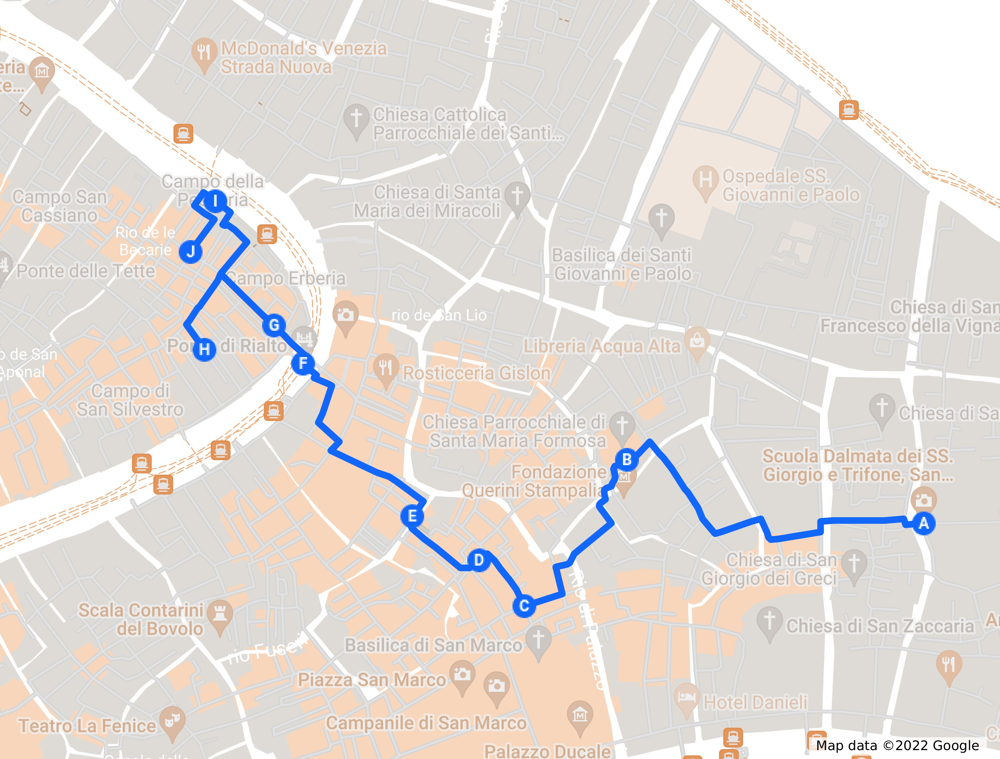

# Cuarto Paseo: Hacia Rialto
## Por el corazón económico de la antigua Venecia

> "Compraré contigo, venderé contigo, hablaré contigo, andaré contigo, y todo
> eso, pero no comeré contigo, beberé contigo, o rezaré contigo. ¿Qué hay de
> nuevo en Rialto?" Shylock en la obra "El mercader de Venecia", de
> Shakespeare.

El eje principal turístico, y también histórico, en Venecia va desde San Marco
hasta Rialto, del poder político al poder económico; aunque en realidad no había
una gran diferencia, porque el dogo presidía sobre lo que era en realidad un
cártel de diferentes empresas semi-estatales, sí es cierto que las transacciones
comerciales y las noticias sobre las mismas no podían tener lugar en el palacio
ducal, así que el eje se desplazó hacia Rialto. Seguiremos, más o menos, ese
camino en este paseo, que comienza muy cerca de San Marco.

No solamente es el pequeño tour dentro del gran tour, ese camino tuvo su
significación en la historia de Venecia: era el camino de los condenados por
robo, a los que azotaban y que, por tanto, se abrazaban al Gobbo porque era el
final del suplicio.

Y comenzaremos por la Iglesia de San Giorgio degli Schiavoni, también una *Scuola*
o gremio, y precisamente de los dálmatas o Schiavoni, que eran, entre otras
cosas, los soldados de la república. La iglesia es interesante, pero sobre todo
es interesante ver cómo la cultura de esas colonias influenciaba a la metrópoli,
que fue el primer crisol cultural, quizás la clave de su longevidad y éxito. Un lugar donde había tanto españoles como griegos procedentes del imperio bizantino, armenios y árabes, alemanes y alemanes del Báltico; ingleses y flamencos. Cada uno en su lugar, pero contribuyendo a la riqueza económica y también cultural, y siguieron haciéndolo hasta el final.

Desde ahí vamos hacia el centro, San Marco y ligeramente en dirección Rialto, cruzando el rio San Lorenzo, el ponte de San Severo, y por la *ruga Giuffa*, que de hecho se escribe junto, *Rugagiuffa*. Una *ruga*, deformación de *rua*, es un tipo de calle que no nos hemos encontrado hasta ahora, y es una calle de cierta importancia comercial. Pero volvemos al crisol. Según Curiosità veneziane, era una calle donde solían trabajar comerciantes armenios procedentes de un barrio de Isfahan, en Irán, llamado así. 

> Según la Wikipedia en asturiano, no te lo pierdas, Venecia e Isfahan son ciudades hermanadas; a saber si es cierto, pero sí parece más fiable el hermanamiento con Erevan, en Armenia. Conociendo la geografía de Venecia acabamos conociendo las relaciones comerciales de otrora en Europa y el Oriente Medio.

Durante el imperio abbasida, cientos de miles de comerciantes armenios fueron forzados a emigrar a Isfahan. Algunos acabarían yendo a otros lugares, como Venecia, y de ahí el nombre de la calle, que viene del nombre del barrio, Nueva Juffa, donde se forzó a esas personas a quedarse. Hoy en día sigue siendo el mayor barrio armenio del mundo.

Pero… El propio libro de las calles de Venecia dice que esa etimología no es muy fiable. Google ni siquiera dice que hubiera una relación significativa entre Isfahan y Venecia; buscándolo en Google sólo salen entradas sobre vuelos baratos o un restaurante Venice en Isfahan. Lo más probable es que viniera del vocablo *gajuffo*, que viene a significar gitano. Así que de una u otra forma, calle comercial, o de armenios residentes en Irán, o de gitanos procedentes de Croacia. Y en cualquiera de los casos, una serie web cómica realizada en Venecia. Habrá que verla.

> Ya he visto unos cuantos episodios. Está en veneciano con subtítulos en italiano, así que se entera uno de la mitad. Una especie de “Vaya semanita”, en veneciano, con situaciones absurdas, y una visión de la ciudad desde los locales bastante curiosa. Como es natural, menciona a Pitura Freska y otros grupos que cantan en veneciano.

Desde ahí llegamos a la Calle Larga de San Marco, que es paralela a una de las aristas de la piazza San Marco. Calle de turismo de masas, sin siquiera una serie web que la ensalce o unas líneas en Curiosità Veneziane; y eso que calle *larga* significa, como ya sabemos, calle Ancha. Así que procedamos por aquí hasta el comienzo de Mercerie.

Verás, más o menos a la altura del primer piso, un altorrelieve con una señora mayor, con su toquilla… Y un mortero en la mano; por eso se llama la *vecia del morter*. Justo debajo, hay también una placa en el suelo que cuenta qué fue lo que ocurrió.

Hay que irse muchos años atrás, al siglo XIV. Principios del siglo fueron una época convulsa para la república, con muchos cambios legales y sociales. Ya hemos hablado de la *serrata* o “cierre” del Mayor Consejo a las familias nobles; las “apostólicas” y las “evangélicas”: en total dos docenas de familias dentro de las cuales tenían que estar los elegidos en ese consejo. Previamente, la elección la hacían los gremios o el dogo, u otros miembros del Consejo. No es que fuera totalmente democrático, pero al menos había cierta posibilidad para las clases medias de ascender políticamente, lo que en una república mercantil como la veneciana equivalía también a ascender económicamente.

Entre esas familias estaban los Tiepolo, los Querini y los Badoer. Que, a pesar de formar parte de esas familias *elegidas* no creían que fuera la mejor forma de gobernar la república. Pensaban que cerrar el Consejo y todos los privilegios que ello conllevaba a unos pocos sería el fin de la república más tarde o más temprano. Se equivocaban, claro, pero estaban dispuestos a defender con sus armas y, si hacía falta, con su vida, el acceso del *popolani*, o al menos gente con suficiente cualificación y éxito en los negocios.

Convinieron lanzarse contra el palacio ducal y cargarse al dogo, un Gradenigo en ese momento. Pero hubo un chivato, la guardia de palacio se reforzó, se trató de negociar con él, pero se cargaron a los negociadores, así que al final se trató de llevar a cabo el golpe de estado.

Con contaban con la certera mano de la *vecia*, que en un momento fundamental de la batalla, en medio del caos, se cargó al portaestandartes de los rebeldes, con una bandera en la que se leía “Libertà”.

¿Es cierta esta historia? ¿Por qué iba a ser mentira que el dogo apoyado por el partido aristócrata salva la situación con la ayuda de una representante de los *popolani*? Quizás porque es demasiado bueno para ser cierto. Pero ya sabemos que en Venecia el relato se confunde con la historia. Ahí queda la estatua y también una placa para recordar el evento.

¿Donde acabaron Tiepolo y Querini? Fueron al exilio, y condenados a la *damnatio memoriae*, quemando y arrasando su casa y erigiendo una columna diciendo lo que había ocurrido. El famoso pintor sería de la misma familia. Badoer fue condenado a muerte y decapitado. A partir de ese momento se constituyó el Consejo de los X para actuar como un ministerio del interior, y a la vez como servicio de espionaje interno y externo.

Los Querini siguieron formando parte de la vida de la república; las familias se dividían en varios clanes, y lo que afecta a uno se queda en la familia inmediata. El palacio Querini Stampalia está un poco más adelante. Ya hemos hablado de él cuando mencionamos a Scarpa, así que nos centraremos en la plaza donde está: Campo Santa María Formosa, y la iglesia de Santa María Formosa

> Uno de los sitios que *no* he visitado todavía. Vamos a ver qué dicen las fuentes.

Es una de las plazas más grandes de Venecia, con 9 calles y once puentes, con múltiples palacios (a algunos de los cuales se llega con un puente) y rodeada por tres *rii*. 
En este *campo* también hay un *ramo Va in Campo*, así que debe ser el nombre genérico de las callejuelas que llegan a un campo, o van de un campo a otro. Como el anterior que mencionamos está en San Marco, y este en Castello, aunque por muy poco, no hay confusión posible.

Entre los palacios hay grandes nombres (y dónde no, pensarás); la casa de Sebastiano Venier, el vencedor de Lepanto (con permiso de Juan de Austria) y luego dogo, el palacio Malipiero Trevisan… La primera es gótica, aunque la mayoría de los palacios son renacentistas, y usa una piedra amarillenta de Vicenza que parece que no aguanta muy bien la humedad. Así que cuando leas esto, a saber en qué estado estará.

La iglesia es de nuestro conocido Codussi; por lo tanto, renacentista de pura cepa, y muy parecida a San Michele, porque los arquitectos son como los cantantes, una vez que encuentran la fórmula, la van repitiendo. Por qué se llama Formosa tiene varios orígenes: primero, porque se dice que la virgen le indicó a un obispo que construyera una iglesia donde apareciera una nubecilla blanca, o la virgen en “forma” de nube. De ahí “Formosa”. ¿Lo entiendes? Yo tampoco. Pero hay otra teoría que dice que la estatua de la Virgen tiene formas voluptuosas, y por eso le llaman “Formosa”. En la iglesia se reunía el gremio de los Bombardieri, o fabricantes de bombas, que las criaturicas también necesitaban patrona. En todo caso, tiene diferentes retable y el curioso premio de ser la única bombardeada durante la primera guerra mundial, por una bomba lanzada desde un avión austríaco.

Esta es una iglesia gremial (aparte de los Bombardieri, estaban los Casselleri o fabricantes de ¿cajitas? ¿Relicarios? y los *frutaroli* o fruteros), por tanto, en una ciudad donde los gremios tuvieron mucha importancia; no tanta como en Florencia, donde nombraban al presidente (hasta que llegaron los Medici), pero si la suficiente como para tener el cargo de la educación, al menos la profesional, y además actuaban como representación de las clases medias ante el gobierno. Como tales, eran un contrapeso del poder; y por eso, el dogo venía una vez al año a visitar esta iglesia y a traer ofrendas.

Esa visita es lo que quedó de la fiesta de las Marías, que se inició alredor del comienzo del milenio con un hecho truculento: el secuestro de 12 solteras durante una ceremonia de presentación en una iglesia. Esto, que suena a rapto de las Sabinas, fue protagonizado por los piratas “narentanos” (del río Neretva) o de Istria, pero no les duró mucho, porque inmediatamente fueron interceptados y masacrados por los, al parecer, fabricantes de cajitas que se usaban para las dotes. Todo esto, que suena poco plausible, justifica que la visita del dogo a esta iglesia específica.

La fiesta de las Marías también formaba parte del carnaval, con todo lo que ello conllevaba. De hecho, se ha recuperado en este siglo, porque se suprimió en el siglo XIV. Curiosamente, después (bastante después) de la revuelta de Bajamonte Tiepolo. Ninguna relación, seguro, guiño, guiño, codazo, codazo.

Durante la fiesta de las marías, en los últimos tiempos, se paseaba una efigie de madera vestida de mujer a la que llamaban *marione* o *maria de tola*. De donde viene… marioneta (que antes de ser de tela o cartón eran de madera, como Pinocho).

Desandamos lo andado por la calle Larga, y volvemos hasta la *calle degli Specchieri*, que debía ser en tiempos una calle donde se asentaban los que vendían especias. Debía de ser algo muy común porque hay una *salizzada degli Specchieri* en Cannaregio, y también una *ruga* en San Polo, cerca de Rialto. Llegamos a San Zulian, una pequeña capilla encajonada en un *campiello*. El mayor interés es el curioso altorrelieve en una de las portadas, justamente la que da enfrente de la calle por donde salimos.

Encima de la portada, hay una estatua de piedra oscura de un señor con una rama en la mano, rodeado de múltiples objetos: un orbe que tiene ¿una vaca?, una bola del mundo, un cartapacio, un atril para libros, y una placa grabada en mármol con una frase en latín. Se trata de un personaje curioso, Tommaso Rangone.

Y famoso también; hay medallas con su efigie por varios museos europeos, el Prado y el British entre ellos. Las medallas las hizo él mismo, supongo, igual que pagó esta estatua y la misma iglesia. La estatua que vemos es de Sansovino, que ya sabemos que el oficio de arquitecto iba asociado fácilmente al de cantero o escultor; por otro lado, Sansovino también es el arquitecto de las portadas, que se terminaron en el siglo XVI. Tommaso era médico, e hizo una fortuna con remedios contra la sífilis y la fiebre amarilla a base de plantas; las que tiene en la mano, precisamente. Y como no era precisamente modesto, puso como condición para financiar la reconstrucción de la iglesia que incluyera su efigie, a modo de profeta hebreo o patriarca. También apoyó a Tintoretto y a otros artistas; la pintura que hay en el interior es nada menos que de Veronese (lo que sucede prácticamente en la mitad de las iglesias de Venecia, pero aún así). Tenía una teoría que propugnaba que el hombre sería capaz de vivir hasta los 120 años (por qué 120 y no 117 o 125, no consta). De eso hablan las tres placas en hebreo, latín y griego que hay encima de las tres portadas.

La sífilis, de hecho, estaba tremenda extendida en Venecia en esa época, y siguió propagándose de la forma que se propaga esta enfermedad, por contacto sexual, durante bastante tiempo. Teniendo en cuenta que se trataba de un país de marineros que pasaban 6 meses fuera de casa, y cómo se extendió la sífilis en Europa a partir del contacto con América, no es de extrañar en absoluto. Llamada *la enfermedad francesa* por su supuesta introducción por las tropas francesas que invadieron Italia, acabó afectando a todos los estratos de la sociedad, de los más ricos a los más pobres, a laicos y religiosos. Se recluía a las mujeres enfermas y a las mujeres más bellas para que no se contagiaran; los hombres, sin embargo, contagiaban y lo consideraban una distinción.

Al final, se convirtió en una enfermedad curable, gracias a Tommaso y a las muchas farmacias que había en toda Venecia. La Theriaca, la poción mágica que se elaboraba en muchas de ellas, se suponía que era eficaz contra las primeras fases de la sífilis.

La poción Theriaca o *triaca* forma parte de la mitología, y hasta la ontología, veneciana. Alex de la Iglesia la menciona a santo de no se sabe muy bien qué, aunque evidentemente no tiene nada de mágico y es algo que, visto desde la perspectiva actual, parece más probable que destruyera el aparato digestivo de la gente que curara cualquier cosa. Supongo que sería el sesgo del superviviente: si te tomas la teríaca y sobrevives, es que no es fácil acabar contigo y cuentas lo bien que te fue. Volveremos a ella un poco más adelante.

> Creo que he conseguido escribir la teriaca de todas las formas posibles. Mi corrector ortográfico está que echa chispas.

Vamos a seguir en dirección a Rialto y parar en la Alianza Francesa. Que demuestra que los venecianos no le tienen inquina a nadie. Y más porque han ocupado uno de los sitios más señeros: el casino o *ridotto* Venier.

> Ha sido el comité francés para la salvaguarda de Venecia quien lo ha restaurado, igual que el ala Napoleónica. Oye, se lo curran. Eso hay que reconocérselo.

¿Que qué era un *ridotto*? Yo creo que lo más parecido es el concepto de *club*, o sea, un lugar donde la gente se reúne a hablar y a divertirse. Lo que ocurre es que el tipo de divertimento no era exactamente el mismo que el que había en el club Diana de mi pueblo, donde se jugaba a la ronda robá y se hablaba de toros mientras te tomabas una caña. Igual era más parecido a lo que llamábamos muerdo-pubs. Es decir, lugares oscuros y con música fuerte donde podías encontrarte de forma discreta con quien pudieras.

Por si fuera poca discreción, a los *ridotti* se iba enmascarado, con la *bauta* de la que ya hemos hablado o con la *moretta* la que más le gustara a uno. De hecho, los juegos de cartas y dados estaban prohibidos (es posible que algún otro estuviera permitido, si no de qué iban a llamarse casinos esos lugares donde se hace poco más que jugar). Este casino Venier no es ni el primero ni el único; había cientos de casinos en el siglo XVIII, donde, como todos sabemos, el principal producto veneciano era el esparcimiento en sentido amplio. Pero sí era uno de los más característicos.

Se llama Venier por la propiedad de la casa, aunque de hecho quien lo administraba era su mujer, Elena Priuli; muchas mujeres encontraron en la administración de estos *ridotti* una salida laboral.

Ahora sólo queda un casino en Venecia, Ca’ Vendramin Calergi, pero también hay una sede cerca del aeropuerto. Entre otras cosas, allí estuvo alojado Wagner. También puedes ir al Venetian en Las Vegas, una Venecia totalmente falsa, pero que da el pego y tiene todos los tópicos que uno espera en Venecia. Incluso la luz del atardecer, que en el Venetian dura todo el día.

---

Ya hemos hablado sobre el puente de Rialto.

> Técnicamente está fuera de Rialto, así que no corresponde hablar aquí de él.

Realmente, el puente en si es un
sitio tan lleno de gente haciéndose selfies (habitualmente, para evitar
aglomeraciones, ver el capítulo sobre cuando visitar Venecia) que no merece
mucho la pena pararse en él, salvo para tener una panorama de dos ramos del Gran
Canal, el que va hacia San Marco y el que va en dirección contraria; la belleza
de los palacios y otros edificios que desde aquí se observa es apabullante. Pero se puede
tener una mejor perspectiva desde el vaporetto: el que llega del aeropuerto pasa
por debajo, y hay otras muchas líneas que también lo hacen. La mejor forma de
ver un puente es siempre pasar por debajo, no por encima. Otra opción es subir a
la terraza del Fondaco de Tedeschi, donde además tendrás una bonito panorama de
toda Venecia. Eso sí, no es de estos de "voy a acercarme a ver si me
cuelo". Aunque la entrada es gratuita, hay que reservar hora en la página
web. Así que planéalo, como muchas otras cosas en Venecia, de antemano. Y si
ninguna de ellas está disponible, simplemente desde las fondamenta de alrededor
puedes ver perfectamente los palacios sin tener que esperar en la cola de los
selfies a que te toque.

Pero muy cerca encontraremos cosas como la "cabeza de oro", un símbolo de una
antigua farmacia, llamada precisamente "Alla Testa d'Oro", establecimientos que
dieron a Venecia su fama y que atrajeron a todo tipo de alquimistas y otros
engañabobos. Las farmacias, bien provistas por especias que llegaban de Oriente,
nada menos, tenían la receta para crear la llamada Teriaca, un bálsamo de
Fierabrás que era capaz de curar todas las dolencias. En su receta incluía
veneno de serpiente y alguna parte jugosa de un escorpión, y sólo se podía hacer
una vez al año, previa exposición al público de los ingredientes y bajo la
supervisión de la Serenísima. Un poco como las recetas de hoy en día, que llevan
siempre los ingredientes y tienen que tener la aprobación de sanidad. Hasta en
eso estaban bien avanzados los venecianos.

Y estaban avanzados porque, por su situación como centro del comercio, tenía acceso a todo tipo de especias, al opio y al veneno o demás partes de la serpiente que se usaban en su fabricación. Por eso es por lo que es típica de Venecia, y la teriaca veneciana se vendría en toda Europa, en general falsificada, porque no es que entonces se estilara el precinto de seguridad ni nada. Incluso con solo la que era de verdad verdadera, ya aportaba unas cantidades considerables a la economía veneciana, donde a principios del siglo XVIII había 80 farmacias. Hay todavía reliquias de la elaboración de la teriaca en varios puntos de Venecia, pero el más evidente (y dorado) es este, la cabeza de oro.

---

Los primeros pobladores de Venecia llegaron, precisamente, a esta zona; el
nombre, inicialmente *rivus altus*, significa canal profundo; está justamente en
un recodo del Gran Canal, lo que lo convierte en una zona fácil de defender para
sus primeros pobladores, que habían llegado de las barras de arena, los *lidi*,
que separan la laguna del mar Adriático.

Rialto es, por tanto, más que un puente; el puente se llama así por la zona, no
al revés; se extendería desde la parte norte del puente hasta la zona del
mercado del pescado, englobando la iglesia de San Giacomo. Ya hemos visto que
aquí acababan, en el camino de la vergüenza, los condenados por robo, abrazados
al Gobbo.

> Voy a ahorraros el chiste de que la condena la leía una persona con acento
francés.

Pero, de estos orígenes, Rialto acabó convirtiéndose en un mito, una palabra
genérica que aludía al sitio donde iba el pueblo a entretenerse... Y por esa
razón lo vemos como nombre de múltiples cines, varios de ellos en España; una
costumbre que comenzó con un cine Rialto que se inauguró en el mismo Hollywood a
principios del siglo XX. De ahí pasó a otras ciudades americanas, y finalmente
un granadino creó el cine Rialto en Madrid antes de la guerra. Todavía funciona
como teatro. Y esto encaja con el concepto de Rialto en Venecia: el gobierno
estaba en la piazza, pero la gente iba a Rialto a ver que se cocía y a
entretenerse; ahí se leían los bandos o se ponían (en la columna del "jorobado",
el Gobbo). Hoy en día hay todo tipo de establecimientos que se llaman Rialto:
confiterías, restaurantes, hoteles y, por supuesto, pizzerías. Igual el nombre
transmite cierto *glamour*, que, *in situ*, se limita a alguna joyería y al
Fondaco dei Tedeschi, lleno de tiendas de lujo, muy cerca.

Porque el Gobbo, al que hemos mencionado al principio del capítulo, soporta un
pedestal; y desde él se leían edictos y condenas. Estos eventos hicieron de esta
plaza un foro público, donde acudía la gente a ver qué pasaba. "¿Qué hay de
nuevo en el Rialto?" se convirtió en una frase hecha, y de hecho es el título de
una novela que coloca al joven Shakespeare como agente del gobierno en
Venecia. Lo que no es muy exacto históricamente, no sólo porque no se conoce que
Shakespeare hubiera estado nunca en Italia, sino porque, de hecho, los primeros
agentes secretos, sí, eso también, ¡los creó Venecia! Agentes como un servicio
de inteligencia centralizado, cuya información se filtraba y se llevaba a la
sección burocrática que pudiera actual al respecto; el mismo título, "What news
on the Rialto", tiene un artículo de Ioanna Ioannou que habla, precisamente, de
ese servicio y sus implicaciones en la política local y mundial. Servicios que
tuvieron su papel en la conjura de Bedmar de la que hablamos en el capítulo de
Cannaregio.

> Si quieres, échale un vistazo ahora mismo. Yo te espero por aquí.

---

Según se sale desde el puente hacia el sestiere de San Polo, en la otra isla,
hay un gran edificio con una curiosa forma de rectángulo con una esquina
recortada, a la derecha, de piedra blanca y con un aspecto bastante
dramático. La esquina cortada le sirve para adaptarse a la forma del canal, que
ahí precisamente hace un meandro. Se trata del palacio de los Camarlengos o dei
Camarlenghi; en él se alojaban una serie de instituciones financieras: el
susodicho camarlengo, y también los "cónsules de los mercaderes", *consoli dei
mercanti*; el camarlengo venía a ser el ministro de hacienda: recaudaba los
impuestos y se encargaba de decidir cómo se empleaban; y los *consoli* eran un
juzgado de lo mercantil, con el *sopraconsoli* una especie de juzgado de última
instancia.

> Los juzgados de lo mercantil, en todo el mundo y también en España, llevan
> asuntos civiles (o sea, no penales) relacionados con contratos y el comercio
> en general.

La pequeña *fondamenta* que lo rodea se llama fondamenta de la Presón, de la
prisión, porque también se encontraba allí la cárcel "de los deudores", o sea,
de los que no devolvían los créditos, se declaraban insolventes o no pagaban sus
impuestos. Allí que iban a parar con sus huesos los que no comulgaban con el
espíritu mercantil de la república. Las ventanas enrejadas existen todavía, en
la planta baja, justo al nivel del agua.

¿Y quienes eran estas personas? Pues gente de todo lugar y procedencia. El hecho de que existan estas instituciones demuestra la existencia de una red de intercambios amplia, y también una red de instrumentos financieros tales como pagarés, que permitían inversiones con cierto componentes especulativo.

Y esas inversiones podían ser perfectamente extranjeras. El comercio con el norte de Europa, las ciudades alemanas, polacas, bálticas y rusas de la liga hanseática, llevaba a Venecia a todo tipo de comerciantes.

> La liga hanseática era el equivalente norteño y distribuido de Venecia, pero en plan capitalismo salvaje. No había ninguna estructura de gobierno que la soportara, aunque había un grupo común de leyes que las ciudades admitidas debían respetar. Eran una potencia comercial que monopolizaba las transacciones de ciertos productos, y protegía sus convoys con su propia marina. El descubrimiento de América trajo su fin, igual que empezó a marcar el declive de Venecia.

Por ejemplo, comerciantes del báltico, que usando las redes de la liga Hanseática, traían pieles de Novgorod (en la actual Rusia) por tierra pasando por Erfurt, Nuremberg en Alemania, cruzando los Alpes y entrando en Italia a través de Bozen (Bolzano). Había alternativas: vender el producto en Brujas, otra ciudad hanseática, por ejemplo, y que ya ellos se apañaran. Pero hábiles comerciantes como los hermanos Veckinchusen decidieron arriesgarse ellos mismos a montar una sociedad en la misma Venecia; con esa sociedad querían vender pieles directamente en Venecia.

> Hildebrand Veckinchusen era alemán, como se colige por su nombre, pero es probable que naciera en alguna ciudad del Báltico; familiares suyos fueron miembros de la corporación municipal en Riga y en Tallin. Prácticamente hasta la primera guerra mundial y desde la invasión de los caballeros teutónicos, los alemanes constituyeron una mayoría de la clase media y profesional en los estados bálticos.

Por acortar la historia, la sociedad fracasó. “Es el capitalismo, amigo”, y si compras pieles a un precio alto y las tratas de vender cuando hay demasiada oferta en el mercado, estás fastidiado. Si además alguno de los involucrados en la sociedad es un poco sinvergüenza, mucho más. Veckinchusen acabó tan endeudado que dio con sus huesos en una cárcel de deudores… En Brujas, porque se regía por las leyes de la Liga. En Venecia tuvo que entregar todos los bienes de la sociedad al estado, y con eso posiblemente consiguió que no se encarcelara en el susodicho palacio dei Camarlenghi a sus socios en esa ciudad.

El hecho de que Veckinchusen dejara un legado de un montón de cartas y libros, y que el comienzo de su caída sucediera en Venecia, muestra una vez más la importancia de la ciudad como centro del comercio en esa época, previa al comienzo de su declive.

No sólo se vendían y compraba lana, miel, cristal o ámbar en Rialto.
El comienzo del mercado del arte tiene lugar, dónde si no, en Venecia
también. Precisamente aquí, en Rialto.

¿Por qué? Rialto era donde se encontraban los mercados de productos perecederos (y también financieros, por cierto), y poco a poco, por
acreción, diferentes puestos que vendían todo tipo de mercancías traídas en las
*mute* de oriente: especias, drogas y, por supuesto, pigmentos.

Algunos pigmentos, como el lapislázuli, que se usaba en el azul de los cuadros,
un color con un alto componente simbólico, relacionado con su precio, y que se
usaba sólo para la realeza o cosas excepcionales como los mantos de la
Virgen. Aquí en Venecia era donde podían adquirirlo con facilidad, y
precisamente en esta zona; en las pequeñas calles que hay hacia el norte de
Rialto hay algunas, como la Ruga dei Spezieri, donde se concentraban los
vendedores de especias y compuestos químicos diversos, para diferentes fines.

Pero claro, el precio era bastante elevado y los artistas tenían que intentar
colocar alguna pintura para poder tener *cash* a mano... para hacer más
pinturas. Hasta ese momento, era un mercado en el que sólo existía la demanda:
los pintores y otros artistas eran artesanos que realizaban pinturas por
encargo, poniendo ellos los materiales y recibiendo el pago cuando, y sólo
cuando, se entregaban. Los cuadros se vendían, sí, o más a menudo se
arrebataban, pero de los nobles o gremios que los habían adquirido.

Rialto cambió eso: desde el siglo XIV existió un mercado libre, donde se
ofrecían pinturas directamente; también había ferias de arte durante las
fiestas de la *Sensa* y San Rocco.

Más adelante, y sobre todo gracias a esa tribu llamada los Medici, el centro del
mercado del arte se trasladó a Florencia. Pero con el Grand Tour volvió a
Venecia. Si te podías llevar un Canaletto o algo de cristal de Murano, era la
experiencia completa, y el cónsul inglés, Joseph Smith, era precisamente
tratante de arte y te podía ayudar a encontrar un recuerdo. No sólo para los
granturistas, también para la nobleza europea compraba a través de un
intelectual allí residente y llamado Algarotti. El mercado se perpetúa hoy en
día con la Bienale, que también va dejando todo tipo de obras de arte público en
el parque correspondiente y en sitios insospechados, como las dársenas del
Arsenal, donde se puede ver unas grandes manos entrelazadas de Lorenzo Quinn,
"Building Bridges". Lo que se puede ver si tomas el vaporetto 4.1 que rodea la
isla en dirección a Fondamente Nuove y a San Michele y Murano.

> De hecho, no creo que se pueda ver de otra forma, aunque igual se puede
> visitar el interior del Arsenale. Tendré que enterarme.

Esta Biennale se celebra desde 1895. Una vez reunificado el estado
italiano, la ciudad andaba de capa caída, y el ayuntamiento decidió convocar este evento para tratar de revivir el mercado del arte. Aunque,
cuando se celebra, está distribuida por todas las islas, en forma de “pabellones” (en realidad, simples locales, instalados en cualquier palacio), las exposiciones se concentran más bien
en la zona del Arsenal y en el barrio de Castello. Así que toca hablar de ella
en otro lado.

En esta zona, y en San Polo en general, es donde es más probable encontrar algo de arte callejero. En una ciudad Patrimonio de la Humanidad, como en casi cualquier otra, todo graffiti se considera vandalismo (y, para ser sinceros, mucho lo es). Pero hay una línea muy delgada entre el arte callejero y el gamberrismo, y los verdaderos artistas saben como no traspasarla. En casi todos lugares suele haber un tipo de arte callejero que se llama *slap*: esencialmente, pegatinas. Estas pegatinas van desde los clásicos *tags*, que son etiquetas con una banda roja o azul en la que pone “name” o “my name is” (y que al parecer vendían en las oficinas de correos americanas), hasta todo tipo de pegatinas fabricadas ex profeso por los artistas, con *tags* (que reciben el nombre del soporte y son esencialmente nombres o apodos escritos con arte) y todo tipo de mensajes, logos, y pequeñas piezas artísticas.

Al ser de pequeño tamaño, se pueden poner en cualquier lado. En la parte trasera de las señas de tráfico o en los postes de las mismas, en umbrales de las puertas… Y sobre todo en cajetas eléctricas de iluminación o contadores. Los únicos lugares donde está claro que no hay nada artístico o histórico que salvaguardar.

> Aquí en Granada hay casetas eléctricas neomudéjares, de inicios del siglo XX, cuando se inició la electrificación para la industria azucarera y los tranvías. Todavía se ven los logotipos de la “Eléctrica Granadina” en algunos de ellos.

Esos cajetines de utilidad pública tienen tamaño suficiente para admitir arte callejero de mayor tamaño, los llamados *pastes*; son esencialmente hojas de papel pegadas con “pasta” (engrudo hecho de harina), o, más modernamente, cola o pegamento, supongo. De estos podemos encontrar unos cuantos en Venecia. Un artista callejero de Florencia, Blub, ha puesto unos cuantos y todavía se pueden ver, aunque como tales papeles se deterioran muy rápidamente y también es probable que estén medio arrancados cuando lo encuentres.

> A cualquier ciudad que voy me aseguro de encontrar la zona de arte callejero, o hacer una ruta. Hay un mapa de arte callejero en Venecia que puedes usar.

Blub tiene un estilo peculiar, fácilmente reconocible. Reproduce obras clásicas, o fotos fijas de películas, con pocos colores y todos pastel… Y les añade unas gafas de bucear. Muchas son mujeres sacadas de cuadros de Vermeer, o de pelis italianas clásicas. Algún Vermeer pasado por Blub se puede ver cerca de Rialto, por la Pescheria.

Es posible que Venecia tenga algún grafitero nativo, pero lo dudo. Lo que es una pena, porque combinar la tradición artística veneciana con la iconografía y soporte actual sería una combinación muy interesante. Cualquier edificio decorado por esta grafitera veneciana sería seguramente salvado de una eventual quema de la ciudad por los futuristas.