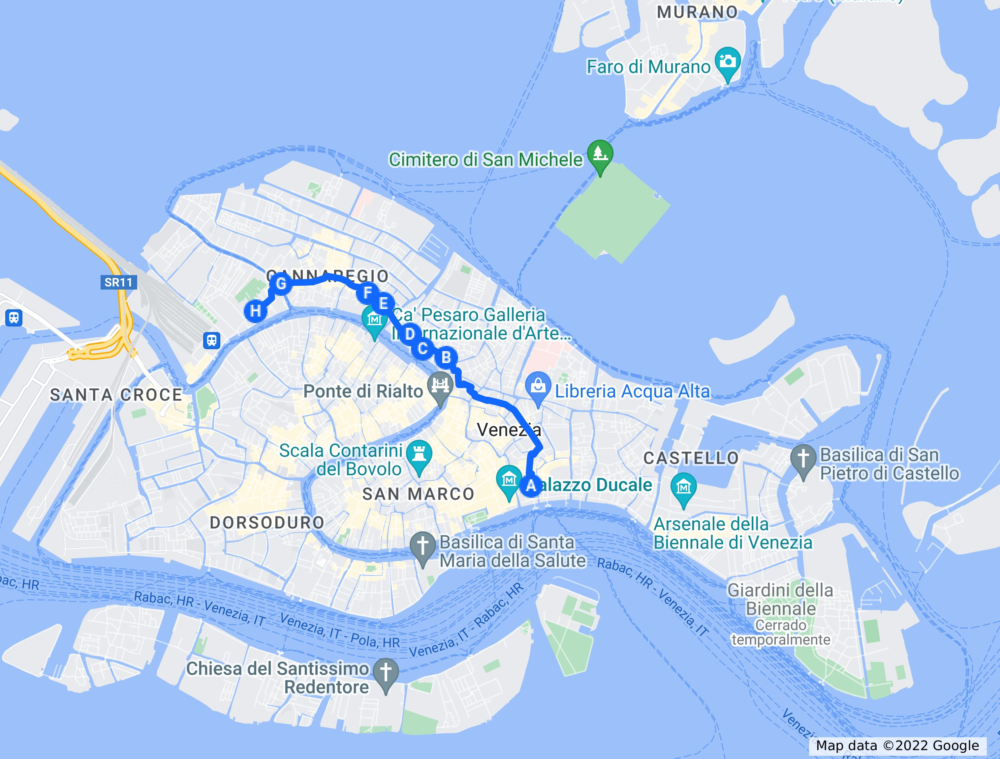

# Por Cannaregio
__*El barrio más populoso de Venecia*__

Todo viaje tiene un final. Y ¿por qué no aprovecharlo para visitar
alguna parte que haya quedado de lado? Así que vamos a hacer un viaje
por Cannaregio, la parte de Venecia que tiene más huellas
españolas... Y alguna que otra historia curiosa.

Cannaregio es el lomo del pez, cerca de la espina; esa parte pega a la
laguna, y es donde vamos a encontrar más huellas de la modernidad,
bloques de pisos, incluso el hospital. En una ciudad como esta, que
tiende a parque temático, es curioso que lo más auténtico, entendiendo
como tal donde desarrollan su vida las personas que viven en la
ciudad, es la zona más moderna. Pero el turista sólo entrevé esa parte
desde el vaporetto o cuando viene de Murano.

También se puede ver, sin más remedio, cuando vas desde San Marco a la
estación del tren. La presencia, al final o al principio, de esa
estación, ancla este paseo a la realidad, a la autenticidad. También,
por supuesto, a las trampas turísticas más destacadas. Aún así, es
Venecia, y hay muchas cosas que ver.

Empecemos por la estación ferroviaria, una a la que nos llevan indicaciones por
toda Venecia.  La estación de Santa Lucia es también parte de esa Venecia real:
casi todos los tenderos, camareros, taquilleros e incluso gondoleros que verás
en tu visita vivirán en Mestre, y tendrán que tomar ese tren todos los días para
llegar a su trabajo. De Mestre la separa sólo un puente, el puente della
Libertà. Y también refleja la historia real de Venecia: El edificio actual se
inició en el periodo fascista, aunque se terminó después de la guerra mundial;
el estilo racionalista refleja los gustos de la época. También le habría gustado
a los futuristas (uno de los cuales, Marinetti, estaba en la comisión nacional
que aprobaba los proyectos de obras públicas, y tuvo que intervenir en este),
que decían que las estaciones de tren y las pistas de carreras eran la verdadera
arquitectura del siglo, y abjuraban siempre que tenían ocasión de las columnatas
y los arbotantes. Habrían disfrutado del hecho que se tirara una iglesia, la de
Santa Lucia, de la que quedó el nombre y alguna placa. De hecho, el arquitecto
que hizo el proyecto inicial, Angiolo Mazzoni, era algo así como el arquitecto
oficial de este movimiento, el futurismo, un movimiento italiano, bastante
cercano y predecesor del fascismo, liderado por un pintor y escultor llamado
Marinetti. Sin embargo, las obras fueron realizadas por otro arquitecto,
Virgilio Vallot, que ganó el proyecto, y terminadas finalmente por Paolo
Perillo, ya en el año 52. Una estación cuya construcción duró, al menos, lo que
un palazzo en la época renacentista.

No es un sitio desagradable; en Italia parece que todo lo cotidiano sea bello y
trascendente. Pero es un lugar un tanto anónimo, y puedes pensar por un momento
que estás en la de Florencia, de la misma época y cortada con el mismo patrón;
sin embargo, no es del mismo arquitecto, aunque se presentó al proyecto y quedó
segundo. Quizás sale de la anonimidad por el mosaico mural que hay a la entrada
a la izquierda, de Mario de Luigi y Anton Ambrosini, del mismo año; un conjunto
de objetos abstractos que tratan de transmitir la idea de Venecia, incluyendo un
león de san Marcos que está prácticamente invisible, en el extremo derecho,
oculto por las pequeñas tiendas que se han instalado en el atrio.

Cuando se inauguró la estación ferroviaria de Santa Lucia, poco después de la
independencia de Italia, había que buscar una forma de que los pasajeros y,
sobre todo, los turistas, llegaran fácilmente desde la misma hasta los dos
centros gravitatorios de Venecia: Rialto y San Marco. Por supuesto, estaban los
*vaporetti*, pero estos no tienen ancho de banda suficiente para que el
contenido de un tren completo sea transportado de forma cómoda a cualquiera de
esos dos centros; hay que proporcionar caminos alternativos, y de ahí salió esta
calle, Strada Nova.

> Realmente, Google Maps marca un camino por la Riva del Vin, cruzando la Santa
> Croce y San Polo que llega en 21 minutos. Seguro que incluye un montón de
> puentes con escalones subiendo y bajando. Los mapas de Apple en mi iPad (donde
> mayormente estoy escribiendo esto) sugieren, sin embargo, que se vaya por
> Strada Nova, a pesar de que marquen la duración con los mismos 24 minutos y de
> que haya, por medio, 8 escaleras (frente a los 7 de la ruta alternativa).

Como se llama *strada*, ya podemos imaginar que se trata de algo que se hizo
después de la república; efectivamente, fueron los austriacos en 1818 los que
empezaron a soterrar un *rio*; de hecho, mucho antes de que se hiciera la
estación o siquiera hubiera llegado el ferrocarril; el último, sí, lo realizó ya el
reino de Italia en 1866 y se inauguró en 1871. Con el nombre de via Vittorio
Emanuele, es como aparece en Curiosità Veneziane, que se escribió justamente en
esa época. No dice nada de ella, salvo que llegaba hasta el Ca’ D’Oro. Siendo,
en aquella época, una calle nueva, en realidad no había llegado a ocurrir nada
todavía. Y lo de *Nova*, en vez de *Nuova*, es por usar palabras venecianas,
aunque también se lo encuentra uno escrito de la forma italiana.

Aunque todo el camino se denomina popularmente de esa forma, y así se diseñó, en
realidad lo que uno se encuentra nada más salir a la izquierda de la estación
(donde, por cierto, puedes evitar escalones saliendo por la izquierda de las
vías a un callejón un tanto inmundo, la calle Favretti) dejando a la derecha la
parada de vaporetto, y embocando la calle que hay a la izquierda, alejándose del
canal: el Rio Terà Lista di Espagna.

Como se previó y se proyectó, es una calle obligatoriamente turística, llena de
hoteles y hostales con calificación baja en Google, pero ¿sabes por qué se llama
así? La *lista* era una especie de cercado que marcaba la extraterritorialidad
de una zona. Y aquí, aunque habría que ver exactamente dónde, porque al ser un
Rio Terà, es decir, enterrado, por aquí pasaba un canal en su época, estaba la
embajada de España ante la república.

Posiblemente también otras embajadas. La república, sobre todo en sus últimos
siglos, estaba obsesionada con la seguridad y quería mantener a los embajadores
extranjeros lo más lejos posible del palacio ducal. Aquí, en el llamado
apropiadamente Palazzo di Spagna, previamente Palazzo Friziero o Frigeri, porque
pertenecía a esa familia, y en el número 168, estaba la embajada.

Fui incapaz, sin embargo, de identificar nada que pudiera aparecer una embajada
del siglo XVII en la calle, a pesar de fotografiar varios candidatos. Y no he
sido capaz ni de encontrar el número 168 en Google ni en Apple Maps ni de
encontrar ninguna imagen que tenga ese tipo de etiqueta. Así que, lector o
lectora, si estás en Venecia con este libro (o lo que sea) en tus manos,
acércate al número 168, hazle una buena foto, y etiquétalo correctamente, para
que las generaciones venideras sepan donde podría haber comenzado, redoble de
tambores, la Conjura de Bedmar.

> De hecho, parece que fue la embajada española *después* de la conjura de
> Bedmar, al final del siglo XVII. Según Curiosità Veneziane el marqués de
> Bedmar vivía en la llamada Ca’ del Duca, justo en el Gran Canal, un poco
> después del puente de la Accademia, a la derecha (saliendo desde San
> Marcos). Como por ahí no pasa ningún paseo, meto aquí lo de la conspiración,
> hala; si quieres saber algo más, le dedico más espacio en el capítulo dedicado
> a España en Venecia. O sea, en realidad no comenzó allí, pero es el único
> punto identificable y nombrable como embajada de España. Por otro lado, en el
> artículo de la Wikipedia sobre la Strada Nova explica claramente que la
> embajada de la que se trata estaba en el palazzo Frigerio que es actualmente
> el Gran Hotel Principe.

La conjura de España, o de Bedmar, merece un capítulo aparte y de hecho (casi)
lo tiene. En un relato heredero de la tradición bizantina y hasta otomana, es
una historia en la que aparecen como personajes los llamados uscoques o piratas
de la costa de Croacia, el duque de Osuna y hasta Quevedo. Os animo a que la
leáis en algún sitio, porque es muy curiosa. Pero la principal historia que
afecta al paseo, y a este en particular, es que Venecia descubrió (o se inventó)
esa “conspiración” debido a que era un estado totalitario con sus súbditos y
liberal con los extranjeros ya en esa época de declive, y había creado un
servicio secreto al servicio del Dogo, de hecho el primer servicio secreto
“oficial” creado en el mundo occidental; hasta ese momento los diferentes
estado, nobles e iglesias habían contado con algún espía o aventurero al
servicio de algún señor, rey o familia, pero no una burocracia estatal y un
servicio de información centralizado como el que se creó en Venecia. La segunda
idea es que, a causa de esa mentalidad conspiranoica, las embajadas, incluyendo
la de España, se trataron de apartar lo más posible del palacio Ducal, y también
reunir para poder ser controladas mejor y con un número inferior de agentes. De
ahí esa calle, ese nombre, y la embajada de España si es que la lográis
encontrar (que buscando el Gran Hotel Príncipe no creo que sea tan
complicado). Más mérito tendría que intentéis encontrar la susodicha *lista*, de
la que a estas alturas no creo que quede gran cosa.

> Hay alguna otra *lista* en el callejero: Lista Vechia di Bari, que al parecer
> correspondía a la embajada austríaca. De hecho, está justo al otro lado del
> gran Canal, o sea, más o menos a la misma distancia del “centro”.

A lo largo del mismo, muchos *nizioleti* nos dirigen a correos, a la *ferrovia*,
y a San Marco y Rialto. Estos *nizioleti* son carteles pintados directamente
sobre la superficie de la pared, en fondo blanco o amarillo con una simple línea
negra de borde; son exactamente iguales que los que anuncian las calles, y a
veces se sitúan en sus cercanías.

Lo que es curioso no es que haya tantos, sino que se hayan mantenido. Y también
su veteranía: llevan ahí siglos. Incluso el mismo nombre, *nizioleti* (o
*nisioleti*), es una palabra véneta que no existe en italiano. Pero el origen
exacto de los carteles debe haberse perdido en la noche de los tiempos, porque
no he conseguido averiguar cuando se crearon; cabe imaginar que los que dirigen
a la *ferrovia* (la estación del tren) o al *piazzale* Roma son, al menos, del
siglo pasado. Te animo a abandonar Google Maps, porque total, no te va a servir
de mucho en Venecia, y seguir estos indicadores hacia Rialto, o hacia
Correos. Que ya no está ahí, pero donde estaba, hay ahora un centro comercial
desde cuya terraza hay unas vistas estupendas; es precisamente el Fondaco dei
Tedeschi, en cuyo muro todavía hay algún buzón atestiguando ese pasado postal.

> Si quieres subir a la terraza, tendrás que reservarlo con antelación, al menos
> en tiempos de Covid. Es posible que ya esté totalmente abierto. Yo no lo
> logré...

Lo curioso de estos nizioleti es que han inspirado la aparición de otros muchos
que dirigen hacia monumentos, hacia los servicios más cercanos (también cerrados
en 2022 y 2021), algunos museos sin mucho éxito... Y, los más curiosos, los que
se encuentran en el suelo, una señalética en mosaicos creados con pequeñas
piedras de colores, que tras muchos años, se conservan exactamente igual. En la
Lista di Spagna hay decenas, dirigiéndose tanto hacia *alberghi* diversos, y
también hacia el casino *oficial* de Venecia. También algún *night club* y
similar. En esa calle que dirige desde la estación del tren hacia Rialto y San
Marco tenemos, sólo mirando al suelo, todo lo que un turista de un sólo día
podría desear. Y alguna cosa más que quizás no desees.

Como está tan cerca de la estación del tren, y es muy posible que no te apetezca
nada ir haciendo fotos con la maleta a cuestas, una alternativa es seguir este
recorrido dejando temprano las maletas en la consigna de la estación, lo que te
costará unos cuantos euros por pieza, así que si puedes aprovecha y meta todo lo
que puedas en la maleta más gorda que tengas, y date un garbeo por allí hasta
pillarte el tren de vuelta o el autobús al aeropuerto desde el Piazzale Roma.

Avanzar por esta calle es a veces complicado, y en ningún lado más que en los
puentes que lo cruzan, como el Ponte delle Guglie, o de las “agujas” o
“pináculos”. Al cruzar este puente estarás en el *sestiere* de Cannaregio, ahora
de verdad. Torciendo a la izquierda, llegaremos pronto a la entrada del Ghetto.

La palabra gueto, originalmente *ghèto* en veneciano, si no el
concepto, se creó originalmente en Venecia. Acogiendo a judíos que
venían huyendo de *pogroms*, persecuciones y genocidios, en otros
lados de Europa, incluyendo España, acabaron en Venecia, que al no
casarse diplomáticamente con nadie, acogía a todo el mundo, con el
objetivo de que acabaran trabajando y beneficiando a la república. En
esta zona hay tanto sinagogas alemanas como españolas, porque en la
época medieval, el hebreo era solo un lenguaje litúrgico, y cada uno
hablaba versiones del idioma donde del país donde se encontraban; el
sefardí o ladino o judeo español, por ejemplo, parece castellano
medieval, y es una delicia de escuchar. Por eso cada comunidad, al no
tener un lenguaje común, tenía su propia escuela y sinagoga.

> El hebreo es solo común a los que viven en Israel, y sólo se empezó
> a usar con regularidad tras la segunda guerra mundial. En general,
> los judíos de la diáspora hablaban lenguajes, como el ladino o el
> yiddish, que se derivaban de los idiomas del lugar donde se habían
> establecido. A los sefardíes les enseñarían en ladino y a los
> ashkenazíes del centro de Europa en yiddish.

La comunidad judía fue arrasada durante la ocupación nazi. Mirando al
suelo en todo el gueto veréis losas doradas con los nombres de las
personas que fueron asesinadas en los campos de concentración
nazis. Diferentes asociaciones se encargan de pulirlas y que se vea
con claridad de qué persona hablan. Estas *stolpersteine* o *pietre
d’inciampo* están por todo el gueto, y merece la pena fijarse, porque
hablan del fascismo, del racismo, del totalitarismo y de sus
consecuencias fatales. Cada una de las piedras representa a una
persona o una familia, víctimas inocentes, que no deben caer en el
olvido. La mayoría están en Cannaregio, aunque hay también algunas en
otros *sestiere*. Mirando a los nombres que hay inscritos en ellas te
encuentras a veces dos apellidos, puede ser que sefardíes o
posiblemente personas que habían emigrado desde España o algún país
hispanoamericano; también familias enteras, que desaparecieron en los
campos de exterminio.

Hay mapas que te indican la localización de todas estas pequeñas placas; pero mi
consejo es el habitual: En Venecia, mira en todas direcciones cuando vayas
andando por la ciudad: arriba, abajo, derecha e izquierda. Estas personas
merecen un recuerdo, y que no se olvide lo que les ocurrió.

Si partimos de la estación y atravesamos Cannaregio, al final llegaremos a algún
punto del entorno del palacio ducal, así que vamos a empezar desde ahí, si le
parece bien al lector; el indicado está simplemente cerca de donde
nos alojamos en abril de 2022, *calle* delle Rasse, supongo que de los rasos. Un
camino relativamente directo es tomar Mercerie; el problema es que esa calle,
una de las más comerciales, está habitualmente repleta de gente y no es cuestión
de ir con las maletas por ahí. Así que vamos a tomar unos pocos callejones. Si
da la casualidad de que se va por la tarde, a la izquierda está el Bra's
Cocktail Bar, que tiene el techo decorado con cientos de sujetadores, haciendo
honor a su nombre; "Bra" significa sujetador en inglés. Es posible que no
quisieran complicarse demasiado con el nombre, hacer referencia al pasado procaz
y sicalíptico de Venecia... O quizás hagan referencia a la piazza Bra, una de
las plazas principales de Verona, cuyo nombre viene a significar simplemente
*largo* o pequeña plaza. De hecho, la plaza donde se encuentra no es demasiado
grande; pero en ella merece la pena acercarse a *Magna Bevi Tassi*: "Come, bebe
y cállate" en veneciano, un local de *cicchetti*, con cervezas artesanas, donde
puedes tomarte un Select Spritz (versión veneciana del Aperol Spritz) y probar
unas tapas a buen precio, mientras charlas tranquilamente con los propietarios,
que hablan una mezcla español-veneciano que es totalmente comprensible.

> En general, cuando intentas dirigirte en tu italiano intermedio a
> alguien en Venecia, casi siempre te tratarán de contestar en
> español, especialmente si es del gremio de hostelería. O igual se trata en
> realidad de veneciano, o de un subconjunto que abarque a los dos idiomas. La
> experiencia es bastante interesante, y desde luego nada práctica para
> prepararte el B1 de italiano.

Una buena oportunidad, que no te faltarán, de probar esta bebida que, sí, tiene
origen veneciano; en inglés se le llama *Italian Spritz* y el Aperol es sólo la
versión más conocida, o la que tiene más publicidad. En general, se trata de
mezclar alguna bebida amarga, tipo vermú, con vino blanco, prosecco (a veces lo
he visto con sidra en vez de estos auténticos ingredientes, pero no lo consumas,
sólo el original, evita imitaciones), y gaseosa o sifón. Es fácil de
identificar, al menos el de Aperol, por el color butano, el tipo de copa
característica y la pajita, para que emborrache más.

> A mi no me gusta una pizca, pero si te va el Bitter Kas o el
> Martini, igual te mola.

El origen geográfico está aquí; pero no fueron los venecianos los que lo
idearon: las tropas austríacas que ocupaban Venecia y el Norte de Italia en la
primera mitad del siglo XIX no eran muy amigas de los vinos locales, bastante
fuertes, así que los rebajaban con sifón o agua con gas; *spritzen*, en alemán,
significa precisamente eso, añadir agua con gas

> Si no te van las bebidas alcohólicas, prueba a pedir en Alemania o Austria
> *gespritzter apfelsaft*, zumo de manzana con agua con gas. Muy rico, sólo un
> poco dulce.

En casi todo el resto de Italia, habrá solo Aperol; en Venecia, sin embargo,
habrá varios vermús, por ejemplo, Campari. Y ya que estás, pídete el Select, que
es el del lugar, y que no podrás tomar en ningún otro lado. La marca Aperol es
de Padua, y entre esta y Select crearon este cóctel que llegaría a España por el
2020 o así. Aquí no viene ya embotellado, sino que te lo hacen sobre la
marcha. Mucho más rico, para el que le guste eso, claro. Si te apetece, sin
embargo, te lo puedes comprar en un supermercado. Para un veneciano o padovano
será un sacrilegio similar al de tomar sangría ya embotellada, pero es mucho más
práctico si hay uno de botellón, donde va.

El concepto es el concepto, sin embargo. En Estonia, si vas por ahí, que ya son
ganas, puedes encontrarte el Vana Tallinn Spritz. Un licor local, que nunca he
probado y que no pienso probar mezclado con sifón. Pero que muestra la expansión
mundial de una idea, echarle sifón a cosas. Trivial una vez hecha, pero que tuvo
que suceder y sucedió en Venecia.

Si quieres pasarte de nivel, pide Cynar spritz; en los mejores bares lo tendrán
al lado del Select, el Campari y el Aperol. El Cynar es un licor hecho, sí, de
alcachofas y que, pese a los intentos de lanzarlo en España, ha acabado como una
broma en algunas películas; recuero que en la inmarcesible “Matías, juez de
línea”, todo el pueblo se dedicaba al contrabando de Cynar. Sin embargo, es el
más amargo de todos, y el color, más bien oscuro, hace que parezca menos un
jarabe para la tos; el sabor también. Y oye, es también de Padua como el Aperol,
así que todo queda en la provincia del Veneto.

Todavía estamos en Castello, pero nuestro objetivo es Cannaregio, un lugar donde
puedes entrar en contacto con la Venecia real. Es decir, la Venecia donde
todavía vive gente, va a comprar con una cesta de la compra (porque los
carritos, en esos puentes con escaleras, pueden ser un poco complicados, aunque
también se ven, sobre todo del modelo con tres ruedas que es capaz de subir
tales escaleras),y se para en las esquelas para mirar quién se ha muerto y de
qué familia es.

Igual hay que explicar qué es eso de la esquela, porque en este mundo moderno el
90% puede que no la haya visto nunca; quizás tampoco se usan en ciudades
grandes. Pero en pueblos pequeños, en mi pueblo, Úbeda, era uno de los servicios
que ofrecía la funeraria, es decir, la empresa de servicios funerarios que había
por allí: un folio con un borde en negro, y una cruz y a veces una foto del
finado (aunque cualquier parecido con el finado/a en el momento de la muerte era
pura coincidencia, porque igual ponían la foto de cuando estuvo en la mili o la
última foto de la renovación del DNI, 20 años antes) junto con la lista de los
deudos y cualquier otra persona que pasaba por allí. También el mote o mal
nombre, porque si no nadie sabía quién se había muerto. El nombre acompañado del
mote, por ejemplo, José Martínez Fernández "Ciribulle" era mucho más informativo
que el nombre normal. Estos folios se pegaban por vallas, columnas diversas, y
también puertas de comercios, y por supuesto en la puerta de la iglesia donde se
celebraba el funeral. Los más tradicionales de la casa también publicaban las
esquelas en los periódicos locales.

> Y acabo de ver que hay páginas web que se dedican exclusivamente a publicar
> esquelas, lo que no deja de tener cierta guasa.

Bueno, pues eso mismo se ve en Venecia, en la Venecia milenaria, pegados a la
pared, al lado de anuncios de actuaciones folclóricas y de pasquines
políticos. Y la gente, con su bolsa de la compra, se para y mira a ver de quién
se trata, y si algún vecino más lo hace, comparan pareceres y frases como "Se
está muriendo gente que no se había muerto nunca antes" o "En lo que nos estamos
quedando" o "Que tanta gloria encuentre como descanso deja". En veneciano o
italiano, que estoy seguro que no es tan diferente del román paladino.

Para ayudar a identificar de quién se trata, generalmente aparece una foto, en
algún aspecto característico del difunto o difunta: un uniforme marinero, unas
grandes gafas de color blanco, su camisa favorita. Siempre figura también “di
anni xx”, los años de los que murieron, y alguna fórmula: “ha subido al cielo”,
“falta al afecto de sus queridos”, “è mancato all’afetto del suoi cari”, y datos
sobre cuando será el funeral, y en algunos casos, el cementerio donde se va a
enterrar: San Michele, por ejemplo. Muchos entierros tienen lugar en la basílica
o la capilla del hospital SS. Giovanni e Paolo, que no en vano es el hospital
civil de Venecia. Signos, pues, de un pueblo relativamente pequeño, que conoce y
tiene afecto por los suyos, y que resultan bastante incongruentes al turista
medio que, como yo, aparece por allí. O que ni siquiera se fija, confundiéndolo
con un anuncio más.

Hoy en día es una zona residencial más, relativamente alejada del turismo, donde
todavía la comunidad judía tiene bastante presencia, pero donde las multitudes
no están tan presentes como en otros lugares. En diciembre de 2022 estuvimos
comiendo en una pizzería regentada por personas del subcontinente asiático, muy
amables y con una comida italiana bastante aceptable. Un lugar con 4 estrellas
justas en Google, en el que no había nadie cuando llegamos; durante nuestra
comida llegó otra pareja y un turista solitario, posiblemente americano, de los
que piden coca-cola con cualquier comida.

Nos pusieron al lado de la ventana, bien visibles, y desde ella se veían varias
docenas de pequeños patinetes de colores en la entrada a una guardería; durante
la comida, llegó un abuelo y recogió a uno de los niños, que se montó
diligentemente en su patinete y partió, privilegiado usando ruedas en un lugar
donde son los únicos con ese privilegio.

Cannaregio incluía un montón de almacenes, fábricas e instalaciones
industriales, las mismas que se han ido convirtiendo en viviendas; por eso la
densidad de población local, y la ausencia y cierta lejanía de los centros
turísticos, le han dado carácter a este barrio, precisamente.

—--

Uno de los palacios más impresionantes de Cannaregio es el llamado Ca’d’Oro,
pero no es muy impresionante desde el interior. Tendremos que acercarnos hasta la
parada flotante del vaporetto para poder verlo un poco mejor; todos los
trayectos del vaporetto también ofrecen una buena vista. Desde la orilla
opuesta, la llamada Riva d l'Ogio, también tienes buenas vistas a cualquier hora
del día. Porque esta obra de orfebrería gótica es impresionante prácticamente a
cualquier hora, y la iluminación interior de noche todavía lo hace más bello.

> En nuestro segundo viaje a Venecia, pasábamos por esta *riva* a todas horas,
> porque nuestro alojamiento estaba en una calle que salía de ahí; cuando digo
> que a todas horas lucía, es porque lo vimos a todas horas (salvo al amanecer),
> y no dejamos de pararnos para contemplarlo unos minutos cada una de las
> veces. En la puerta del hotel L'Orologio había un par de mesas donde te podías
> detener más tiempo; incluso al final de la *riva* había un pequeño
> embarcadero, y siempre había gente sentada en el mismo, abandonada en la
> contemplación.

Sería digno de ver cuando, efectivamente, estuviera recubierto de oro, lo que le
daba el nombre. Incluso sin él, las cenefas de las ventanas góticas y la terraza
y los colores de los mármoles de la fachada siguen jugando con la luz de forma
muy interesante. Posiblemente sea el mejor ejemplo (junto con la Porta della
Carta) del gótico florido. El palacio, efectivamente, se creó a finales del
siglo XV por parte de la familia Contarini, una de las familas nobles más
famosas; siendo además de las más ricas, se trajo a canteros lombardos,
incluyendo a Matteo Raverti, que había trabajado en la catedral de Milán y, en
la misma Venecia, en la fachada del palacio ducal y en San Marco. También los
hermanos Bono, estos venecianos, y que habían trabajado también en San Zanipolo
y Santa Maria dell'Orto.

Al final pasó a la familia Franchetti, un coleccionista cuyas obras están hoy
expuestas en el interior. Y donde podemos ver, entre otros, a Carpaccio, y a
frescos de Giorgione y Tiziano, incluyendo la Venus del Espejo de Tiziano.

> Tiziano realizó muchas versiones de esta Venus. La que se expone aquí es,
> precisamente, la Venus que no tiene espejo. Hay una copia de Rubens de otra
> versión que se encuentra en el Thyssen-Bornemisza de Madrid.

--- 

Ca’Sagredo es hoy en día un hotel de lujo, pero también es uno de los palacios
góticos más interesantes; también por la mezcla entre diferentes estilos, que
incluye una escalera monumental de Andrea Tiralli y frescos de Tiepolo y
Longhi. Además, está decorado con estucos de color pastel, los célebres estucos
venecianos. Siendo un hotel de lujo, es posible que puedas camelarte al conserje
y echar un vistazo; pero también es posible que te conteste con la clásica
malafollá destinada a los que no son clientes de hoteles de lujo. Si lo
consigues, escríbele a este autor, anda, y así pongo algo más en la siguiente
edición del libro.

Al final de la Strada Nuova hay una iglesia. También al principio, y a la mitad,
y todos lados, pero esta es una iglesia protestante, a diferencia de las
demás. En concreto, la primera comunidad luterana de Italia, y una de las
primeras que se abrió fuera de Alemania. Usó lo que era anteriormente la Scuola
dell’Angel Custodio, y se situó cerca del Fondaco de Tedeschi, donde tenía, por
así decirlo, a la parroquia. El aspecto exterior es el de un edificio
renacentista, con proporciones muy palladianas, pero en realidad se construyó
mucho más tarde, durante el barroco, por un arquitecto llamado Andrea Tiralli,
que era muy fan de Palladio. El interior es interesante, con elementos de la
antigua capilla de la comunidad, que estaba en el Fondaco dei Tedeschi. También
hay un Tiziano, pero donde no.

A pesar de la tolerancia general de la república, se ve que el tema del
protestantismo no lo llevaban tan bien. Las congregaciones se reunían en
secreto, y los pastores se camuflaban como simples comerciantes alemanes; la
Inquisición actuaba contra los creyentes. Sólo se permitían algunas
predicaciones, pero sin que permitieran llegar a congregación. En el siglo XIX,
eventualmente, adquirieron la iglesia actual, donde sigue habiendo una
congregación con un pastor (o, en 2022, pastora) alemán.
