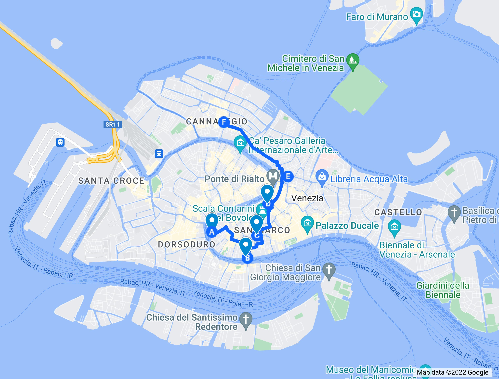

# Sexto Paseo: de teatro en teatro
## Por San Marco, del teatro Grassi al Teatro Malibran

> "En el invierno, Venecia es como un teatro abandonado. Se ha terminado la
> obra, pero permanecen los ecos", Arbit Blatas

Por eso, veremos Venecia una tarde de invierno, y también una mañana, vamos,
unos cuantos días, después de haberla visitado en primavera *y* en verano. Menos
horas de luz para ver cosas, pero más para refugiarte en museos, palazzi... Y
teatros, si encarta, claro.

Venecia inventó el teatro y la ópera de pago, mercantilizó el arte y todo
eso. Pero como decían Les Luthiers de Mastropiero en el *sketch* "El beso de
Ariadna":

> Toda vez que por necesidades económicas Mastropiero se vio obligado a componer
> música a pedido o por encargo, produjo obras mediocres e inexpresivas. Por el
> contrario, cuando sólo obedeció a su inspiración jamás escribió una nota.

Así que las necesidades económicas acaban produciendo obras mejores o peores,
pero existentes, que no es mala cosa para el arte. Los teatros, de hecho,
empezaron en palazzi alquilados a empresarios espabilados que montaban
producciones por las que cobraban al público. Este paseo también empieza en un
palacio: el palazzo Grassi, justo a la ribera del gran canal. También cerca de
una parada de vaporetto, por si quieres empezar directamente.

Y este palacio tiene un "teatrino". Hemos dicho que no hay mucha arquitectura
moderna en Venecia; la que hay está bastante disimulada, porque consiste
generalmente en reforma de interiores, para que Venecia siga siendo
Venecia. Pero lo que se hace es bastante radical, sobre todo por no tener que
establecer más diálogo arquitectónico que el que el autor quiera establecer con
el espectador. Lo que es, por cierto, algo muy del manifiesto futurista, que
ponía al espectador en el centro de la obra de arte. El arquitecto al que se le
encargó la reforma de este Teatrino, Tadao Ando, un arquitecto japonés, creó un
diseño basado en el hormigón, lleno de ángulos... y de un pavimento español de
la empresa IdealWork llamado "Nuvolato Architop".

> En la página web del producto enseñan una cocina. Si se innova, se innova, qué
> carallo.

El aspecto "nuboso" (de ahí viene lo de "Nuvolato") le da un
aspecto... sorprendente, y desde luego posmoderno. Se hizo en 2013, y tiene todo
tipo de eventos culturales; pero también se puede visitar. Merece la pena,
aunque sea por el contraste con el exterior.

En este teatro se celebran, como en los otros, diferentes conciertos. También el
 final de temporada de la serie Rugagiuffa, de la que hablamos cuando pasamos
 por esa calle.  No hay que andar mucho por Venecia para encontrar a personas
 vestidas al modo barroco, más caracterizados como en Salzburgo que como en
 Venecia, pero en todo caso tratando de conseguir que los turistas se acerquen a
 sus representaciones. Que estoy seguro que son excelentes, pero, la verdad, no
 me van a encontrar allí.

> Donde me van a encontrar es en la Casanova Opera Pop el próximo mes de
> diciembre de 2022, en el teatro Malibran, algo que, entre otras cosas, ha
> causado este capítulo, que acabará en ese teatro. Pero no hemos venido a
> hablar de Casanova. Ni de Operas Pop. Así que siga leyendo.

Porque Venecia es como Salzburgo, o como Viena, o como Memphis o Nueva Orleans
en otro estilo. Son ciudades de la música, es donde se va a vivir la música donde
se hizo, donde se descubrió.

> En Nueva Orleans tuve el privilegio de ver a una banda de *swing* que incluía
> a Uncle Lionel (solo un rato, porque estaba mayor, el pobre, murió al año o año y
> pico) en el Candlelight Lounge. Nueva Orleans creó el swing, y vivirlo allí, y
> beber cerveza y tomar arroz con habichuelas, y hablar con la mujer en la tapa,
> y con gente aleatoria que se sentaba en tu mesa, fue todo un privilegio.

Pero mientras Memphis es la cuna del Rock and Roll y Viena de Mozart, Strauss,
la marcha Radetzky y toda esa peña, ¿qué música creó Venecia? La *polifonía
multicoral*. O sea, polifonía = múltiples voces a la vez. Multicoral: pues que
hay muchas corales. Y sólo se pudo hacer en Venecia por las características
sonoras únicas de la basílica de san Marcos.

Y ¿quién la creó? Pues el relativamente desconocido Monteverdi. Sí, yo no tenía
ni idea de que existiera. Monteverdi fue un sacerdote veneciano, nacido en
Cremona pero desarrollando toda su vida profesional en Venecia. Esto sucedió en
la transición entre el siglo XVI y el XVII, y también en la transición de la
música del renacimiento al barroco, donde se le reconoce como uno de los
pioneros. Igual que en la pintura el desarrollo de nuevos lenguajes marca el
cambio de estilos y épocas, el barroco significó la conversión de la música en
un simple placer estético, pero asociada al texto.

Monteverdi creó una de las primeras óperas teatrales que realmente
tuvo una trama dramática, y no simplemente gente cantando. Todavía estaba en
Mantua cuando lo hizo, así que tampoco le vamos a echar la culpa (o entonar las
alabanzas) a Venecia. De hecho, Monteverdi fue un gran innovador, pero el único
invento que realmente se puede atribuir a Venecia es la polifonía
multicoral. Pero sí es cierto que las óperas que creó en Mantua fue para la
corte de Gonzaga, mientras que las que creó ya en Venecia se representaron por
primera vez en teatros como los que nos ocupan en este capítulo.

> Algún mérito habrá que atribuirle a Venecia por atraer a gente tan brillante
> como Monteverdi, claro, y que pueda desarrollar todo su potencial. Pero el
> crédito de haber descubierto algo, a la ciudad que lo merezca.

---

Posiblemente el teatro más famoso de Venecia sea el de la Fenice, cuyo símbolo
es el ave fénix, y aparece por todos lados. Es posiblemente el único teatro al
que puedes acceder por barca o góndola, y tiene un embarcadero específicamente
para quienes lo vayan a hacer de esta forma. Pero no es famoso por eso: es uno
de los 10 teatros de ópera mejores del mundo, habiendo estrenado en él muchas de
los grandes compositores de nuestro tiempo, desde Stravinsky (también enterrado
aquí) hasta, más recientemente, en 2022, Giorgio Battistelli.

> Evidentemente, yo no conozco de nada a este señor. Pero lo que quiero decir
> aquí es que se han estrenado cosas continuamente, y se considera lo
> suficientemente importante como para que se le elija como primer lugar para
> estrenar una obra.

Pero era uno de los teatros favoritos de Verdi: aquí se estrenó tanto "La
traviata" como "Rigoletto", a mediados de siglo. Y el teatro que existe ahora es
el mismo que entonces, aunque la última reapertura es del año 2003. ¿Por qué
eligió Verdi La Fenice para estrenar cinco de sus operas? Verdi estrenó muchas
óperas allí, y pasó temporadas haciendo los montajes y arreglos, de acuerdo con
su contrato. Estos contratos, precisamente, pueden justificar su preferencia:
Verdi se cuidaba muy bien de ser pagado de acuerdo con su talento (y fama), y La
Fenice, como uno de los teatros mejores de la épica, podía pagar lo que él
pedía.

Como corresponde a la época, es un edificio neoclásico, situado en un *campo*,
el de San Fantin, no demasiado lejos de San Marcos. Merece la pena desviarse un
poco del circuito para echarle un vistazo. Por dentro tiene el aspecto rococó
que uno espera de este tipo de teatros; y como sigue siendo un lugar donde se
celebran conciertos, puedes aprovechar e ir a uno de ellos. Si no, simplemente
échale un vistazo, aunque visitar un teatro sin actuación es como ir a un campo
de fútbol sin partido: está bien, puedes apreciar las cualidades artísticas e
ingenieriles, pero no es para lo que se hizo.

El interior tiene forma de herradura, con un patio de butacas y una serie de
palcos en varios pisos situados alrededor del mismo. Esta estructura se llama
teatro “a la italiana” y es bastante diferente de lo habitual en nuestro
país. No es que yo haya visitado muchos. En mi pueblo había un Teatro Ideal
Cinema que tenía forma rectangular, tres niveles (patio de butacas, principal y
general) y un par de palcos a derecha e izquierda del escenario. No parecían muy
accesibles, pero en todo caso quedaba claro que estaban hechos para gente de
otro nivel.

Sin embargo, el nivel social era justo el contrario. En la platea, que podía
estar incluso sin pavimentar, se encontraba el pueblo, el *popolani*, de
pie. Los palcos se alquilaban por temporadas a los nobles que pagaban a
empresarios por el derecho a usarlos, llevar invitados y demás. En la Fenice y
en muchos otros teatros había, también, un palco real. En la Fenice, al no haber
realmente reyes sino dogos, no comenzó uno hasta la ocupación austriaca,
en 1808. Una vez creada la república italiana, como quedaba bien, lo dejaron,
aunque cambiaron los símbolos imperiales por el león de San Marcos, lo que
sucedió durante la breve república del mismo nombre.

También es uno de los lugares más reconocibles de Venecia. Donna Leone situó
allí su primer libro, "Muerte en la Fenice", donde introdujo al comisario
Brunetti. Un director de orquesta muere, precisamente, durante una
representación de "La Traviata". Donna Leone tiene un ojo especial para las
tradiciones e historias de origen venecianas, y para mi es una de las mejores
novelas de la serie.

Después de ver la portada puedes dar una vuelta hacia la parte de atrás, donde
verás el embarcadero y su decoración Art Nouveau. Aparte de ser una zona
tranquila y bastante decadente, puedes imaginarte a los asistentes vestidos con
sus mejores galas y, por qué no, con sus máscaras, las lámparas, quizás
antorchas, brillando sobre las aguas, y una bella máscara girándose hacia ti, en
un tropo que no falta en ninguna película que se precie (incluyendo, por
supuesto, Veneciafrenia, donde la escena cumbre se desarrolla en un teatro, el
llamado — e inexistente — teatro Manin).

---

Los primeros teatros comerciales estuvieron en palacios alquilados por alguna
familia noble a empresarios; esa tradición continúa ahora con la representación
de operas en palacios. No en salas de baile o en palacios vaciados (no es que se
pueda, los muros son muros de carga), sino de una forma curiosa e innovadora:
una experiencia inmersiva en la que la planta noble del palacio se convierte en
el escenario, y el público se va moviendo de estancia de un acto al siguiente.

El palacio donde se celebra el programa “Música a palazzo” es el palacio
Barbarigo-Minotto. Este nombre compuesto es el habitual en estos palacios: se
suele poner primero la familia patricia que fue la que construyó el palacio y a
continuación la familia que la adquirió, generalmente tras la caída de la
república.

> También así se distingue de los otros palacios Barbarigo, como el palacio
> Barbarigo de la Terrazza, un palacio que, ninguna sorpresa, tiene una bonita
> terraza justo encima de la portada, que se puede ver en la orilla opuesta del
> Gran Canal.

El palacio es el clásico gótico veneciano, con un exterior enlucido en rosa
pálido, chimeneas y altanas, pero la decoración interior es del siglo XVIII y se
debe a una de las familias que allí habitó, Gregorio Barbarigo y Catarina
Sagredo. Entre diferentes decoraciones barrocas, hay también una carga
considerable de simbología masónica.

> Cuál es esa simbología, no lo tengo nada claro. Cuando asista a la opera en
> ese lugar, trataré de fijarme. Ver La Traviata, escrita por Verdi, que era
> masón, en un lugar con simbología masónica, no puede ser más adecuado e
> inmersivo.

Hablando de masonería, Carlo Goldoni, que le da nombre al siguiente teatro, sí
que lo era; la familia Barbarigo, el arquitecto o Tiepolo, el decorador, no he
encontrado ninguna constancia. El teatro, llamado actualmente Teatro Stabile del
Véneto Carlo Goldoni, *si* es el más antiguo de Venecia. Como todos los teatros
ha pasado por diferentes invocaciones, sin más remedio, porque Carlo Goldoni es
un personaje relativamente reciente.

> Hay otro teatro Goldoni en Livorno.

Como en el caso de la Fenice, el teatro está construido “a la italiana”, con
cuatro pisos de palcos y una platea en la que caben, en total, 400 personas; el
exterior, sin embargo, es estilo Art Nouveau y tiene una serie de puertas de
forja con apariencia bastante moderna.

Goldoni era veneciano, y desarrolló gran parte de su carrera en Venecia. Durante
ella, cambió el teatro tal como se conocía. Sin embargo, no se le conoce tanto
fuera de Italia. Puede ser que comparta sino con el resto de los autores
teatrales de la misma época. Yo recuerdo a Leandro Fernández de Moratín de mis
clases en el instituto. Pero ellos, curiosamente, sí se conocían entre si; para
cuando Fernández de Moratín empezó a escribir teatro, Goldoni ya era un autor
consagrado. Se vieron en París más tarde, donde Goldoni había ido
como director artístico del teatro de la Comedia Italiana y Fernández de Moratín
en misión diplomática para aconsejar a Luis XVI medidas antirrevolucionarias. Si
hubiera tenido éxito, Goldoni no habría muerto en la miseria: como era profesor
de italiano de los reyes, recibía una pensión que le fue suprimida cuando
estalló la revolución francesa; murió en la pobreza en 1793. Un día antes de
morir la Convención revolucionaria decidió concederle una pensión, que tuvo que
ir a su viuda.

Goldoni fue profeta en su tierra, usando incluso el véneto para escribir algunas
de sus comedias. También en el extranjero: algunas de sus óperas recibieron la
música de los músicos austríacos Haydn, Mozart e incluso Salieri, el enemigo de
Mozart. También Vivaldi le puso música a sus óperas, y escribió óperas en
francés, donde residió y fue profesor de los hijos del rey Luis XV. Y allí, o en
Italia, accedió al grado máximo de la masonería y escribió “Le donne curiose”,
donde aparece la secta de los “Liberi Muratori”, al parecer relacionada con la
masonería; igual que Mozart escribió “La Flauta Mágica”, cuya simbología es
también masónica.

Este teatro pasó por muchos nombres en sus cuatrocientos años de existencia;
primero se llamó teatro Vendramin, por la familia que lo construyó; más adelante
se llamó San Luca y San Salvador. Goldoni, de hecho, trabajó para el teatro
mientras todavía se llamaba San Luca, antes de la caída de la república. No se
llamó Goldoni hasta 1875; cuando se reabrió cien años más tarde, ya como
propiedad municipal, comenzó con una representación de una obra de Goldoni, “La
locandiera”.

> Goldoni no estrenó, al parecer, ninguna de sus obras aquí; le tiraba más el
> teatro Sant’Angelo, en la zona de Rialto, ya desaparecido.

---

El Teatro Malibrán es uno de los teatros más antiguos de Venecia y, por tanto,
del mundo. Está situado en el barrio de Cannaregio, cerca, sin embargo, de San
Marco y también de Rialto.

> Y cuando hablo de mundo hablo del mundo occidental, claro. Es totalmente
> posible que se cobrara por el teatro Kabuki en el siglo XI o que los títeres
> balineses tuvieran compañías profesionales estables en el siglo III. No los
> quiero hacer de menos, pero tampoco forman parte de nuestra herencia cultural,
> o se han incorporado a ella solamente en el último siglo. Así que quedémonos,
> por lo pronto, con la coletilla “occidental” cuando digo mundo.

Y lo es no porque no se celebrara teatro antes, sino porque anteriormente se
alquilaban palazzi particulares para llevar a cabo representaciones. El teatro,
efectivamente, es de finales del XVII, inaugurándose durante el carnaval con el
nombre San Giovanni Crisostomo. Muy
apropiado, con máscaras en el escenario y también en la platea. Una experiencia
de las que merecería la pena viajar en el tiempo para visitar.

Pero recibe ese nombre en el siglo XIX, por una cantante española: María García
Malibrán, una mezzo-soprano, la más famosa de la época, que ejecutó una pieza
con tal fortuna que la familia Gallo, propietaria del edificio, decidió
dedicárselo; esa interpretación salvó al teatro de la ruina, y qué menos que
hacerlo. Gracias a ella, por tanto, hoy podemos disfrutar de este teatro, que
sigue haciendo representaciones hasta hoy.

El teatro está justamente donde se situaba la residencia de Marco Polo, un
edificio que desapareció por un incendio, está cerca de las *corti* Prima y
Seconda del Millione, que se refieren a la obra en la que describe sus viajes;
es de estilo barroco, aunque desde el exterior su apariencia no es demasiado
llamativa. Estoy seguro de que he pasado por delante, y seguramente tú también,
sin dedicarle más de una mirada. En él se estrenaron muchas obras, de autores
locales sobre todo (como Pallavicino, Pollarolo), pero también obras como
Agrippina de Händel. Este teatro sigue funcionando hoy en día, con una
programación permanente de óperas y musicales diversos.

> En el momento que escribo esto, hay un musical pop basado en la vida de
> Casanova, llamado simplemente "Casanova Opera Pop" que iré a ver en diciembre
> de 2022. Casanova… También era masón. Parece que vamos de logia en logia en
> vez de ir de teatro en teatro.

También es un teatro de estilo “italiano”, es decir, en forma de herradura y con
las paredes cubiertas de palcos, con un palco “real” en medio. Esta forma se ve
claramente desde arriba, en Google Maps por ejemplo. La forma de herradura no
solamente está en el interior del teatro, sino que el techo tiene esa forma
claramente identificable.

> A decir verdad, parece un ataúd enmarcado en una herradura un poco más grande.

Las representaciones eran
ocasiones sociales, donde los artistas tenían que llamar la atención y
justificarse ante el público para poder acabar la obra. Goethe, en su “Viaje a
Italia” cuenta, aparte de que aparentemente había teatro, en esa época una
docena de años antes de la disolución de la república, casi todos los días, que
el público imprecaba e insultaba a los actores que maltrataban o hacían mal a
algún personaje de los buenos, y tenían que salir esos mismos actores a
convencerles que se estuvieran quietecitos, que todo al final salía de la mejor
forma posible. Aún así, lo que sucedía el teatro a veces tenía más que ver con
la gente que estaba allí que con la representación. Una anécdota que he leído
habla, también en las postrimerías de la república, de los cánticos del público
metiéndose con Cecilia Zen Tron, “la Trona”, una buena pieza que, a los 17 años,
fue prometida (y posteriormente desposada) con un señor de cincuenta,
inmensamente rico, como en el tópico. Los cánticos, en véneto y también en
verso, venían a decir que sus favores sexuales los vendía más baratos que un
palco de la familia, que había sido alquilado por una cantidad exorbitante a un
príncipe ruso. Cecilia “la Trona”, ni corta ni perezosa, contestó también en
verso

> La Trona

> La mona

> La dona

Donde “la mona” es una palabra en idioma véneto que designa lo que podéis
imaginar, es decir, que ella, la Trona, su *mona*, la donaba o daba gratis. No
tiene gracia, pero es que hay que estar allí para pillarlo. Cabe visualizar al
pueblo, en la platea, comiendo, bebiendo, y pasando un buen rato. Como, por otra
parte, sucedía también en los teatros del resto del mundo. En Venecia sólo había
más, y tenían a las grandes comedias creadas por Goldoni. Hasta tal punto se
vivía el teatro como punto de encuentro que, según cuenta Pedro Antonio de
Alarcón, las autoridades austriacas cerraron La Fenice para evitar las
manifestaciones “que allí ocurrían frecuentemente”.

Y es que los teatros eran un escenario para la vida; pero la vida también pasaba
por el escenario. Goethe decía que en los teatros venecianos la gente reía
porque reproducían las situaciones y escenas que sucedían en cualquier lugar de
la ciudad; y lo hacían a través de una serie de personajes estereotipados:
Arlequín, con los leotardos y el traje ajustado y, efectivamente, arlequinado;
Pantalone, el mercader avaro y veneciano, un personaje con origen precisamente
aquí; Zanni, el bobo, pero con un gran corazón… Todos juntos en la *commedia
dell’arte* que pudo, posiblemente, tener su origen en la comedia en idioma
véneto, pero también, por supuesto, en las comedias de Plauto. Como *arte* en
toscano y otros idiomas precursores del italiano significa *gremio*, o sea que
la *commedia dell’arte* era la “comedia del gremio”, o
profesional. Efectivamente, los actores eran profesionales que siempre
representaban el mismo personaje y se *metían* en ese personaje. Hasta que llegó
Goldoni, no había guión, sino situaciones que los artistas resolvían según lo
que habían escuchado ese día, o habían vivido, reflejando de esa forma la vida
cotidiana de los venecianos, romanos, brescianos y quien se pusiera a tiro.

En esas comedias muchos de los personajes llevaban máscaras, y de hecho se les
denominaba *maschere*. No resulta nada raro que, durante el carnaval, la gente
*adoptara* esos personajes y, sobre todo, sus indumentarias, sus máscaras, y su
forma de actuar, cerrando el círculo: las máscaras estereotipaban a la gente,
pero la gente adoptaba ese estereotipo, o el estereotipo contrario al de su zona
de comfort. Al final, el gran teatro del mundo y de la vida, que no conoce
límites. En carnaval o el resto del año.

Una de las máscaras más populares, sin embargo, no procede de la *commedia
dell'arte*. Se trata de la *baùta*. La *baùta* es una media máscara que no cubre
la boca, y tiene un pequeño pico; está hecha de cartón o cuero y, hoy en día, de
plástico, claro. Es también la más antigua: se empezó a fabricar en el siglo
XIII y se ha convertido en la máscara por antonomasia; incluso fuera de
Venecia. Si ves “Versalles”, unos salteadores de camino usan precisamente esta
máscara. Por supuesto, en Veneciafrenia también se usa por múltiples personajes,
y los principales, en una versión muñeco diabólico. Y si paseas por Mercerie o
por cualquier otro sitio donde vendan máscaras (casi toda Venecia), será la que
veas con más frecuencia. Como deja libre la boca, se puede comer y beber con
ella, lo que es una gran ventaja al no tener que descubrirse. En “El proceso”,
una serie italiana en Netflix, aparece cuando se registra el dormitorio de la
víctima una baùta de color blanco (debía ser una *moretta*, tratándose de una
mujer). La sola aparición de esta máscara apunta a algo oculto, quizás ilegal y
vagamente sexual. La investigadora, Elena Guerra, se queda mirándola y piensa en
algo. Se trata de una muchacha de 17 años, ¿qué habrá detrás de la máscara?

> La acción se desarrolla en Mantua, una ciudad en Lombardía, bastante al oeste
> de Venecia, que nunca formó parte de sus dominios. El símbolo de la baùta y lo
> que representa ya se ha extendido a toda Italia, si no al mundo.

Y no es estrictamente una máscara de carnaval; es simplemente una máscara, que
en Venecia se usaba como parte de la indumentaria habitual; ni estaba mal visto
llevar máscara ni se consideraba de forajidos o truhanes. Había ciertas reglas
para usarlas: nunca antes de las 12 de la mañana, tampoco en oficios religiosos
ni en eventos oficiales, por ejemplo. Pero el atuendo que incluía el tricornio y
el *tabarro* (un tabardo) eran obligatorios para las mujeres que asistían al
teatro, siendo multadas en caso de que no lo cumplieran. Las reglas variaban a
lo largo del tiempo: mientras que en un momento las prostitutas tenían prohibido
usarlas, a continuación se las obligaba a estar enmascaradas todo el tiempo; en
el siglo XVIII los viajeros describen el uso generalizado, en todo momento,
antes, durante y después del Carnaval.

> No recuerdo que Goethe contara nada de esto, pero él llegó poco antes del
> final, donde las buenas (y malas) costumbres se habían relajado bastante.

Algunos pintores, como Longhi, las representan en sus cuadros con
frecuencia. Y fue el mismo Goldoni el que empezó a usarlo en sus obras
teatrales; también en óperas nacionales y extranjeras. Eso contribuyó
a su popularidad en todo el mundo. Al final, el teatro, el carnaval, y
la vida misma son un ciclo, el ciclo de las máscaras.

> Y ya que viene a cuento, os recomiendo “Máscaras”, de Leonardo
> Padura, un novelista cubano cuyo personaje, Mario Conde, pertenece a
> la policía de La Habana y resuelve crímenes, en esta ocasión
> relacionados con el teatro. La reflexión de esta novela es parecida
> a la del párrafo anterior. Además, Cuba es una isla. Como Venecia.

No hay falta de teatros y actuaciones en Venecia, pero a falta de
personal local, prácticamente están dirigidos a los
turistas. Seguramente verás en muchas plazas de Venecia y en las
parada de vaporetti personas vestidas como en la peli de Mozart
ofreciendo conciertos en diferentes iglesias desconsagradas o
"scuoli". Una interesante experiencia sin duda, que aprovecha que
grandes músicos como Vivaldi hayan nacido aquí, en Venecia. Pero es
como ir a un espectáculo de flamenco en Sevilla o de jazz en Nueva
Orleáns. Si lo entiendes, te llena; si no, te aburre. Lo dejamos por
tanto como asignatura pendiente. Tarde o temprano llegaremos a la
música.

Efectivamente, no faltan teatros, pero como dice el refrán, donde no
falta, sobra. En mi último viaje pasé por delante de un bonito
edificio que todavía tenía un cartel que decía “Teatro Italia”. Entré
a comprar pan y algo de queso. Sí, puedes comprar en el supermercado
que se encuentra en el antiguo Teatro Cine Italia, que ahora se llama
Despar Teatro Italia; Despar es una cadena de supermercados con
tiendas por toda Italia.

> De hecho, te aconsejo que lo hagas, porque hay muy pocos supermercados en
> Venecia y cuando pases delante de uno hay que acaparar para cuando estés a más
> de 20 minutos andando de cualquiera, que es donde se suele alojar uno.

Volvemos a preguntarnos por qué una población que tiene, en la
actualidad, cincuenta mil habitantes, necesita tanto teatro. En mi
pueblo, que tiene por el estilo, sólo hay uno, pero ni siquiera es
estable. Y los pocos supermercados que hay, sobre todo en ciertos
barrios. E igual eso mismo es lo que se plantearon los que compraron
este edificio de principios de siglo; un edificio modernista/Liberty
de los muy pocos que existen en Venecia. Ya hay suficientes espacios
escénicos para los turistas, pero no hay tantos supermercados para los
locales. Seguramente los venecianos lo agradecerán.

Una experiencia única, por tanto. Comprar pasta italiana, y encontrarse frescos
y cornisas decoradas justo al lado de la bollería industrial y de los quesos. Y
un sitio también único para terminar el paseo, ¿no? Un lugar donde la comida y
los productos de limpieza son el verdadero espectáculo, y donde las arias las
cantas las cajas cuando se teclea el importe de las compras.

---

Aldo Rossi decía que la ciudad era la memoria colectiva de los pueblos. Sin
embargo, gran parte de la ciudad de Venecia es agua, y el agua no tiene
memoria. Quizás por eso mismo construyó el Teatro del Mundo, un teatro flotante,
con capacidad para unas 250 personas, que durante la bienal de arquitectura de
los años 79-80 estuvo anclada junto a la punta de la Dogana, creando una curiosa
combinación de monumento y servicio. No hay nada que lo recuerde, ni
posiblemente nadie, y quizás sea lo mejor y lo más interesante de todo ello. El
teatro tenía una cúpula octogonal, haciendo juego con la Salute, más allá de
donde se ancló. A pesar de estar perdido en la memoria, este teatro del mundo
recuperaba la memoria de los pabellones flotantes que aparecían en Venecia entre
los siglos XV y XVII, sobre todo en carnavales; se llamaban de la misma forma,
“teatri del mondo”, porque, al ser flotantes, estaban totalmente libres de
ataduras; podían anclarse, o moverse, o ir a donde quisieran.

Aldo Rossi era marxista y milanés, aunque pasó gran parte de su vida profesional
en Venecia, como parte del Instituto Universitario de Arquitectura de Venecia y
director de la bienal de arquitectura; escribió un libro llamado “La
arquitectura de la ciudad”, donde se refería repetidamente a Venecia, que
seguramente sería su inspiración. Levantándose metafóricamente después de
muerto, ganó un recurso por la adjudicación de las obras de La Fenice, que
finalmente se llevaron a cabo con su proyecto. Este “Teatro del Mundo” no fue,
pues, su única obra “teatral” en Venecia.

Pero no es el único teatro flotante; ya hablamos del concierto de Pink Floyd en
medio del Bacino de San Marco; pero es que en los últimos años, también, el
*cinema galleggiante* o flotante abre en agosto y está en funcionamiento hasta
mediados de septiembre. Un escenario flotante donde se realizan eventos y
espectáculos, y donde se proyecta cine; para asistir no tienes más que pillarte
tu *tender* e irte para allá. Si las ciudades americanas, donde reina el coche,
hay *drive-in cinemas*, ¿por qué no iba a haber aquí *sail-in* cinemas, o cines
a los que se llegue navegando?

> Si no ponen Waterworld para inaugurar la temporada todos los años, es que
> tienen poco sentido de la ironía. O que no le gustan las películas malas de
> solemnidad, que puede ser.
