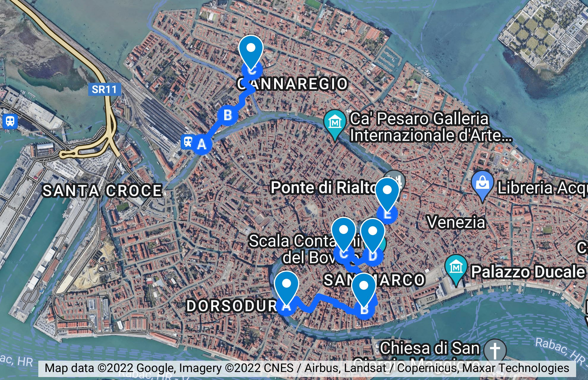

# España (y Granada) en Venecia
***De la conjura de las aceitunas, a los tejidos de Fortuny***

> "Gente son nacida al logro, y destinada al robo [...]. Su tesoro es dar a
> entender que pueden; su religión la que más les vale; sus ejércitos son
> alquilados; sus armadas aparentes; y en fin es una república ramera, que toda
> su vida está ganando con su cuerpo para valientes que la defiendan". Quevedo,
> en "Sátira contra los venecianos", citada en "Quevedo y Venecia (Una versión
> desconocida para sátira)". Haciendo profuso uso del punto y coma, que fuera
> inventado unos años antes en Venecia por Aldo Manuzio.

La relación entre Venecia y España viene de muy atrás, incluso desde antes de
que fuera España. El Senado veneciano trató de establecer una serie de tratados
comerciales con la Granada nazarí en el siglo XV, poco antes de su
conquista. Como potencia pragmática que era, le daban igual musulmanes o
cristianos, y si eran capaces de proporcionar algún servicio o de adquirir
alguna mercancía, se establecían relaciones tranquilamente.

El reino nazarí de Granada tenía un puerto importante, Málaga, prácticamente
hasta el final de sus días; un puerto en el Mediterráneo que los venecianos
podían aprovechar en su *muda* a Flandes, es decir, las expediciones regulares
comerciales que se organizaban desde la Signoria y que, en este caso,
enganchaban con las rutas de la liga hanseática; ya hemos hablado de eso en otro
capítulo. Esas escalas requerían la apertura de un consulado, y así se hizo en
Málaga desde principios del siglo XV. Las galeras venecianas paraban tanto en
Málaga como en Almuñécar para repostar provisiones y cargar, sobre todo, azúcar,
principalmente en esta última.

> El oro blanco que siguió siendo la principal fuente de riqueza de Granada
> durante muchos siglos.

Fue un Contarini, Bernardo Contarini, el que ejerció como cónsul en los años
iniciales. De los Contarini de toda la vida. El consulado no duró mucho, sin
embargo, aunque las relaciones comerciales continúan. Si ya usaban café, cómo
podían pasar sin el azúcar granadino.

Evidentemente, no fue el único contacto entre Venecia y los reinos peninsulares;
Venecia era *la* potencia del Mediterráneo, militar y comercial. Ese hecho rigió
los contactos entre ella y el Reino de Aragón, que antes de la reconquista de
Granada (o conquista, tampoco nos vamos a meter ahora en estas disquisiciones,
que estamos hablando de Venecia) también aspiraba a potencia regional y de hecho
los almogávares, mercenarios aragoneses, luchaban a favor o en contra del
imperio bizantino, también amigo/enemigo de Venecia según soplara el viento e
hinchara las velas de sus galeras.

Pero como los enemigos de mis enemigos son mis amigos, y Génova no se llevaba
bien ni con Aragón ni con Venecia, estas se unieron en el siglo XIV en un
tratado para defenderse de ella o atacarla, lo que sucediera antes. Se pusieron
de acuerdo en la construcción de una flota de galeras, sufragada por las dos, y
en diversas escaramuzas contra los genoveses, acabaron pocos años más tarde
cuando Venecia y Génova firmaron la paz.

La corona de Castilla, no tan amiga del mar hasta que llegó Colón,
principalmente proveía de productos a las *mude* en los puertos de Cádiz, así
como pilotos que llevaban las galeras hasta Flandes. El consulado, sin embargo,
se situó inicialmente en Sevilla, pero eventualmente, según se convirtieron las
visitas en más habituales, se abrió también uno en Cádiz.

La colaboración con más alcance, sin embargo, fue en la batalla de Lepanto. Pero
de eso ya hemos hablado en otro lugar.

---

Empezaremos en Ca' Duca, un palacio en un recodo del gran canal, que fue en su
tiempo ocupado por Alonso de la Cueva, marqués de Bedmar. Un palacio con una
fachada inacabada, como inacabada estuvo su labor, al tener que salir (huir
según algunas crónicas) de Venecia a consecuencia de lo que se dio en llamar "La
Conjura de Bedmar".

La llamada conjura española, o conjura de Bedmar, o conjuración de Venecia, es
una historia compleja, pero muy española y muy veneciana. Si la tenemos que
acortar, Venecia acusó a España de intentar dar un golpe de estado, y capturó y
ajustició a quienes se suponía que habían participado en ella, mercenarios
holandeses y franceses.

Pero la historia es más larga, y en ella sale Quevedo haciendo de espía. Así
que, ¿por qué diablos acortarla?

> Además, esto que quería ser un panfleto para dos o tres paseos va ya por las
> trescientas y pico páginas, así que de perdíos al río.

Es también bastante indicativo de la época cuando sucedió, y supuso un cambio
tanto en la política española como en la veneciana, y hasta en la europea. Pero
vayamos por el principio. Principios del siglo XVII, el sol no se ponía en el
imperio… español. Llegaba desde las Américas hasta Oceanía, pasando por Asia. En
Europa, partes de Alemania, Bélgica, Holanda también eran parte del Imperio
español. También Italia. ¿Toda Italia? No, un pequeño estado, en declive, se
oponía a ese dominio: Venecia. También los estados papales, claro, pero es que
con la Iglesia hemos topado y ahí no quería meterse

> Ya se había metido hasta el corvejón Carlos I, su abuelo, cuyas tropas,
> aliadas con los franceses, protagonizaron el infame "saco" o saqueo de Roma.

Felipe III, a la sazón monarca, y en esta posición desde el filo del siglo,
1598, estaba por la paz. Pero gobernar un imperio tan grande era un asunto
complicado. Por eso le encargaba diferentes dominios a virreyes y gobernadores.

> Seguro que hay una diferencia, pero se me escapa. ¿Lo colegas que eran del rey?

Así que llegamos a principios del siglo XVII, con gran parte de Italia bajo el
control español. En el Milanesado gobernaba Pedro de Toledo, marqués de
Villafranca, que era el único territorio español que realmente tenía frontera
con Venecia; hacia el este, Bérgamo y Brescia eran parte de la República.

El virrey de Nápoles era, a la sazón, Pedro Téllez, duque de Osuna. Una persona
de armas tomar, resolutiva, que había puesto orden en la zona de Nápoles,
desarrollado nuevas tácticas de guerra naval, y se había opuesto a los pirata
otomanos y berberiscos. Quevedo era su amigo, secretario y ocasionalmente espía;
también su propagandista, con algún soneto conservado y alguna biografía que no
ha sido nunca publicada, pero que se sabe que existe.

El marqués de Bedmar, granadino, era embajador, residiendo en la susodicha ca’
del Duca. Felipe III tenía como lema “vamos a calmarnos”, y no quería problemas
con nadie. Tras el imperio en el que no se ponía el sol, quería seguir con la
misma cantidad imponiendo la Pax Hispanica. Su política era de alianzas y de
desarrollo, no de cambiar (más) fronteras ni de subvertir el orden político en
ningún lado.

Los demás protagonistas son los otomanos, que desde Lepanto habían estado en paz
 con Venecia, lo que sucedía a gusto de los dos, un imperio en ascenso, el
 otomano, y otro en declive, el veneciano. Otro imperio más en ascenso, el de
 los Habsburgo, se enfrentó con los venecianos por un intermediario, los
 “uscoques” o “uscocos”, que o eran piratas de las islas del Adriático, o
 simplemente gente que vivía en esas islas y que estaba hasta las narices del
 dominio veneciano y aprovechaba cualquier ocasión para darles para el
 pelo. Cuando podían, estos le devolvían el golpe; ofrecían un premio por cada
 uscoque capturado y asesinado, y sus cabezas se exponían el la *piazza* de San
 Marco.  Y España, o al menos el duque de Osuna, aprovechaba también cualquier
 ocasión para pescar a río revuelto. En apoyo a los uscoques o en apoyo a la
 libertad de navegación, la flota del duque de Osuna, que como tenía prohibido
 usar la cruz de San Andrés que se usaba como bandera de los ejércitos españoles
 usaba una bandera negra, se enfrentó a la veneciana en las cercanías de Ragusa
 o Dubrovnik, consiguiendo según todas las fuentes, es decir, la Wikipedia
 española y la francesa, porque en la italiana no viene nada, una derrota
 vergonzosa de los venecianos, que certificaban así su decadencia, la de una
 flota que, menos de medio siglo antes, había derrotado a los otomanos, bien es
 verdad que con la ayuda de estos españoles (o españoles y asimilados) con los
 que ahora se enfrentaba.

La flota veneciana tenía la ventaja numérica, pero la española, muy inferior en
número y dotada de 15 galeones solamente, logró vencer, provocando el caos y
bastante mortandad, hundiendo 4 de las 34 galeras que tenían los venecianos. Eso
no hizo más que aumentar la animadversión de los venecianos hacia el duque de
Osuna, que culminó en la conspiración llamada de Bedmar.

La secuencia de los acontecimientos no está muy clara. Sí está claro que,
posiblemente a continuación de esta derrota, el pueblo veneciano, o quizás
simplemente los arsenalotti animados por sus capataces, se plantaron en esta
Corte del Duca y quemaron en efigie al marqués de Bedmar y a Quevedo, no se sabe
muy bien si por su actividad propagandística en contra de Venecia o porque se
conocía su relación con el duque de Osuna.

Y quizás su presencia en Venecia. Los cronicones cuentan que durante ese
episodio tuvo que salir por patas de Venecia, disfrazado de mendigo y gracias a
su dominio del veneciano. Dado que había que salir en góndola de la misma,
habría que ver exactamente como lo hizo, pero es más cierto que vivió para
contarlo que el hecho, no constatado, de que estuviera en Venecia.

La conjura vino, posiblemente, a continuación. La historia veneciana oficial
dice que los españoles, comandados por el marqués de Bedmar y ayudados por los
franceses, infiltraron, en el mejor estilo de guerra híbrida, mercenarios
franceses y holandeses, que debían atacar el palacio ducal. Una flota del duque
de Osuna esperaba en las afueras del Lido.

Pero una prostituta patriótica, según una versión, o simplemente los agentes del
Consejo de los Diez, se enteraron de la conspiración y detuvieron a los
cabecillas. Lo que sucedió a continuación no te sorprenderá: los encerraron en
los Piombi, los torturaron y confesaron ser culpables hasta de la muerte de
Manolete. Todo esto sucedió el 18 de mayo de 1618, y cuentan las crónica que
“los canales se encuentran llenos de cadáveres”.

El marqués de Bedmar se dio el paseo desde aquí, la casa del Duca, hasta la
piazza, un cuartito de hora mal contado, y exigió ante el Senado explicaciones
sobre lo ocurrido. No había tales barcos, ni había tales mercenarios, ni el
marqués de Bedmar aparentemente sabía nada ni tenía nada que ver con la
conspiración ni nunca se probó que fuera provocada por el marqués. Según algunos
historiadores, fue simplemente una operación de propaganda del estado veneciano
contra sus entonces enemigos, los españoles, que aprovecharon para deshacerse de
algunos mercenarios incómodos o, efectivamente, agentes españoles.

Pero el dogo Bembo logró deshacerse de algunos mercenarios más incómodos de la
cuenta y lo más importante, del duque de Osuna, que acusado de tratar de ganar
Venecia para si y no para la corona, y de desobedecer órdenes montando su propia
flota contra los otomanos y venecianos, fue obligado por Felipe III a volver a
España, cubierto de cadenas, y finalmente murió “como un
perro”. Afortunadamente, el marqués de Bedmar pudo seguir su carrera
diplomática. Pero en un giro de guión inesperado, lo nombraron cardenal y acabó
como obispo de Málaga.

> Para confundir todo un poco, hay otro Alonso de la Cueva, el I de su nombre,
> que fue *señor* y no *marqués* de Bedmar, y que nació en mi pueblo, en
> Úbeda. No he logrado entender la relación que hay entre ellos, pero o son hijo
> o sobrino o, a todo tirar, nieto. Los dos, en todo caso, están relacionados
> con el Beltrán de la Cueva supuesto padre de la “Beltraneja”, de los que hemos
> sabido en la serie “Isabel”.

Esta conjura, o lo que fuera, pasó a la historia no sólo por las operaciones de
propaganda y contrapropaganda de los españoles y venecianos, sino porque dio
lugar, unos 80 años más tarde, a un informe o novela de Saint Réal, escrita en
francés originalmente, “La conjura de los españoles contra la república de
Venecia”, donde los españoles quedaban bastante mal, pero tenía tanta intriga,
emoción y violencia que se convirtió en un *best-seller*, traduciéndose por
supuesto al italiano y terminando por crear el *relato* de esta conspiración,
conjura o golpe de estado. Hasta Voltaire la cita; a lo largo de los siglos
siguientes tuvo múltiples reediciones.

Este hecho, un tanto rocambolesco, ha inspirado también una de las pocas obras
literarias de la filósofa Simone Weil. La obra, inacabada, se llama “Venecia
salvada”, y contrapone la belleza de una ciudad con el sueño de un
revolucionario que, finalmente, decide salvar a la ciudad denunciando a sus
compañeros de conspiración, los otros mercenarios que participaron en la
conspiración, según cuentan los cronicones. En el contexto en el que lo
escribió, la guerra europea, y más en la Francia de Vichy, el estado
colaboracionista con los nazis, Venecia representa cualquier ciudad, y Jaffier,
el mercenario colaboracionista con la potencia extranjera, España, es avatar de
cualquier traidor. Pero ese traidor tiene un intento fallido de redención; y
trata de redimirse por salvar la ciudad, la ciudad de la que habla Marco Polo
(según Italo Calvino) cuando habla de cualquier otra ciudad. Lo que no deja de
ser curioso es como cualquier evento de Venecia acaba, pasando por la literatura
universal, elevado a la categoría de mito. Es el efecto de Venecia.

Pero volvamos a la Venecia real, y al sitio real donde tuvieron lugar esos
acontecimientos. Podemos acercarnos a esta Ca’ del Duca desde el canal, donde
será fácil de reconocer por un gran desconchón en la pintura de la fachada que
deja al aire los ladrillos de debajo; otra parte está almohadillada, y en
general da una impresión de no haberse puesto de acuerdo la comunidad de vecinos
que es muy típica española. O típica de los cambios de arquitecto y propietario
del palacio: Fue del padre de Catarina Cornaro, pasó por el duque de Sforza, se
lo expropiaron, Sansovino hizo un proyecto de restauración, lo usó Tiziano como
estudio, y finalmente fue ocupado por el duque de Bedmar. Puedes acceder a una
escalera que baja al canal desde la *corte*, a la izquierda de la misma, desde
la que podrás ver la fachada perfectamente. Al otro lado, el *rio* del Duca
permitirá, seguramente, una salida alternativa desde la que podría escapar
Quevedo o el propio duque en caso necesario.

En la corte del Duca hay una palmera platanera, y es un lugar recoleto, apartado
del mundanal ruido, y donde podrás leer tranquilamente algún relato del
episodio, mientras te sientas un rato en la escalera que da al canal, como lo
hace el chaval que se ve en la foto de la Wikipedia. En esos escalones, alguna
colilla; si fuera todavía la embajada española, habría también cáscaras de
pipas, porque en España los escalones donde sentarse son el espacio apropiado
para sentarse a comer pipas de girasol y donde quiera que van los españoles
hacen lo mismo.

Ahora, según Google Maps, es un hotel, y por doscientos y pico euros la noche lo
puedes alquilar en AirBnB, y al parecer aloja también un colectivo
artístico. Puedes también echarle un vistazo desde la *corte*, estrecha y
alargada, con el pabellón de Iraq de la bienal al otro lado, una plaza recoleta,
lejos del turismo, donde, sin embargo, sucedió el acontecimiento más dramático
de la historia común de España y Venecia.

> No siempre las relaciones fueron tan truculentas; este paseo podría tener como
> parada intermedia el teatro Malibrán, llamado así por una cantante española
> que tenía ese segundo apellido (el primero, García, posiblemente era demasiado
> común para el bautizo de un sitio tan señero como el teatro). Pero ya hay un
> paseo dedicado a los teatros, así que mejor échenle un vistazo al mismo.

Si bien casi todo mundo conoce a Bedmar en Venecia, es posible que Mariano
Fortuny sea el español que más éxito ha alcanzado en Venecia; discutiblemente,
junto con la mezzosoprano Malibrán que le dio nombre al teatro (y de la que
hablamos en su capítulo). No solamente era español, sino granadino de pura cepa;
igual, por cierto, que el susodicho Bedmar. Nació durante la estancia de sus
padres, el también pintor Mariano Fortuny y Cecilia Madrazo. Fortuny era de
Reus, y pasó sólo dos años en Granada, así que realmente nació de
casualidad. Pero eso no quita que sea tan de pura cepa como el marqués de Bedmar
de más arriba.

Y lo más curioso es que el español que más fama alcanzó en Venecia es que lo
hizo en un arte, el brocado, que es puramente veneciano. Los venecianos, tras
importar lana de Flandes e Inglaterra y seda de Oriente, acabó creando sus
propios tejidos: brocados, damascos y terciopelo. Para un humano con cromosomas
XY como yo, soy incapaz no ya de describiros la diferencia, sino siquiera de
entenderla. “Tela cara y suavita”, así, en general. Pero los venecianos no sólo
desarrollaban estos tejidos, sino a que fueron pioneros en entender la química
que daba lugar a diferentes colores; igual que aportaron el color a la pintura,
también a la moda: en el “Plictho de l’arte de tentori”, donde *arte* ya sabéis
que equivale a un gremio, y *tentori* eran los tintoreros, se describía como y
de dónde obtener colores como el vermellón (de un gusano) o el negro, de la
corteza de algunos árboles.

Fortuny se encontró esa tradición, pero fue mucho más allá. Creó un tipo de
tejido, con múltiples pliegues, con el que creó la célebre túnica Delphos, que
salía en “El tiempo entre costuras”, y que llevaron diferentes artistas de
fuste. ¿Merece la pena acercarse al palacio Pesaro-Fortuny para ver todo esto?
Pues igual sí. Fue el palacio donde Fortuny tenía el taller, y donde murió en el
año 49. Y también formó parte de algo llamado “La orden de la maleta” u *ordine
della Valigia*, sobre la que no he podido encontrar gran cosa. Sé que se trata
de 27 pintores, que incluyen a otros como Marco Novati o Armando Tonello, y que
decoraron una maleta de cartón y que era una reacción al modernismo. Y que se
reunían en el café Gorizia.

Fortuny, de hecho, era bastante clásico: sus vestidos estaban inspirados por la
antigüedad griega, y no tenía nada que ver con el futurismo. Pero Venecia es
así, aloja todas las contradicciones, los futuristas presentan sus manifiestos,
y los anti modernistas… Pintan una maleta de cartón.

> Era una maleta de cartón que pertenecía al dueño del café Gorizia, y que fue
> encontrada por un grupo de pintores que se reunían en dicho lugar, pateada por
> las plazas venecianas, y finalmente decorada y firmada por ellos. Una maleta
> pintada, al final, fue el manifiesto de esta *Magnifico ordine della Valigia*;
> una maleta que quedó, finalmente, expuesta en el hotel que alojaba el café y
> que a partir de entonces se llamó “a la Valigia”. Si pasas delante del ahora
> llamado hotel Gorizia la verás, en una urna de cristal, expuesta en un
> escaparate que da a la calle. Una maleta vieja, con asa de cuerdas enrolladas,
> y que está, en la cara visible, dividida en varios rectángulos; uno muestra
> una silueta del Canalasso; en la esquina superior izquierda, un señor con
> bombín y una colilla humeante, un pequeño cuadrado con una naturaleza muerta,
> otro joven con chaqueta y corbata, de frente… Arte clásico, figurativo, en un
> formato que se parece más al dadá o al movimiento fluxus. En todo caso, un
> trozo de historia contemporánea, sólo comprensible para los que estén ya
> iniciados en la misma, y que por la misma razón me entusiasmó encontrar,
> precisamente cuando volvía del Palazzo Fortuny al hotel, después de un largo
> día veneciando.

Este hotel, como es natural, queda a medio camino entre el palacio Fortuny y la
tienda Fortuny. El primero es un museo que contiene muchas de las obras que
emprendió el susodicho Fortuny, incluyendo el célebre vestido Delphos; en el
segundo podrás comprar complementos, lámparas de seda y cristal, perfumes,
tejidos y prendas que no vas a encontrar en ningún otro lugar (bueno, también en
París y Munich). Es un sitio que combina la historia veneciana con el ingenio
español, granadino y catalán. ¿Qué mejor sitio para absorber y entender Venecia?

Quizás el siguiente que os voy a proponer, que conmemora un episodio dramático,
aunque no para España, que en general lo ignoró. A continuación pararemos, por
qué no,en Campo Manin. Esta plaza está ocupada, en el lado este, por un edificio
moderno, la Intesa San Paolo; el sur es un canal enterrado, Rio Terrà
S. Paternian, y en el oeste, un *ponte storto* o torcido.

> Hay siete *ponti storti* en Venecia; son simplemente puentes que, por unir dos
> calles que no están alineadas, no son perpendiculares a la ribera.

Pero el centro está ocupado por un monumento a Daniele Manin. Como ya quedamos
en que íbamos a reivindicar el origen español de Daniele Manin, lo metemos en
este capítulo. En mi primera visita recuerdo pasar por esta plaza, ver ese mismo
edificio de la Intesa, y el monumento. “Daniele Manin, ni idea”. El monumento
presenta a un señor de porte, con levita, grandes patillas de la primera mitad
del XIX, y un aspecto a lo político de la independencia italiana; pero a sus
pies, en la parte baja del pedestal, hay un gran león alado con la zarpa
adelantada y rugiendo.

Efectivamente, era político y buscaba la independencia. La de Venecia de los
austríacos, creando la República de San Marco, cuya bandera era la italiana con
el escudo de Venecia, el león alado con la zarpa adelantada, inserta en la banda
verde.

El padre de Daniele Manin se llamaba Pietro Antonio Fonseca; Pedro Antonio de
Alarcón, en su viaje a Milán, tuvo que elegir entre una obra sobre Garibaldi y
otra sobre Manin. En su libro “De Madrid a Nápoles” dice “Manin fue muy superior
a Garibaldi… Y ya ha muerto”. Esta, muy pillada por los pelos, es la otra
relación de Manin con España… Y con Granada.  De la obra, Pedro Antonio de
Alarcón cuenta:

> En él hay vivas y mueras, himnos, cañonazos, policía austríaca, motines
> populares… Todo lo que puede encender la sangre de las masas.

Manin se proyecta, en esa obra, como un patriota y ejemplo para el resto de
Italia; y este relato a vuelapluma resume bien lo que pasó. Si añade a los
*arsenalotti*, los primeros que se rebelaron, asesinando al director del
Arsenale impuesto por los austríacos, y a los soldados croatas, los *schiavoni*
que por una vez dispararon *a* los venecianos, en vez de *para* los venecianos,
tenemos una idea más o menos precisa de lo que sucedió en esos días en los que
emergió Manin como presidente.

El *campo* se llamaba originalmente de San Paternian, como el rio Terrà, pero ya
en Curiosità Veneziane, escrita a finales del XIX, se dice que en ese campo iba
a erigirse la estatua, y que se había elegido este campo porque Daniele Manin
había vivido cerca. Un sitio adecuado, pues, aunque este trozo de historia
efímera pase totalmente desapercibido.

Muy cerca también vivía Aldo Manuzio, en esta misma parroquia de S. Paternian.
